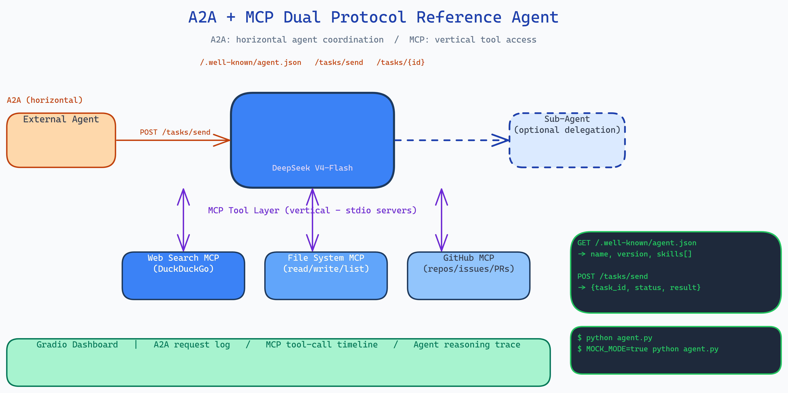

# A2A + MCP Dual Protocol Reference Agent: The Canonical Implementation

[](https://github.com/dakshjain-1616/A2A-MCP-Dual-Protocol-Reference-Agent)



## The Problem

> Two protocols are converging on how agents should work: A2A standardizes how agents discover and communicate with each other (horizontal coordination), and MCP standardizes how agents access tools like web search and file systems (vertical tool access). Every developer building production agents will need both. But there's no canonical reference showing how they work together, which protocol handles which concern, how the request flows, what the integration looks like in code.

NEO built this reference agent to answer that question with working code, a live dashboard, and an offline mock mode.

## How the Two Protocols Divide the Work

**A2A (Agent-to-Agent)** handles horizontal concerns:
- Agent discovery: `GET /.well-known/agent.json` advertises capabilities
- Task routing: `POST /tasks/send` delivers tasks to the agent
- Status polling: `GET /tasks/{id}` checks task progress
- Peer communication: agents can delegate subtasks to other A2A agents

**MCP (Model Context Protocol)** handles vertical concerns:
- Tool registration: MCP servers expose capabilities as typed function signatures
- Tool invocation: the agent calls tools through a uniform interface
- Context management: tool results flow into the reasoning loop as structured data

The boundary is clean: A2A moves tasks between agents; MCP moves data between agents and tools.

## The Three MCP Servers

The agent ships three stdio MCP servers, each exposing a tool set:

**Web Search MCP**: DuckDuckGo search, query refinement, result parsing.

**File System MCP**: read, write, list, and search local files. Used when the agent needs to persist research artifacts or load context.

**GitHub MCP**: repository metadata, file contents, issue and PR listings. Used for code research tasks.

The agent decides which tools to call based on its reasoning. Each call runs through the MCP interface and feeds results back into the next iteration.

## Live Gradio Dashboard

The dashboard shows the agent's work in real time across three panels:

- **A2A request log**: every task that arrived via A2A, with status, requester, and timing.
- **MCP tool-call timeline**: each tool invocation in order: which server, which tool, arguments, result, latency.
- **Agent reasoning**: the model's thinking trace between tool calls.

This is designed for developers learning the protocols. You can send a research task, watch A2A deliver it, watch MCP tools execute sequentially, and see how the model stitches results together into a final answer.

## DeepSeek V4-Flash

The agent uses DeepSeek V4-Flash as its inference engine, the April 2026 release optimized for cost-efficiency. At the time of writing it provides strong reasoning performance at a fraction of the cost of Opus or GPT-5.5, which matters when you're building a reference implementation that developers will run many times while learning.

## Mock Mode

The full agent works offline. Set `MOCK_MODE=true` and every external call, web search, file access, GitHub, returns deterministic mock responses. This lets developers understand the protocol flow and validate integration patterns without API keys or network access.

## How to Build This with NEO

Open NEO in VS Code or Cursor and describe what you want to build. A good starting prompt for this project:

> "Build a reference agent that implements both A2A and MCP protocols simultaneously. A2A: expose /.well-known/agent.json for capability discovery and /tasks/send for task delivery. MCP: implement three stdio MCP servers for web search (DuckDuckGo), file system operations, and GitHub queries. Use DeepSeek V4-Flash as the inference engine. When a task arrives via A2A, enter a reasoning loop that calls MCP tools as needed, feeding results back into each iteration. Build a Gradio dashboard with three real-time panels: A2A request log, MCP tool-call timeline with latencies, and agent reasoning trace. Add mock mode that works without API keys."

<a href="https://heyneo.com/dashboard?section=new-chat&prompt=Build%20a%20reference%20agent%20implementing%20both%20A2A%20and%20MCP%20protocols%20simultaneously.%20A2A%3A%20expose%20well-known%20discovery%20and%20task%20delivery%20endpoints.%20MCP%3A%20implement%20three%20stdio%20servers%20for%20web%20search%2C%20file%20system%2C%20and%20GitHub.%20Use%20DeepSeek%20V4-Flash.%20Build%20Gradio%20dashboard%20with%20A2A%20request%20log%2C%20MCP%20tool-call%20timeline%2C%20and%20agent%20reasoning%20trace.%20Add%20mock%20mode%20without%20API%20keys." style="display:inline-block;background:#1e40af;color:#ffffff;padding:10px 22px;border-radius:6px;text-decoration:none;font-weight:600;font-size:14px;">Build with NEO →</a>

NEO scaffolds the A2A server, the three MCP servers, the reasoning loop that bridges them, the Gradio dashboard, and the mock mode. From there you iterate: add a fourth MCP server for your specific data source, implement A2A task delegation so the agent can spawn sub-agents for subtasks, or replace DeepSeek with a local Ollama model for fully offline operation.

To run the finished project:

```bash
git clone https://github.com/dakshjain-1616/A2A-MCP-Dual-Protocol-Reference-Agent
cd A2A-MCP-Dual-Protocol-Reference-Agent
pip install -r requirements.txt
cp .env.example .env  # add DEEPSEEK_API_KEY

python agent.py                    # start agent with live dashboard
MOCK_MODE=true python agent.py     # offline mock mode
```

NEO built the canonical A2A + MCP reference agent that shows exactly how inter-agent coordination and tool access divide responsibilities, with a live dashboard and offline mock mode for learning the protocols without API keys. See what else NEO ships at [heyneo.com](https://heyneo.com/).

---

## Try NEO in Your IDE

Install the NEO extension to bring AI-powered development directly into your workflow:

- **VS Code**: [NEO in VS Code](https://marketplace.visualstudio.com/items?itemName=NeoResearchInc.heyneo)
- **Cursor**: <a href="cursor://extension/NeoResearchInc.heyneo" style="color:#0066FF;font-weight:bold;">Install NEO for Cursor →</a>

---
