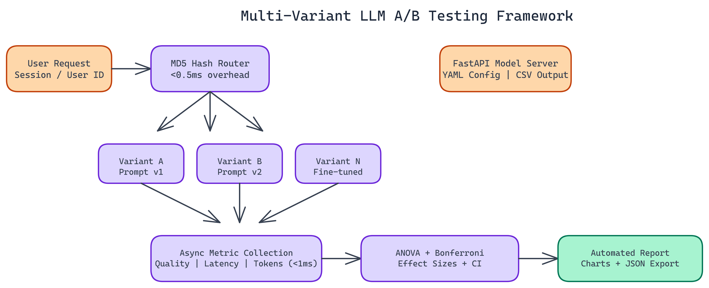

# Beyond A/B: Building a Multi-Variant LLM Testing Framework with Statistical Rigor

[View the code on GitHub](https://github.com/dakshjain-1616/AB-testing-tool)

Most A/B testing frameworks are built for two things: websites and simple binary outcomes. Click or no-click. Convert or bounce. LLM evaluation is a different problem. You might be comparing three prompt templates, two model sizes, and a fine-tuned variant all at once. You need statistics that actually handle that.

We built a multi-variant testing framework from the ground up, designed specifically for ML systems. It supports N variants simultaneously, uses proper statistical corrections for multiple comparisons, and adds under 0.5ms of routing overhead per request.

## The Problem with Naive A/B Testing for LLMs

When you test more than two variants, running pairwise t-tests between every combination is statistically wrong. It inflates your false positive rate. Test five variants with pairwise comparisons and you have ten tests running simultaneously, each with a 5% chance of a false positive. The probability that at least one of those is spurious climbs fast.

This is a known problem in statistics, and it has known solutions. We applied them.

## How the Framework Works

The system runs four stages in sequence.

### Deterministic Routing

Incoming requests get assigned to variants using MD5-based hashing on a user or session identifier. This is deterministic. The same user always hits the same variant. That matters because it eliminates the noise you get when the same user experiences multiple variants inconsistently.

Routing overhead is under 0.5ms. It is not a bottleneck.

### Async Metric Collection

Metric logging is fully asynchronous. We use a queue-based system so logging never blocks the request path. Total logging overhead stays under 1ms per request. In high-throughput production environments, non-blocking collection is not optional.

We track response quality scores, latency, token usage, and any custom metrics you define per experiment.

### Statistical Analysis

This is where the framework earns its keep. For continuous metrics across N variants, we run one-way ANOVA first. If that test shows a statistically significant difference somewhere in the group, we move to pairwise comparisons with Bonferroni correction.

Bonferroni correction adjusts the significance threshold for each individual test based on the total number of comparisons being made. It keeps the family-wise error rate under control. For categorical outcomes, we use Chi-Square tests with the same correction applied.

Every result comes with confidence intervals and effect sizes, not just p-values. A statistically significant result with a tiny effect size might not be worth shipping.

### Automated Reporting

The output is a full report with publication-ready visualizations, effect size tables, and JSON export for downstream integration. Results are ready to share with a team or feed into another system without manual processing.

## Configuration and Integration

The framework is YAML-configured. You define your variants, traffic splits, metrics to track, and experiment duration. Results accumulate in CSV format for immediate analysis.

There is a FastAPI endpoint for model serving, so you can integrate this directly into an existing ML serving stack. Teams running online experiments do not need a separate infrastructure layer.

## Real Use Cases

The most common use case is prompt template comparison. You have a system prompt you wrote six months ago and a new version. You want to know if the new one actually improves response quality across a real distribution of user queries, not just the five examples you tested manually.

Other uses: comparing model sizes (does the 70B variant meaningfully outperform the 13B on your specific task?), evaluating fine-tuned vs. base models, testing different retrieval strategies in a RAG system.

The framework handles all of these. As long as you can define a metric, you can test it.

## What Rigorous Testing Actually Buys You

The alternative to proper statistical testing is intuition-driven decisions. Someone looks at a sample of 20 responses, decides one prompt "feels better," and ships it. That works sometimes and fails silently much of the time.

With this framework, you get confidence intervals that tell you the true effect size range. You get correction for multiple comparisons so you are not chasing noise. You get effect sizes so you know whether a statistically significant improvement is actually large enough to matter in practice.

That is the difference between shipping a hunch and shipping a measured improvement.

---

NEO builds ML infrastructure where rigorous evaluation is a first-class concern, not an afterthought. See what else we ship at [heyneo.so](https://heyneo.so/).

See more of what we are building at [heyneo.so](https://heyneo.so).

---

## Try NEO in Your IDE

Install the NEO extension to bring AI-powered development directly into your workflow:

- **VS Code**: [NEO in VS Code](https://marketplace.visualstudio.com/items?itemName=NeoResearchInc.heyneo)
- **Cursor**: [NEO in Cursor](cursor:extension/NeoResearchInc.heyneo)

---
