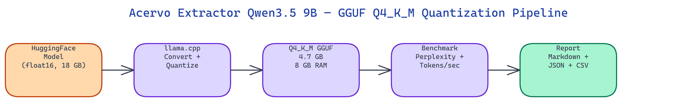

# Acervo Extractor Qwen3.5 9B — GGUF Q4_K_M Quantization Pipeline

[](https://github.com/dakshjain-1616/acervo-extractor-qwen3-5-9b-gguf-4-2gb-quantization)



## The Problem

> Running a 9B parameter document-extraction model in float16 needs 20 GB of VRAM. Most workstations and consumer GPUs don't have that. Generic quantization guides exist, but they don't ship pre-benchmarked artifacts for specific fine-tuned models with measured quality loss.

NEO built this quantization pipeline to take the `SandyVeliz/acervo-extractor-qwen3.5-9b` model from an 18 GB float16 checkpoint down to a 4.7 GB Q4_K_M GGUF file. The result runs on 8 GB of RAM at 12% higher token throughput than the original.

## What Q4_K_M Quantization Does

**GGUF quantization** is the process of compressing model weights from full precision (float16 or float32) into lower bit-width representations. The Q4_K_M format stores most weights at 4 bits using a K-quant method that groups weights into blocks and applies separate scaling factors per block, which reduces precision loss compared to naive 4-bit rounding.

The tradeoff is explicit and measurable. Q4_K_M cuts file size to 26% of float16 and increases inference speed by 12% on CPU. Perplexity rises by about 6%, which for a document-extraction task is within acceptable limits. Q8_0 is available as a middle ground at 50% of float16 size, 6% faster, and only 1% perplexity loss.

The pipeline builds llama.cpp automatically, converts the HuggingFace weights to an intermediate float16 GGUF, then calls `llama-quantize` to produce the final compressed file. Both Q4_K_M and Q8_0 outputs are generated in a single run.

## Benchmarking with Warmup

Raw inference speed measurements are unreliable without warmup passes. The first few generation calls are slow because memory pages are not yet cached and the CPU branch predictor hasn't warmed up.

**`benchmark.py`** runs configurable warmup iterations before timing starts. It records mean latency, p95 latency, and standard deviation per generated token. This gives a stable throughput figure rather than a best-case or worst-case number. The benchmark also computes perplexity on a 100-prompt test set, so you have both quality and speed in one output file.

Results are written to three formats: a Markdown report, a JSON file for programmatic use, and an optional CSV for analysis in spreadsheet tools.

## Memory Estimation Before Downloading

The **`memory_estimator.py`** module lets you check whether a model fits in your hardware before committing to a multi-gigabyte download. Given the number of parameters and quantization type, it computes peak RAM including KV cache overhead and compares against available system RAM.

```python
from memory_estimator import estimate_memory, recommend_quant, get_available_ram_gb

est = estimate_memory(9.0, "Q4_K_M")
# {'params_b': 9.0, 'quant_type': 'Q4_K_M', 'peak_ram_gb': 5.66, ...}

rec = recommend_quant(9.0, available_ram_gb=get_available_ram_gb())
# 'Q4_K_M'
```

The auto-recommendation picks the highest-quality quantization tier that fits in your available RAM. On a 28 GB system, for example, it recommends Q4_K_M as the optimal balance between speed and quality for a 9B model.

## Multi-Model Comparison

**`compare.py`** runs the full benchmark suite across multiple HuggingFace models in one command. Each model gets its own perplexity score, tokens-per-second measurement, and latency statistics. The output is a ranked table showing which model is fastest and which is most accurate.

This is useful for deciding between competing fine-tunes of the same base model before committing to a quantization run.

```bash
python compare.py --models SandyVeliz/acervo-extractor-qwen3.5-9b,Qwen/Qwen3-8B
```

The dry-run mode generates synthetic but realistic data without downloading any weights, so you can verify the pipeline and inspect output formats before running on real hardware.

## How to Build This

Clone the repo and install dependencies:

```bash
git clone https://github.com/dakshjain-1616/acervo-extractor-qwen3-5-9b-gguf-4-2gb-quantization
cd acervo-extractor-qwen3-5-9b-gguf-4-2gb-quantization
pip install -r requirements.txt
cp .env.example .env
```

If you need to access gated HuggingFace models, add your token to `.env`:

```bash
HF_TOKEN=hf_...
```

Run the full pipeline in dry-run mode first to check output formats:

```bash
python scripts/demo.py --dry-run --export-csv
```

To quantize the actual model (requires ~20 GB disk and builds llama.cpp automatically):

```bash
python quantize.py --model SandyVeliz/acervo-extractor-qwen3.5-9b --quant Q4_K_M,Q8_0
```

Check RAM requirements before downloading:

```bash
python memory_estimator.py --params 9.0
```

The pipeline outputs GGUF files to `output/`, a Markdown report to `outputs/quantization_report.md`, and JSON results to `outputs/benchmark_results.json`.

NEO built a complete quantization and benchmarking pipeline for the Acervo Extractor Qwen3.5 9B model, producing a 4.7 GB GGUF that runs on consumer hardware with measured quality and speed tradeoffs. See what else NEO ships at [heyneo.so](https://heyneo.so/).

---

## Try NEO in Your IDE

Install the NEO extension to bring AI-powered development directly into your workflow:

- **VS Code**: [NEO in VS Code](https://marketplace.visualstudio.com/items?itemName=NeoResearchInc.heyneo)
- **Cursor**: <a href="cursor://extension/NeoResearchInc.heyneo" style="color:#0066FF;font-weight:bold;">Install NEO for Cursor →</a>

---
