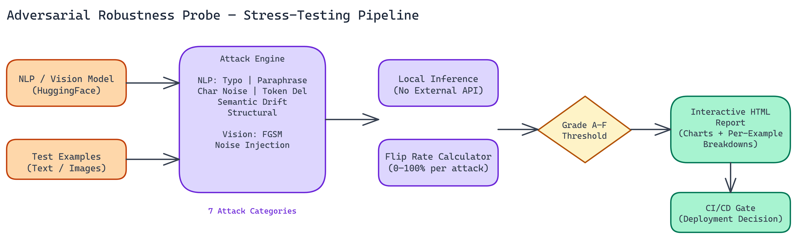

# Adversarial Robustness Probe: Stress-Testing NLP and Vision Models Before They Ship

[](https://github.com/dakshjain-1616/Adversarial-Robustness-Probe)



## The Problem

> A model that works on your test set may not work on data that's been slightly modified. Typos, paraphrasing, noise injection, small pixel perturbations: these are the kinds of inputs that expose the gap between benchmark performance and real-world reliability. Most teams never measure this gap before shipping — and when models make decisions with consequences, that omission has real costs.

NEO built Adversarial Robustness Probe — a stress-testing framework for NLP and vision models that applies seven attack categories, measures how often predictions change under each attack, and produces a structured report you can share with engineering or compliance teams.

## The Flip Rate Metric

The core metric is flip rate: the percentage of inputs where the model's prediction changes after perturbation. A model with a 5% flip rate under typo attacks is substantially more robust than one with a 60% flip rate under the same conditions. The metric is simple, interpretable, and directly relevant to deployment decisions.

The grading scale runs from A to F. An A grade means flip rates between 0 and 20 percent across attack types. The model handles perturbations well and is likely to be reliable in noisy real-world conditions. A D or F grade means flip rates between 80 and 100 percent, indicating the model is critically unstable and should not be deployed in sensitive contexts without significant robustness work.

Most production models that haven't been explicitly hardened land somewhere in the middle of this range, which is exactly the information you need when making deployment decisions.

## Seven Attack Types

The attack suite covers both text and image inputs.

**For NLP models:**

Typo attacks introduce realistic character-level errors: transpositions, substitutions, missing characters. These mimic what happens when users type quickly on mobile devices or when OCR systems introduce errors in document processing.

Paraphrasing attacks rephrase inputs while preserving semantic meaning. A robust model should produce the same classification whether you write "this product is terrible" or "this item performs very poorly."

Character noise attacks apply random character-level perturbations beyond typical typo patterns. These test the model's sensitivity to unusual but plausible input variations.

Token deletion attacks remove individual tokens from the input. Robust models should handle abbreviated or incomplete inputs without large prediction shifts.

Semantic drift attacks gradually shift the meaning of the input while keeping surface features similar. These test whether the model is tracking meaning or surface patterns.

Structural attacks change sentence structure, word order, or syntactic form while preserving the core semantic content.

**For vision models:**

FGSM attacks apply gradient-based pixel perturbations, the classic fast gradient sign method. These are small, often imperceptible changes that maximize prediction uncertainty.

Noise injection adds various forms of random pixel-level noise. This tests robustness to real-world image degradation from compression, low light, or sensor noise.

## How It Runs

All inference happens locally. No external API calls, no data leaving your environment. This matters for any organization working with sensitive data. You point the tool at a HuggingFace NLP model or a torchvision vision model, provide your test examples, and run.

Processing 100 examples across multiple attack types takes 5 to 10 minutes depending on hardware. GPU is optional. The framework is designed to run in standard CI/CD environments, which means you can add robustness checks to your deployment pipeline without specialized infrastructure.

## The HTML Report

Results generate as an interactive HTML report. The visualization dashboard shows flip rates by attack type, distribution of prediction confidence changes, and per-example breakdowns where you can inspect exactly which inputs triggered flips and under which attack.

The report format is designed for sharing. Engineering teams can use it to prioritize hardening work. Compliance teams can use it as documentation for model risk assessments. The A-F grading makes the summary accessible to stakeholders who don't want to read through detailed metrics.

## Four Practical Use Cases

**Security red-teaming.** Before deploying any model that processes user-generated content or handles sensitive classifications, you want to know how it behaves when someone deliberately crafts adversarial inputs. The probe doesn't cover every possible attack vector, but it covers the most common ones.

**Model selection.** When you're choosing between two model architectures or fine-tuned variants, benchmark accuracy often doesn't separate them meaningfully. Robustness profiles frequently do. A model that's 1% less accurate but has half the flip rate under perturbation is usually the better production choice.

**Regulatory compliance.** In regulated industries, demonstrating that you've tested model robustness is increasingly a requirement, not a best practice. The HTML report provides a structured artifact that satisfies that requirement.

**CI/CD integration.** Adding a robustness gate to your deployment pipeline catches regression before it reaches production. If a new fine-tuning run degrades robustness on key attack types, you want to know before the model ships.

## Building More Reliable Models

Running adversarial probes during development, not just after, changes how you approach model improvement. When you can see exactly which attack types cause the most flip rate increase, you can target data augmentation and training changes at those specific weaknesses. The probe becomes a feedback loop, not just an evaluation tool.

## How to Build This with NEO

Open NEO in VS Code or Cursor and describe what you want to build. A good starting prompt for this project:

> "Build an adversarial robustness testing framework in Python for HuggingFace NLP and torchvision models. Apply seven attack types: typo injection, paraphrasing, character noise, token deletion, semantic drift, structural attacks, and FGSM pixel perturbations for vision. Compute a flip rate metric per attack — the percentage of inputs where the model's prediction changes — and grade overall robustness A through F. Generate an interactive HTML report with per-attack heatmaps and per-example breakdowns. Run all inference locally with no external API calls."

<a href="https://heyneo.so/dashboard?section=new-chat&prompt=Build%20an%20adversarial%20robustness%20testing%20framework%20in%20Python%20for%20HuggingFace%20NLP%20and%20torchvision%20models.%20Apply%20seven%20attack%20types%3A%20typo%20injection%2C%20paraphrasing%2C%20character%20noise%2C%20token%20deletion%2C%20semantic%20drift%2C%20structural%20attacks%2C%20and%20FGSM%20pixel%20perturbations%20for%20vision.%20Compute%20a%20flip%20rate%20metric%20per%20attack%20%E2%80%94%20the%20percentage%20of%20inputs%20where%20the%20model%27s%20prediction%20changes%20%E2%80%94%20and%20grade%20overall%20robustness%20A%20through%20F.%20Generate%20an%20interactive%20HTML%20report%20with%20per-attack%20heatmaps%20and%20per-example%20breakdowns.%20Run%20all%20inference%20locally%20with%20no%20external%20API%20calls." style="display:inline-block;background:#1e40af;color:#ffffff;padding:10px 22px;border-radius:6px;text-decoration:none;font-weight:600;font-size:14px;">Build with NEO →</a>

NEO generates the project structure and core implementation from that. From there you iterate — ask it to add the FGSM gradient-based attack for vision models, build out the A-F grading scale with configurable thresholds, or add a CI/CD integration mode that returns a non-zero exit code when flip rates exceed a limit. Each request builds on what's already there without re-explaining the context.

To run the finished project:

```bash
git clone https://github.com/dakshjain-1616/Adversarial-Robustness-Probe.git
cd Adversarial-Robustness-Probe
pip install -r requirements.txt
python src/cli.py --model distilbert-base-uncased-finetuned-sst-2-english --task sentiment --input data/sentiment_examples.txt --attacks all --output reports/report.html
```

Open `reports/report.html` in a browser to see flip rates by attack type, confidence change distributions, and the overall robustness grade.

NEO built an adversarial robustness probe where model stress-testing across seven attack types is part of the build process, not a post-deployment afterthought. See what else NEO ships at [heyneo.so](https://heyneo.so/).

---

## Try NEO in Your IDE

Install the NEO extension to bring AI-powered development directly into your workflow:

- **VS Code**: [NEO in VS Code](https://marketplace.visualstudio.com/items?itemName=NeoResearchInc.heyneo)
- **Cursor**: <a href="cursor://extension/NeoResearchInc.heyneo" style="color:#0066FF;font-weight:bold;">Install NEO for Cursor →</a>

---
