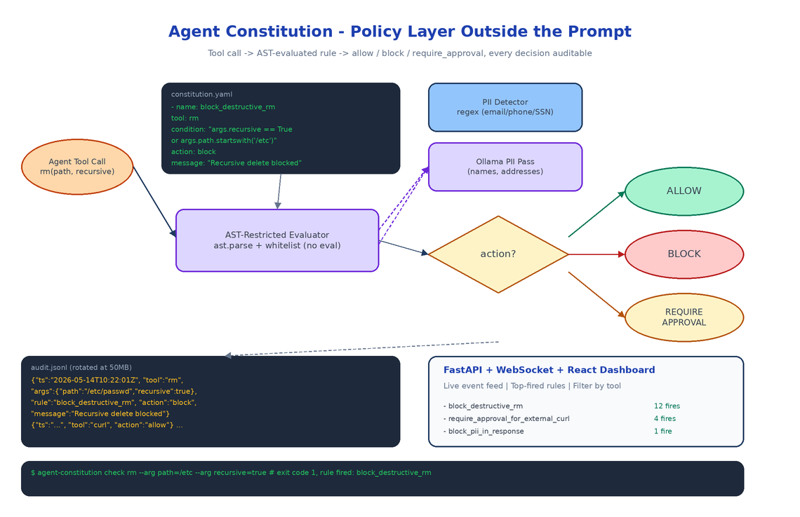

# Agent Constitution: A Policy Layer That Actually Stops Agents from Doing Dumb Things

[](https://github.com/dakshjain-1616/Agent-Constitution)



## The Problem

> Every team running agents in production eventually ships the same prompt: "do not run destructive commands, do not exfiltrate PII, do not call paid APIs without approval." That instruction is a sticky note, not a guardrail. Models forget it. New tools get added. A junior engineer changes the system prompt and the rule quietly disappears. Then one Tuesday afternoon the agent runs `rm -rf` on a path it should never have touched and the postmortem starts with the phrase "we thought we had told it not to."

Agent Constitution moves the rule out of the prompt and into a YAML file the agent cannot rewrite at inference time. Rules are evaluated by a separate enforcer, every decision is logged, and every block is visible on a dashboard. The model is no longer the security boundary.

## Rules Are YAML, Conditions Are AST

A constitution is a list of rules. Each rule has a name, a target tool, a condition expression, and an action: `allow`, `block`, or `require_approval`. The condition is a Python-like expression evaluated against the tool call arguments and an extra context dict.

```yaml
- name: block_destructive_rm
  tool: rm
  condition: "args.recursive == True or args.path.startswith('/etc')"
  action: block
  message: "Recursive deletion or deletion under /etc is not permitted."

- name: require_approval_for_external_curl
  tool: curl
  condition: "not args.url.startswith('https://internal.')"
  action: require_approval
```

The expressions are parsed and evaluated through Python's `ast` module with a restricted node whitelist. No `eval`, no `exec`, no attribute access on dunder methods. This matters: if condition strings were `eval`'d directly, the constitution file would become a code injection vector. Restricting the AST means a malicious or sloppy rule cannot smuggle in `os.system`.

## PII Detection: Regex First, LLM Second

The PII detector ships with regex patterns for the common cases (email addresses, US/E.164 phone numbers, SSNs, credit card numbers via Luhn validation, IPv4) and an optional Ollama-backed second pass for the things regex misses: names, addresses, free-form identifiers, anything where the pattern is "looks like a person."

The two-stage design is deliberate. Regex catches 80% of incidents at zero cost and zero latency. The Ollama call runs only when a rule explicitly requests deep PII detection on a payload, because running a local LLM on every tool call would defeat the point of having a fast policy layer.

```python
from agent_constitution.rules.pii_detector import PIIDetector

detector = PIIDetector()
matches = detector.detect("Contact me at john@example.com or 555-123-4567")
# [PIIMatch(pattern_name='email', matched_text='john@example.com'), ...]

redacted = detector.redact("Email: jane@corp.io")
# "Email: [REDACTED]"
```

## Audit Log: JSONL with Rotation

Every check the enforcer performs is appended to a JSONL audit log: timestamp, tool name, arguments, the rule that fired (if any), the action taken, the violation message. JSONL specifically, not JSON, because it streams: tail -f works, ingestion pipelines love newline-delimited records, and rotation is a file rename instead of a JSON array surgery.

Rotation kicks in at a configurable size (default 50MB) and keeps a configurable number of rolled files. The dashboard reads from the live file via WebSocket so new events appear within a second of being written.

## The Dashboard

The dashboard is FastAPI + WebSocket on the backend, React on the frontend. It shows the current constitution (rendered from the YAML), a live feed of audited events, the top-fired rules over the last hour, and a search box for filtering by tool, action, or time range. The point isn't to look impressive in a screenshot, the point is that on the morning after an incident you can answer "what blocked it, when, and what was the argument that triggered the rule" in under thirty seconds.

## Two Ways to Enforce

You can wire enforcement two ways depending on how much control you have over the agent's tool layer:

```python
# 1. Decorator: wrap a function and let exceptions propagate
@enforcer.enforce
def delete_file(path: str):
    os.remove(path)

# 2. Manual check: integrate with an existing tool router
result = enforcer.check(
    tool_name="curl",
    tool_args={"url": "https://example.com"},
    extra_context={"approved": False},
)
if result.blocked:
    return f"Blocked: {result.violations[0].rule_name}"
```

The decorator is convenient for greenfield agents. The manual check is what you reach for when the agent is using an existing framework like LangGraph or a custom tool dispatcher.

## How to Build This with NEO

Open NEO in VS Code or Cursor and describe what you want:

> "Build a policy enforcement framework for AI agents. Rules live in YAML with a name, target tool, condition expression, and action (allow, block, require_approval). Condition expressions are evaluated through a restricted Python AST whitelist, no eval. Ship a PII detector with regex for email, phone, SSN, credit card with Luhn, IPv4, and an optional Ollama pass for free-form names and addresses. Write every check to a JSONL audit log with size-based rotation. Expose a FastAPI + WebSocket dashboard with a React frontend that streams events live and lets you filter by tool, action, and time. Provide both an @enforce decorator and a manual enforcer.check() API for integration."

<a href="https://heyneo.com/dashboard?section=new-chat&prompt=Build%20a%20policy%20enforcement%20framework%20for%20AI%20agents%20with%20YAML%20rules%2C%20AST-evaluated%20conditions%2C%20regex%20%2B%20Ollama%20PII%20detection%2C%20JSONL%20audit%20logs%20with%20rotation%2C%20and%20a%20FastAPI%20%2B%20WebSocket%20%2B%20React%20dashboard.%20Provide%20both%20an%20%40enforce%20decorator%20and%20a%20manual%20check%20API." style="display:inline-block;background:#1e40af;color:#ffffff;padding:10px 22px;border-radius:6px;text-decoration:none;font-weight:600;font-size:14px;">Build with NEO →</a>

NEO scaffolds the YAML parser, the AST-restricted evaluator, the PII detector with both regex and Ollama paths, the JSONL audit writer with rotation, and the FastAPI + WebSocket dashboard. From there you add the rules your team actually cares about and wire the enforcer into whatever tool dispatcher your agent already uses.

```bash
git clone https://github.com/dakshjain-1616/Agent-Constitution
cd Agent-Constitution
pip install -e .

agent-constitution init --sample -o constitution.yaml
agent-constitution validate constitution.yaml
agent-constitution dashboard --constitution constitution.yaml
# open http://localhost:8000
```

NEO built a policy layer where the rule that blocked the agent is always visible, never inside the prompt, and never something the model can edit. See what else NEO ships at [heyneo.com](https://heyneo.com/).

---

## Try NEO in Your IDE

Install the NEO extension to bring AI-powered development directly into your workflow:

- **VS Code**: [NEO in VS Code](https://marketplace.visualstudio.com/items?itemName=NeoResearchInc.heyneo)
- **Cursor**: <a href="cursor://extension/NeoResearchInc.heyneo" style="color:#0066FF;font-weight:bold;">Install NEO for Cursor →</a>

---
