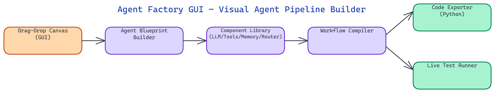

# Agent Factory GUI: Visual No-Code Builder for AI Agent Workflows

[](https://github.com/dakshjain-1616/Agent-Factory-GUI)



## The Problem

> Building AI agents in code requires significant boilerplate: wiring up LLM clients, managing tool registries, handling memory backends, and writing routing logic from scratch every time. Even experienced engineers spend hours on infrastructure before writing a single line of domain-specific logic. For teams exploring agent architectures, this cost kills experimentation velocity.

NEO built Agent Factory GUI to eliminate that friction — a visual canvas where you compose agent pipelines by connecting components, test them interactively, and export clean Python code ready for production deployment.

## The Visual Canvas

At the core of Agent Factory GUI is a node-based canvas built on a flow graph model. Each node represents a distinct agent component — an LLM provider, a tool, a memory store, a router, or a sub-agent. Edges between nodes define the data flow: outputs of one component feed directly into the inputs of the next.

The component palette on the left sidebar organizes every available block by category. LLM nodes support OpenAI (GPT-4o, GPT-3.5), Anthropic (Claude 3.5 Sonnet, Claude 3 Haiku), Groq (Llama 3, Mixtral), and local models via Ollama. Each LLM node exposes its configuration inline — temperature, max tokens, system prompt, and stop sequences are editable directly on the canvas without opening a separate settings panel.

Tool nodes cover the standard function-calling toolkit: web search, code execution, file read/write, HTTP requests, SQL queries, and custom Python functions. Dropping a tool node onto the canvas automatically generates its input/output schema and wires it into the tool-use loop of the connected LLM node. Memory nodes offer short-term buffer memory, long-term vector store memory (backed by Chroma or Pinecone), and summary memory with configurable token limits.

Router nodes are where the architecture gets interesting. You can define conditional routing logic visually — a router node inspects the LLM's output and sends execution down different branches based on content, intent classification, or structured output fields. This covers the most common agent patterns: ReAct loops, plan-and-execute, and multi-step conditional pipelines all map naturally to the canvas model.

## Component Wiring and Workflow Execution

Agent Factory GUI uses a typed port system for component connections. Every node exposes typed input and output ports — `message`, `tool_call`, `memory_context`, `decision`, and `final_response`. The canvas enforces type compatibility at connection time, preventing common wiring mistakes before you ever run the pipeline.

Workflow execution runs in topological order across the node graph. The runtime engine walks the graph, resolves dependencies, and executes each node in sequence or in parallel where the graph allows. Parallel execution is particularly useful for fan-out patterns where a planner node dispatches to multiple worker agents simultaneously and a reducer node aggregates their outputs.

The execution trace panel at the bottom of the screen shows each node's inputs, outputs, and timing in real time. Every LLM call displays the full prompt sent and the raw completion received. Tool calls show their arguments and return values. Memory operations show reads and writes with their relevance scores. This level of observability is standard in the GUI — debugging an agent pipeline no longer means adding print statements to source code.

## Real-Time Testing and Iteration

The test console on the right panel lets you send inputs to the pipeline and watch execution flow across the canvas in real time. Active nodes highlight as they execute, edges animate to show data movement, and the trace panel updates live. You can pause execution at any node, inspect the current state, modify a configuration value, and resume.

This interactivity changes how agent development works. Instead of write-run-read-cycle debugging, you iterate on the visual structure of the pipeline itself. Swap one LLM node for another, add a memory node between two steps, or insert a validation router — and immediately test the change against the same input. The feedback loop is tight enough that exploring architectural variants takes minutes rather than hours.

The GUI also includes a batch test mode. You upload a JSONL file of test cases, run the full pipeline against all of them, and get a results table showing outputs, latencies, and any errors per case. This is the bridge between exploratory design on the canvas and systematic evaluation before export.

## Python Code Export

When the pipeline is ready, the export button generates a self-contained Python module. The export engine traverses the node graph and emits clean, idiomatic Python using the appropriate SDK for each component — `openai`, `anthropic`, `langchain`, or the agent's own abstraction layer. The exported code is fully runnable, well-commented, and structured so that a developer can read and extend it without reverse-engineering the visual design.

Export templates are configurable. You can target a bare Python script, a FastAPI endpoint, a LangChain agent, or a Docker-ready service with a requirements file. The export format respects the graph structure — parallel branches in the canvas map to async concurrent execution in the exported code, sequential chains map to straightforward function call sequences.

## Supported Topologies

Agent Factory GUI covers the standard taxonomy of agent architectures. Single-agent ReAct loops with tool use are the simplest pattern — a single LLM node wired to a tool registry and a decision router that loops until the agent produces a final answer. Planner-executor architectures split into two agents connected by a task queue node: the planner decomposes a goal into steps, and one or more executor agents carry out each step.

Hierarchical multi-agent setups are supported through sub-agent nesting. An agent node can itself contain a full pipeline, letting you build supervisor-worker hierarchies where a high-level orchestrator delegates to specialized sub-agents for retrieval, code generation, or domain-specific reasoning. The canvas handles the nesting visually with collapsible group nodes.

## How to Build This with NEO

Open NEO in VS Code or Cursor and describe what you want to build. A good starting prompt for this project:

> "Build a drag-and-drop visual canvas for composing AI agent pipelines, with a FastAPI backend and React frontend. Nodes represent LLM providers (OpenAI, Anthropic, Groq, Ollama), tools (web search, code execution, file I/O, SQL), memory backends (buffer, Chroma vector store, summary), and conditional routers. Use typed input/output ports to enforce connection compatibility. Execute workflows in topological order with support for parallel fan-out branches. Show a real-time execution trace panel with full prompt/completion logs. Export the finished pipeline as a self-contained Python module."

<a href="https://heyneo.so/dashboard?section=new-chat&prompt=Build%20a%20drag-and-drop%20visual%20canvas%20for%20composing%20AI%20agent%20pipelines%2C%20with%20a%20FastAPI%20backend%20and%20React%20frontend.%20Nodes%20represent%20LLM%20providers%20%28OpenAI%2C%20Anthropic%2C%20Groq%2C%20Ollama%29%2C%20tools%20%28web%20search%2C%20code%20execution%2C%20file%20I%2FO%2C%20SQL%29%2C%20memory%20backends%20%28buffer%2C%20Chroma%20vector%20store%2C%20summary%29%2C%20and%20conditional%20routers.%20Use%20typed%20input%2Foutput%20ports%20to%20enforce%20connection%20compatibility.%20Execute%20workflows%20in%20topological%20order%20with%20support%20for%20parallel%20fan-out%20branches.%20Show%20a%20real-time%20execution%20trace%20panel%20with%20full%20prompt%2Fcompletion%20logs.%20Export%20the%20finished%20pipeline%20as%20a%20self-contained%20Python%20module." style="display:inline-block;background:#1e40af;color:#ffffff;padding:10px 22px;border-radius:6px;text-decoration:none;font-weight:600;font-size:14px;">Build with NEO →</a>

NEO generates the project structure and core implementation from that. From there you iterate — ask it to add sub-agent nesting with collapsible group nodes for hierarchical multi-agent setups, build out the batch test mode that runs a JSONL file of test cases and produces a results table, or add Docker-ready export templates. Each request builds on what's already there without re-explaining the context.

To run the finished project:

```bash
git clone https://github.com/dakshjain-1616/Agent-Factory-GUI.git
cd Agent-Factory-GUI
cp backend/.env.example backend/.env
bash start.sh
```

Open `http://localhost:8000` to load the canvas. Drag nodes from the left palette, connect them between typed ports, and click Run to watch the trace panel update live as the pipeline executes.

NEO built Agent Factory GUI to close the gap between architectural ideas and working agent pipelines — draft on the canvas, test interactively, export to production code. See what else NEO ships at [heyneo.so](https://heyneo.so/).

---

## Try NEO in Your IDE

Install the NEO extension to bring AI-powered development directly into your workflow:

- **VS Code**: [NEO in VS Code](https://marketplace.visualstudio.com/items?itemName=NeoResearchInc.heyneo)
- **Cursor**: <a href="cursor://extension/NeoResearchInc.heyneo" style="color:#0066FF;font-weight:bold;">Install NEO for Cursor →</a>

---
