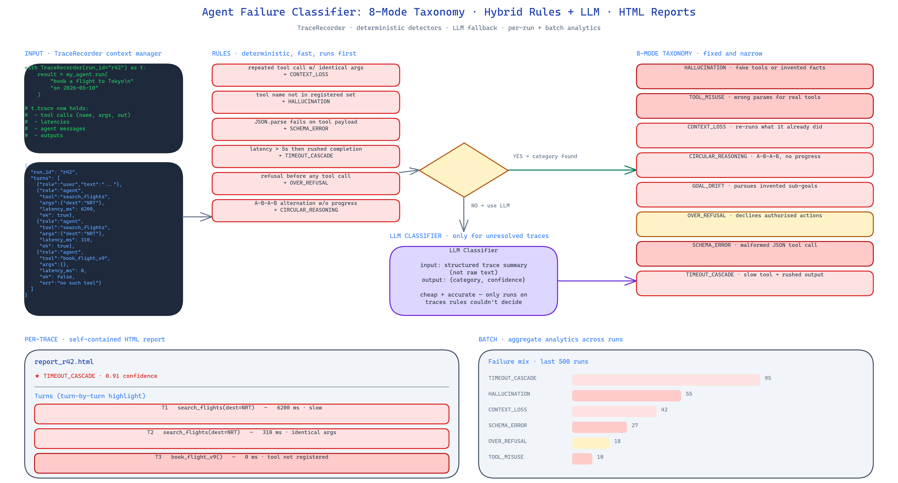

# Agent Failure Classifier: Root-Cause Analysis for Broken Agent Runs

[](https://github.com/dakshjain-1616/Agent-Failure-Classifier)



## The Problem

> An agent run fails. The trace is 40 steps long, riddled with retries, half-formed JSON, and three tool calls that returned 200 but produced garbage. Someone opens the log, stares at it for twenty minutes, and concludes "it hallucinated, I think?" That is not a diagnosis. That is resignation. Without a consistent taxonomy you cannot compare failures across runs, you cannot measure whether a prompt change helped, and you cannot route failures to the right fix.

NEO built Agent Failure Classifier to give agent failures the same treatment error codes give crashes in normal software: a named category, a confidence score, and enough structure to aggregate trends over time.

## The 8 Failure Modes

The taxonomy is deliberately narrow so that the categories stay distinguishable:

- **HALLUCINATION** — the agent asserted facts or called tools that do not exist. Classic signal: a function invocation whose name appears nowhere in the registered tool set.
- **TOOL_MISUSE** — the tool exists, but the call is wrong. Bad parameter types, missing required fields, using a read tool after a write was needed.
- **CONTEXT_LOSS** — the agent re-queried something it already knew, or ran the same step twice with identical inputs. Classic signal: two identical tool calls with no intervening state change.
- **CIRCULAR_REASONING** — the trace loops between two or three steps without progress. Distinguished from `CONTEXT_LOSS` by the pattern of alternation.
- **GOAL_DRIFT** — the original goal was abandoned mid-trace in favour of a sub-goal the agent invented. Classic signal: the final output does not answer the initial question.
- **OVER_REFUSAL** — the agent declined an action it was capable of performing and the user had authorised. Classic signal: a refusal message emitted before any tool call.
- **SCHEMA_ERROR** — the tool call JSON is malformed. Missing braces, stringified numbers, wrong nesting.
- **TIMEOUT_CASCADE** — a slow tool call (>5s) is followed by hasty completions. The agent gives up on verification because it is out of budget.

Each category has a crisp definition and at least one unambiguous classifier heuristic, which matters for comparing runs apples-to-apples.

## Hybrid Detection

Pure LLM classification is slow and flaky. Pure rule-based classification misses anything subtle. The classifier runs both:

**Rule-based detectors** run first. They are fast, deterministic, and catch the obvious cases:
- Repeated tool calls with identical arguments flag `CONTEXT_LOSS`.
- Tool names outside the registered set flag `HALLUCINATION`.
- JSON.parse failures on tool call payloads flag `SCHEMA_ERROR`.
- Tool latency above the threshold followed by rushed output flags `TIMEOUT_CASCADE`.

**LLM classification** runs only on traces the rules did not resolve. It sees a structured summary of the trace — not the raw text — and picks a category with a confidence score. This keeps the classifier both cheap and accurate.

## TraceRecorder

The library ships a `TraceRecorder` context manager that instruments any agent loop:

```python
from agent_failure_classifier import TraceRecorder, classify

with TraceRecorder(run_id="run_042") as rec:
    result = my_agent.run("question")

category = classify(rec.trace)
```

`TraceRecorder` captures tool calls, tool outputs, latencies, and the agent's own messages in a consistent schema. The classifier reads that schema; it does not care which framework produced the run.

## HTML Reports and Batch Analytics

For individual traces the CLI produces an HTML report with inline styling — no external CSS, no JS dependencies — that breaks the trace down turn by turn and highlights the flagged failure. You can open it in a browser or paste the file path into a Slack channel and people can read it directly.

For batches the CLI aggregates: top failure modes, confidence distribution, per-mode frequency over time. When you roll out a prompt change you can quantify its effect instead of arguing about vibes.

## How to Build This with NEO

Open NEO in VS Code or Cursor and describe what you want to build. A good starting prompt for this project:

> "Build a Python library that classifies failed LLM agent runs into eight root causes: HALLUCINATION, TOOL_MISUSE, CONTEXT_LOSS, CIRCULAR_REASONING, GOAL_DRIFT, OVER_REFUSAL, SCHEMA_ERROR, TIMEOUT_CASCADE. Use a hybrid approach — rule-based detectors first for fast deterministic cases (repeated tool calls, unregistered tool names, JSON parse failures, latency-followed-by-rush), then an LLM classifier for the remainder. Provide a TraceRecorder context manager that captures tool calls, outputs, latencies, and agent messages into a framework-agnostic schema. Generate self-contained HTML reports per trace and aggregate analytics across batches. Provide a CLI with single-trace classification, batch processing, and format validation."

<a href="https://heyneo.com/dashboard?section=new-chat&prompt=Build%20a%20Python%20library%20that%20classifies%20failed%20LLM%20agent%20runs%20into%20eight%20root%20causes%3A%20HALLUCINATION%2C%20TOOL_MISUSE%2C%20CONTEXT_LOSS%2C%20CIRCULAR_REASONING%2C%20GOAL_DRIFT%2C%20OVER_REFUSAL%2C%20SCHEMA_ERROR%2C%20TIMEOUT_CASCADE.%20Use%20a%20hybrid%20approach%20-%20rule-based%20detectors%20first%20for%20fast%20deterministic%20cases%2C%20then%20an%20LLM%20classifier%20for%20the%20remainder.%20Provide%20a%20TraceRecorder%20context%20manager%20that%20captures%20tool%20calls%2C%20outputs%2C%20latencies%2C%20and%20agent%20messages.%20Generate%20self-contained%20HTML%20reports%20per%20trace%20and%20aggregate%20analytics%20across%20batches." style="display:inline-block;background:#1e40af;color:#ffffff;padding:10px 22px;border-radius:6px;text-decoration:none;font-weight:600;font-size:14px;">Build with NEO →</a>

NEO scaffolds the rule detectors, the TraceRecorder, the LLM classifier, and the report templates. From there you iterate — add a ninth failure mode for your specific system, pipe the analytics into a dashboard, or wire the classifier into CI so PRs that regress a failure rate get flagged automatically.

NEO built a hybrid rule-plus-LLM classifier for agent trace failures with an 8-mode taxonomy, a framework-agnostic TraceRecorder, and HTML reports you can actually send to a teammate. See what else NEO ships at [heyneo.com](https://heyneo.com/).

---

## Try NEO in Your IDE

Install the NEO extension to bring AI-powered development directly into your workflow:

- **VS Code**: [NEO in VS Code](https://marketplace.visualstudio.com/items?itemName=NeoResearchInc.heyneo)
- **Cursor**: <a href="cursor://extension/NeoResearchInc.heyneo" style="color:#0066FF;font-weight:bold;">Install NEO for Cursor →</a>

---
