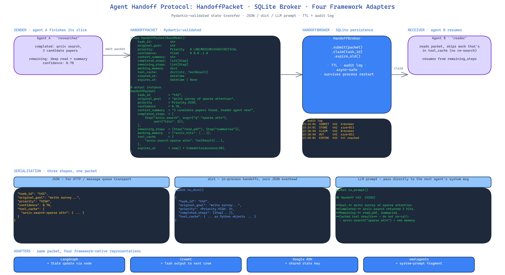

# Agent Handoff Protocol: A Standard HandoffPacket for Multi-Agent State Transfer

[](https://github.com/dakshjain-1616/Agent-Handoff-Protocol)



## The Problem

> You wire two agents together. They need to pass state — the original goal, which steps are done, what the tools returned, where the thread is going next. Every framework has its own way of doing this. LangGraph wants you to use its state machine. CrewAI wants you to use tasks and outputs. Google ADK wants shared state. smolagents wants... something else. If you are building across frameworks, or you want to survive the framework you pick going out of fashion, you end up writing your own adapter, badly, every time.

NEO built Agent Handoff Protocol to make this a solved problem. One Pydantic-validated packet schema, one SQLite broker, four framework adapters — and agents can pass enriched state to each other without losing any of it in translation.

## The HandoffPacket

The packet is deliberately explicit. It is not a blob with a task ID — it is a full checkpoint:

```python
class HandoffPacket(BaseModel):
    task_id: str
    original_goal: str
    priority: Priority               # LOW | MEDIUM | HIGH | CRITICAL
    confidence: float                # 0.0 to 1.0
    context_summary: str             # why we are handing off
    completed_steps: list[Step]
    remaining_steps: list[Step]
    working_memory: dict
    tool_cache: dict[str, ToolResult]  # don't re-call tools the previous agent already called
    created_at: datetime
    expires_at: datetime | None
```

Each field exists because a real handoff fails without it. Without `original_goal`, the receiving agent will drift toward a sub-goal. Without `tool_cache`, the receiving agent will re-run expensive tool calls the sender already did. Without `confidence`, you cannot decide whether to escalate. Without `expires_at`, stale handoffs pile up in the broker forever.

Pydantic validation enforces the schema at construction. Malformed packets never reach the network.

## Multiple Serialisation Formats

Same packet, three output shapes:

- **JSON** — for machine-to-machine transport over HTTP or message queues.
- **dict** — for in-process handoffs where you do not want the JSON round-trip cost.
- **LLM-friendly prompt** — a Markdown rendering of the packet that an LLM can read directly. This is the one you pass into the next agent's system prompt when you want the agent to understand the handoff instead of writing a parser for it.

## Framework Adapters

The whole point of a protocol is that it is framework-neutral, so the library ships adapters:

- **LangGraph** — maps `HandoffPacket` to a LangGraph `State` update and back.
- **CrewAI** — maps `HandoffPacket` to a CrewAI `Task` output and into the next crew member's input.
- **Google ADK** — writes the packet into ADK's shared state under a standard key.
- **smolagents** — renders the packet into a system prompt fragment the next agent reads.

You pick the adapter that matches your stack. If you migrate stacks, you change the adapter, not the packet.

## The HandoffBroker

The broker is a SQLite-backed store with TTL and audit logging. An agent emits a packet; the broker stores it; a downstream agent reads it by `task_id`. Packets expire based on `expires_at`. Every operation — create, read, expire, delete — is logged for audit.

This matters in two cases. First, asynchronous handoffs where the sender and receiver are not in the same process. Second, debugging — when a pipeline breaks, you can query the broker for the last good packet and replay from there.

```python
from agent_handoff_protocol import HandoffBroker, HandoffPacket

broker = HandoffBroker("./handoffs.db")
broker.submit(packet)
# ... later, possibly in a different process ...
next_packet = broker.claim(task_id="t42")
```

## Installation

```bash
pip install agent-handoff-protocol[all]   # all adapters
pip install agent-handoff-protocol[langgraph]   # just one
```

## How to Build This with NEO

Open NEO in VS Code or Cursor and describe what you want to build. A good starting prompt for this project:

> "Build a Python library that standardises state handoffs between LLM agents across frameworks. Define a Pydantic HandoffPacket with task_id, original_goal, priority (LOW/MEDIUM/HIGH/CRITICAL), confidence (0-1), context_summary, completed_steps, remaining_steps, working_memory, tool_cache, created_at, and expires_at. Provide three serialisation formats: JSON, dict, and an LLM-friendly Markdown rendering. Ship framework adapters for LangGraph, CrewAI, Google ADK, and smolagents that translate packets to and from each framework's native state representation. Provide a SQLite-backed HandoffBroker with TTL, expiry, and audit logging for async handoffs. Package with optional extras — agent-handoff-protocol[langgraph], [crewai], [adk], [smolagents], [all]."

<a href="https://heyneo.com/dashboard?section=new-chat&prompt=Build%20a%20Python%20library%20that%20standardises%20state%20handoffs%20between%20LLM%20agents%20across%20frameworks.%20Define%20a%20Pydantic%20HandoffPacket%20with%20task_id%2C%20original_goal%2C%20priority%20%28LOW%2FMEDIUM%2FHIGH%2FCRITICAL%29%2C%20confidence%2C%20context_summary%2C%20completed_steps%2C%20remaining_steps%2C%20working_memory%2C%20tool_cache%2C%20created_at%2C%20expires_at.%20Provide%20three%20serialisation%20formats%3A%20JSON%2C%20dict%2C%20and%20an%20LLM-friendly%20Markdown%20rendering.%20Ship%20framework%20adapters%20for%20LangGraph%2C%20CrewAI%2C%20Google%20ADK%2C%20and%20smolagents.%20Provide%20a%20SQLite-backed%20HandoffBroker%20with%20TTL%2C%20expiry%2C%20and%20audit%20logging." style="display:inline-block;background:#1e40af;color:#ffffff;padding:10px 22px;border-radius:6px;text-decoration:none;font-weight:600;font-size:14px;">Build with NEO →</a>

NEO scaffolds the Pydantic models, the broker, the adapters, and the optional-extras packaging. From there you iterate — add an HTTP transport so packets can cross machine boundaries, add schema-migration logic for packet versioning, or write your own adapter for an internal agent framework.

NEO built a framework-neutral handoff protocol with a Pydantic-validated packet schema, a SQLite broker with TTL and audit, and adapters for the four agent frameworks most teams actually use. See what else NEO ships at [heyneo.com](https://heyneo.com/).

---

## Try NEO in Your IDE

Install the NEO extension to bring AI-powered development directly into your workflow:

- **VS Code**: [NEO in VS Code](https://marketplace.visualstudio.com/items?itemName=NeoResearchInc.heyneo)
- **Cursor**: <a href="cursor://extension/NeoResearchInc.heyneo" style="color:#0066FF;font-weight:bold;">Install NEO for Cursor →</a>

---
