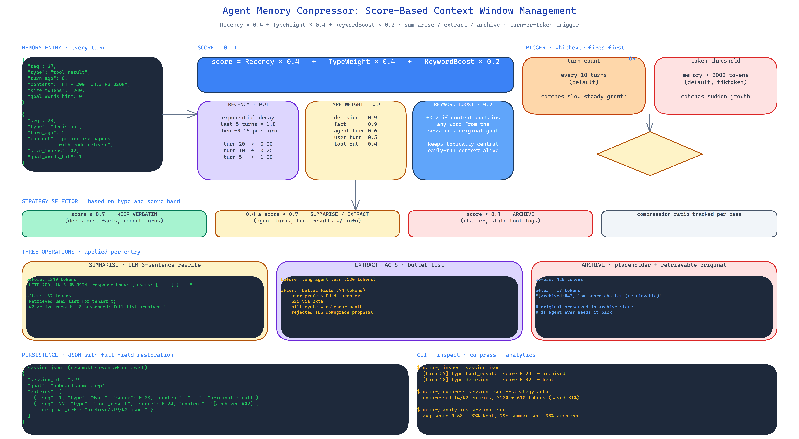

# Agent Memory Compressor: Score-Based Context Window Management for Long-Running Agents

[](https://github.com/dakshjain-1616/Agent-Memory-Compressor)



## The Problem

> Every long-running agent eventually runs out of context. The conversation grows. Tool outputs grow. The agent's own reasoning grows. The frameworks' default is to drop the oldest N messages, which is both stupid and destructive — the oldest messages often include the original goal and the key decisions that shape every subsequent turn. What you need is not truncation, you need *compression*, and you need it driven by how valuable each entry actually is.

NEO built Agent Memory Compressor to do that. Every memory entry is scored. Low-score entries get summarised or archived. High-score entries stay verbatim. The context window stays under budget and the stuff that matters survives.

## The Scoring Formula

Each memory entry gets a score in `[0, 1]`:

```
score = Recency × 0.4 + TypeWeight × 0.4 + KeywordBoost × 0.2
```

**Recency (0.4 weight)** uses exponential decay. The last 5 turns stay at 1.0. Each earlier turn loses 0.15. This means the last 10 turns dominate the score purely by how recent they are, and anything older than ~30 turns needs other signals to survive.

**Type weight (0.4 weight)** encodes the fact that not every entry is equal:

| Entry type | Weight |
|---|---:|
| Decision | 0.9 |
| Fact | 0.9 |
| Agent turn | 0.6 |
| User turn | 0.5 |
| Tool result | 0.4 |

Decisions and facts are weighted highest because they shape future behaviour. Tool results are lowest because they are usually re-derivable if the agent needs them again.

**Keyword boost (0.2 weight)** adds +0.2 if the entry contains goal-related keywords — words that appear in the session's original goal. This stops the compressor from discarding early-run context that is topically central to the whole session.

The scoring is inspired by Ebbinghaus's forgetting curve but adapted for the fact that agents have explicit goals and typed events, not just a blur of "conversation".

## Three Compression Strategies

Low-scoring entries are not just deleted — they are compressed:

- **Summarise** — the entry is rewritten by an LLM as a terse three-sentence summary. Used for agent turns, long tool outputs, and extended reasoning passages.
- **Extract facts** — the entry is reduced to a bullet list of discrete facts. Used when the entry contains multiple independent claims and the agent later needs to recall any of them.
- **Archive** — the entry is replaced with a placeholder that records its existence but not its content. Used for entries that scored near zero. The placeholder is cheap to carry and the full content is still retrievable from the archive store if the agent ever needs it.

Which strategy applies is a function of entry type and score band. Tool outputs get summarised. Long agent reasoning turns get fact-extracted. Low-score chatter gets archived.

## Trigger Logic

Compression does not run on every turn. That would be wasteful. It runs when either of two triggers fires:

- **Turn count** — every 10 turns by default. Catches slow, steady growth.
- **Token threshold** — when the running memory exceeds 6,000 tokens by default. Catches sudden growth from a large tool output.

The thresholds are configurable per SessionManager instance. A tight budget model (8k context) wants low thresholds; a loose one (128k) can go higher.

## Persistence

Memory stores persist as JSON with full field restoration — score, type, timestamp, original content, compressed content if any. A run that compresses at turn 20 and crashes at turn 25 can be resumed from the JSON with all compression state intact.

## CLI Tools

```bash
memory inspect session.json                    # show entries, scores, and compression state
memory compress session.json --strategy auto   # run a compression pass manually
memory analytics session.json                  # score distribution, compression ratio, token timeline
```

The analytics output is the useful one for tuning — it tells you whether your weights are producing the compression behaviour you want across realistic runs.

## How to Build This with NEO

Open NEO in VS Code or Cursor and describe what you want to build. A good starting prompt for this project:

> "Build a Python library for score-based memory compression in long-running LLM agents. Every memory entry gets a score = Recency × 0.4 + TypeWeight × 0.4 + KeywordBoost × 0.2. Recency uses exponential decay — the last 5 turns stay at 1.0, each earlier turn decays by 0.15. Type weights: decisions and facts 0.9, agent turns 0.6, user turns 0.5, tool results 0.4. Keyword boost is +0.2 if the entry contains any word from the session goal. Provide three compression strategies — summarise (three-sentence LLM rewrite), extract facts (bullet list), archive (placeholder with retrievable original). Apply strategies based on entry type and score band. Trigger compression either every 10 turns or when memory exceeds 6000 tokens, whichever comes first. Persist state to JSON with full field restoration. Provide CLI commands for inspect, compress, and analytics."

<a href="https://heyneo.com/dashboard?section=new-chat&prompt=Build%20a%20Python%20library%20for%20score-based%20memory%20compression%20in%20long-running%20LLM%20agents.%20Every%20memory%20entry%20gets%20a%20score%20%3D%20Recency%20%C3%97%200.4%20%2B%20TypeWeight%20%C3%97%200.4%20%2B%20KeywordBoost%20%C3%97%200.2.%20Recency%20uses%20exponential%20decay%20with%20last%205%20turns%20at%201.0%20and%200.15%20per-turn%20decay.%20Type%20weights%3A%20decisions%2Ffacts%200.9%2C%20agent%200.6%2C%20user%200.5%2C%20tool%200.4.%20Keyword%20boost%20%2B0.2%20for%20goal%20words.%20Provide%20three%20strategies%20-%20summarise%2C%20extract%20facts%2C%20archive.%20Trigger%20every%2010%20turns%20or%20at%206000%20tokens.%20Persist%20to%20JSON.%20Ship%20CLI%20for%20inspect%2C%20compress%2C%20analytics." style="display:inline-block;background:#1e40af;color:#ffffff;padding:10px 22px;border-radius:6px;text-decoration:none;font-weight:600;font-size:14px;">Build with NEO →</a>

NEO scaffolds the scoring engine, the compression strategies, the trigger logic, and the CLI. From there you iterate — tune the weights against your own agent traces, add a fourth strategy for code-heavy outputs, or wire the compressor into your session manager's write path.

NEO built a score-based memory compressor that keeps long agent runs under token budget without dropping the stuff that actually matters. See what else NEO ships at [heyneo.com](https://heyneo.com/).

---

## Try NEO in Your IDE

Install the NEO extension to bring AI-powered development directly into your workflow:

- **VS Code**: [NEO in VS Code](https://marketplace.visualstudio.com/items?itemName=NeoResearchInc.heyneo)
- **Cursor**: <a href="cursor://extension/NeoResearchInc.heyneo" style="color:#0066FF;font-weight:bold;">Install NEO for Cursor →</a>

---
