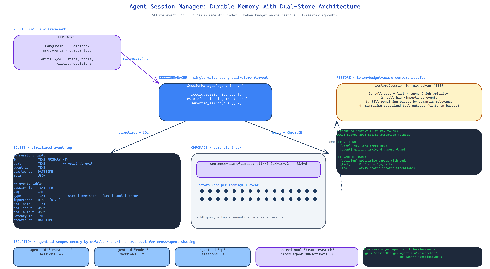

# Agent Session Manager: Durable Memory for Long-Running LLM Agents

[](https://github.com/dakshjain-1616/Agent-Session-Manager)



## The Problem

> Every agent that runs longer than a single conversation faces the same three bad options: stuff the whole history into the prompt until the context window dies, hand-roll a JSON file that does not scale past a prototype, or pay a third-party "agent memory" service that charges per call and adds latency. None of these are acceptable for a real system.

NEO built Agent Session Manager as the fourth option: durable local memory, semantic recall, and token-budget-aware restoration — all in a library light enough to drop into an existing agent loop.

## Two Stores, Two Jobs

The architecture splits memory across two stores because they answer fundamentally different questions:

**SQLite** stores the structured event log. Every session has a goal, a list of completed steps with tool outputs, a queue of pending steps, an error history, and arbitrary metadata. SQL answers *what happened, in what order, with what result*. It is append-only and fast.

**ChromaDB** stores the semantic index. Every meaningful event — a decision, a fact learned, a tool output — is embedded with `sentence-transformers` and written to the vector store. ChromaDB answers *what is semantically similar to this thing I am looking for right now*.

The two stores are kept in sync through a single write path. You do not write to one and forget the other. The SessionManager object exposes one `record()` method that fans out to both.

## Semantic Recall

Keyword search fails the moment the agent's vocabulary drifts. If the agent wrote "I disabled two-factor auth for the test account" three sessions ago and today asks "did we turn off 2FA anywhere?", keyword match does nothing. Semantic recall closes that gap.

The library uses `all-MiniLM-L6-v2` by default — 384 dimensions, fast on CPU, no GPU needed. It is configurable at SessionManager construction if you want to trade speed for fidelity. ChromaDB handles the ANN index; you get the top-k semantically similar events for any query string.

## Token-Budget-Aware Restoration

Restoring a session is not "dump everything back into the prompt". The SessionManager accepts a `max_tokens` budget. It prioritises recent turns, the original goal, and any events flagged as high-importance, then fills the remaining budget with semantically relevant history. Tool outputs that exceed budget are summarised, not truncated mid-JSON.

`tiktoken` is used for accurate token counting across OpenAI-compatible tokenisers. The budget is calculated against the model family you declare at construction time.

## Multi-Agent Isolation

SessionManager takes an `agent_id` at construction. By default each agent gets its own isolated namespace — no accidental cross-agent memory bleed. If you explicitly want sharing, a session can be tagged with a `shared_pool` identifier that other agents can subscribe to. You pick the topology; the library does not assume one.

## Drop-In Integration

The library is framework-agnostic. It does not assume LangChain, LlamaIndex, or any specific agent runtime. You instantiate a SessionManager, call `record()` on events you care about, call `restore()` when you want to rebuild context for a new prompt. That is the whole API surface.

```python
from session_manager import SessionManager

mgr = SessionManager(agent_id="researcher", db_path="./sessions.db")
session = mgr.start_session(goal="Survey 2026 sparse attention methods")

# During agent run
mgr.record_step(session.id, step="queried arxiv", result={...})
mgr.record_decision(session.id, text="prioritise papers with code releases")

# Later, in a fresh run
context = mgr.restore(session.id, max_tokens=4000)
```

## How to Build This with NEO

Open NEO in VS Code or Cursor and describe what you want to build. A good starting prompt for this project:

> "Build a Python library that gives LLM agents durable local memory across runs. Store structured events — goal, completed steps, tool outputs, errors, metadata — in SQLite. Store semantic embeddings in ChromaDB using sentence-transformers all-MiniLM-L6-v2 for meaning-based recall. Provide a SessionManager class with record(), restore(), and semantic_search() methods. Restoration must respect a max_tokens budget using tiktoken for accurate counting, prioritising recency and high-importance events. Support multi-agent isolation by default with optional shared pools. Framework-agnostic — should integrate with LangChain, LlamaIndex, or custom loops."

<a href="https://heyneo.com/dashboard?section=new-chat&prompt=Build%20a%20Python%20library%20that%20gives%20LLM%20agents%20durable%20local%20memory%20across%20runs.%20Store%20structured%20events%20-%20goal%2C%20completed%20steps%2C%20tool%20outputs%2C%20errors%2C%20metadata%20-%20in%20SQLite.%20Store%20semantic%20embeddings%20in%20ChromaDB%20using%20sentence-transformers%20all-MiniLM-L6-v2%20for%20meaning-based%20recall.%20Provide%20a%20SessionManager%20class%20with%20record%28%29%2C%20restore%28%29%2C%20and%20semantic_search%28%29%20methods.%20Restoration%20must%20respect%20a%20max_tokens%20budget%20using%20tiktoken%20for%20accurate%20counting%2C%20prioritising%20recency%20and%20high-importance%20events.%20Support%20multi-agent%20isolation%20by%20default%20with%20optional%20shared%20pools." style="display:inline-block;background:#1e40af;color:#ffffff;padding:10px 22px;border-radius:6px;text-decoration:none;font-weight:600;font-size:14px;">Build with NEO →</a>

NEO scaffolds the dual-store architecture and the SessionManager API. From there you iterate — add importance scoring based on how often a memory is recalled, write a CLI for session inspection, or plug the memory layer into an existing LangChain agent.

NEO built a local-first, framework-agnostic session memory library for long-running agents with dual SQLite + ChromaDB storage and token-budget-aware restoration. See what else NEO ships at [heyneo.com](https://heyneo.com/).

---

## Try NEO in Your IDE

Install the NEO extension to bring AI-powered development directly into your workflow:

- **VS Code**: [NEO in VS Code](https://marketplace.visualstudio.com/items?itemName=NeoResearchInc.heyneo)
- **Cursor**: <a href="cursor://extension/NeoResearchInc.heyneo" style="color:#0066FF;font-weight:bold;">Install NEO for Cursor →</a>

---
