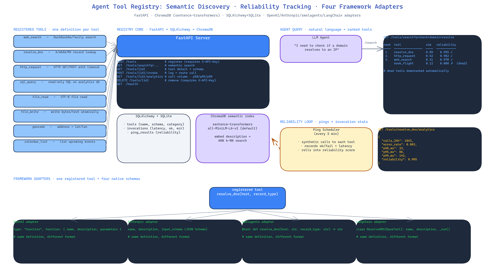

# Agent Tool Registry: Semantic Tool Discovery, Reliability Tracking, and Framework Adapters

## The Problem

> Agents do not have a tool problem. They have a *tool discovery* problem. You can ship an agent with 50 tools registered and watch it ignore 40 of them because the names do not match what the user asked. You can ship with 10 and watch the agent route every request through 3 of them because the LLM gets confused. And every framework wants tools formatted differently — OpenAI function schemas, Anthropic tool definitions, smolagents `@tool` decorators, LangChain `BaseTool` subclasses. The same tool gets reimplemented four times for four frameworks, and nobody tracks whether any of them actually works.

NEO built Agent Tool Registry as a single source of truth: one tool definition, semantic search over natural-language descriptions, reliability metrics per tool, and framework adapters that export to whichever SDK you happen to be using this week.

## Semantic Search

Tools are registered with a natural-language description. The description gets embedded with `sentence-transformers` and written to ChromaDB. An agent asking "I need to check if a domain resolves" gets the DNS tool even if the registered name is `resolve_host_record`.

The default embedding model is `all-MiniLM-L6-v2`. It is fast on CPU and handles typical tool-description drift well. The embedding model is configurable per deployment.

The query endpoint returns ranked results. The top-k tools are surfaced, with their descriptions, registered schemas, and reliability scores. The agent — or a routing layer in front of the agent — picks from the ranked set.

## Reliability Tracking

Every tool call goes through the registry's invocation endpoint, which logs:

- Tool ID
- Latency
- Success / failure status
- Error class if failure
- Caller agent ID

A scheduled ping runs against each registered tool to verify it is alive. Dead tools get flagged and downranked. The analytics endpoint surfaces per-tool call volumes, error rates, p50 / p95 / p99 latencies, and reliability scores computed from recent pings.

This turns the registry from a phone book into a phone book that tells you which numbers still work. Agents querying the registry see "here are the 5 tools that match your intent, ranked by reliability" instead of "here are 5 tools that might be broken".

## Framework Adapters

The same tool, four formats:

- **OpenAI** — function calling schema.
- **Anthropic** — tool use schema.
- **smolagents** — decorated tool class.
- **LangChain** — `BaseTool` subclass.

You register the tool once. The adapter layer converts on demand. If you add a tool today and start using Anthropic next month, the tool is there — no rewrite.

## 10 Default Tools, 12 Categories

The registry auto-initialises with 10 commonly-used tools — web search, DNS resolution, file read / write, SQL query, HTTP request, and similar — organised across 12 categories from web and data to machine learning and security. You are not starting from an empty database; you are starting from a sensible default set and adding your own on top.

## Optional API Key Auth

Mutating endpoints — POST for creating a tool, DELETE for removing one — can be gated behind an `X-API-Key` header. Read endpoints are open by default, which matches the usual threat model: anyone who can reach the registry can query it, but only holders of the key can modify it. If you want full auth, the middleware is one line to extend.

## Gradio UI and Python SDK

Two ways in beyond raw HTTP:

- **Gradio UI** for humans — browse, search, register, test, and see analytics without writing code.
- **Python SDK** for programmatic use — a thin client that wraps the HTTP API and gives you `registry.search()`, `registry.register()`, `registry.invoke()`.

## How to Build This with NEO

Open NEO in VS Code or Cursor and describe what you want to build. A good starting prompt for this project:

> "Build a FastAPI agent tool registry. Each tool has a name, a natural-language description, a JSON schema, and a category. Embed descriptions with sentence-transformers all-MiniLM-L6-v2 and store them in ChromaDB for semantic search. Back the metadata with SQLAlchemy and SQLite. Track reliability with latency, success rate, and periodic pings — downrank dead tools in search results. Expose analytics endpoints for call volumes and p50/p95/p99 latency. Provide framework adapters that export the same tool into OpenAI function schemas, Anthropic tool use schemas, smolagents @tool decorators, and LangChain BaseTool subclasses. Gate mutating endpoints behind an optional X-API-Key header. Auto-initialise with 10 default tools across 12 categories. Ship a Gradio UI and a Python SDK client."

<a href="https://heyneo.com/dashboard?section=new-chat&prompt=Build%20a%20FastAPI%20agent%20tool%20registry.%20Each%20tool%20has%20a%20name%2C%20a%20natural-language%20description%2C%20a%20JSON%20schema%2C%20and%20a%20category.%20Embed%20descriptions%20with%20sentence-transformers%20all-MiniLM-L6-v2%20and%20store%20in%20ChromaDB%20for%20semantic%20search.%20Back%20metadata%20with%20SQLAlchemy%20and%20SQLite.%20Track%20reliability%20with%20latency%2C%20success%20rate%2C%20and%20periodic%20pings.%20Expose%20analytics%20endpoints.%20Provide%20framework%20adapters%20for%20OpenAI%2C%20Anthropic%2C%20smolagents%2C%20LangChain.%20Gate%20mutations%20behind%20optional%20X-API-Key.%20Auto-initialise%20with%2010%20default%20tools%20across%2012%20categories.%20Ship%20Gradio%20UI%20and%20Python%20SDK." style="display:inline-block;background:#1e40af;color:#ffffff;padding:10px 22px;border-radius:6px;text-decoration:none;font-weight:600;font-size:14px;">Build with NEO →</a>

NEO scaffolds the FastAPI server, the ChromaDB semantic index, the reliability ping loop, the four framework adapters, and the Gradio UI. From there you iterate — add authentication, add per-category rate limiting, plug the registry into an existing agent's tool selection step.

NEO built a tool registry that solves the discovery, reliability, and framework-portability problems agents actually run into — one definition, four export formats, live reliability tracking. See what else NEO ships at [heyneo.com](https://heyneo.com/).

---

## Try NEO in Your IDE

Install the NEO extension to bring AI-powered development directly into your workflow:

- **VS Code**: [NEO in VS Code](https://marketplace.visualstudio.com/items?itemName=NeoResearchInc.heyneo)
- **Cursor**: <a href="cursor://extension/NeoResearchInc.heyneo" style="color:#0066FF;font-weight:bold;">Install NEO for Cursor →</a>

---
