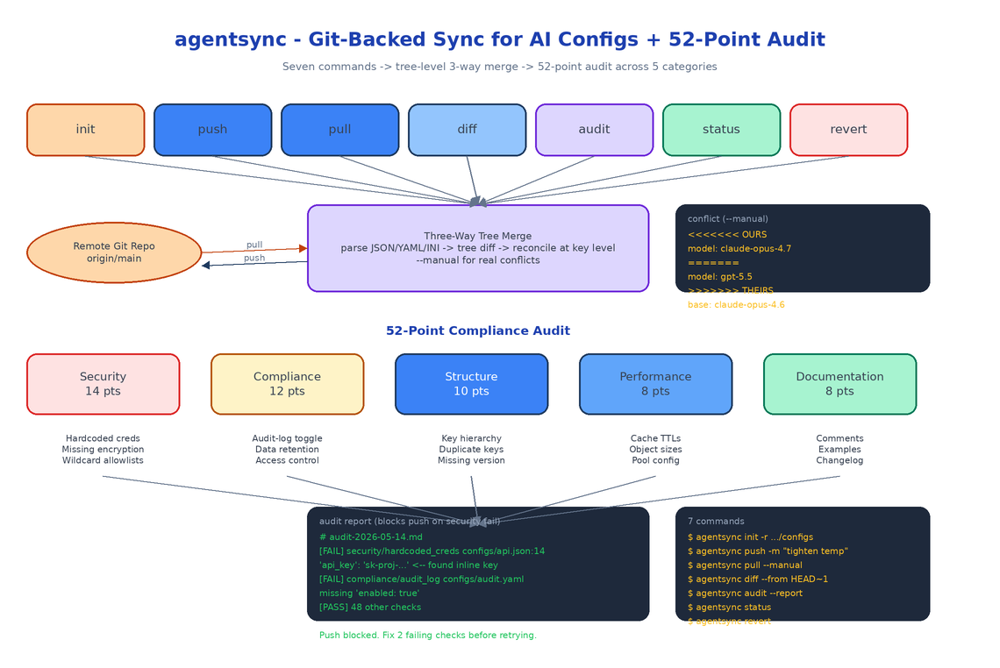

# agentsync: Git-Backed Sync for AI Team Configs with a 52-Point Compliance Audit

[](https://github.com/dakshjain-1616/agentsync)



## The Problem

> A team has six repos that each consume the same AI agent. Each repo has a slightly different copy of the system prompt, the model list, the eval config, the tool registry. Someone edits the system prompt in repo A. Two weeks later someone edits the eval config in repo B from what they thought was the latest version. When the configs get merged back to a central source, the two edits collide, the merge is done by hand, the eval config edit is silently dropped, and nobody notices for a month.

agentsync treats AI configs the same way agent teams should have treated them all along: a versioned shared resource with intelligent merge, conflict detection, and a security audit that runs every time you push.

## Seven Commands, One Workflow

```bash
agentsync init -r https://github.com/org/configs   # link this repo to the central configs
agentsync push -m "tighten temperature on routing prompt"
agentsync pull                                      # merge remote into local
agentsync pull --manual                             # interactive conflict resolution
agentsync diff --from HEAD~1 --to HEAD
agentsync audit --directory ./configs --report
agentsync status                                    # sync state + health
agentsync revert                                    # roll back to a previous merge
```

Each command has a single responsibility. `push` is auto-commit plus a remote update. `pull` is fetch plus three-way merge. `diff` shows the change set between two refs. `audit` runs the 52-point rubric. `status` is the dashboard you check in the morning. `revert` is the panic button.

## Three-Way Merge That Knows About Configs

Generic git merge treats JSON and YAML as line-oriented text. That works until two people edit the same JSON object from different sides — at which point line-by-line merge produces syntactic garbage and you spend twenty minutes hand-fixing braces.

agentsync's merge engine parses each config to its tree representation, computes the diff at the key level, and reconciles three-way: base, ours, theirs. If two sides touch different keys, the merge is automatic. If two sides touch the same key with the same new value, also automatic. If two sides touch the same key with different values, that's a real conflict and it's surfaced cleanly with both candidate values, the base value, and a one-line `--manual` resolver. The output is always valid JSON, YAML, or INI — never a half-broken file.

JSON, YAML, and INI are all supported. The same merge logic runs against the parsed tree regardless of source format.

## The 52-Point Audit

The audit rubric covers five categories:

- **Security** (14 points): hardcoded credentials, plaintext API keys, missing encryption flags, secrets stored alongside non-secret config, allowlists that allow `*`, etc.
- **Compliance** (12 points): missing audit-log toggles, undefined data retention, missing access control fields, regions not declared.
- **Structure** (10 points): improper key hierarchy, duplicate keys, missing version field, schema violations.
- **Performance** (8 points): oversized embedded objects, missing cache TTLs, missing connection pool config.
- **Documentation** (8 points): missing comments on non-obvious values, missing examples for templated fields, missing changelog entry.

A push runs the audit automatically and refuses to push if any security check fails. The full audit produces a markdown report with the failing points, the file and line, and a suggested fix.

```bash
agentsync audit --directory ./configs --report > audit-2026-05-14.md
```

The audit is the part of agentsync that justifies its existence on its own, even if you never use the sync features. Running it against an existing config directory tends to find at least one hardcoded credential and at least one missing audit-log toggle in any team that has been moving fast.

## Full History, Easy Revert

Every merge writes a record to the local agentsync history: who, when, which files, which conflicts, how they were resolved. `revert` lists recent merges and lets you roll back to the state just before any of them — without rewriting git history, by producing a new commit that restores the previous content. Safe for shared branches.

## How to Build This with NEO

Open NEO in VS Code or Cursor:

> "Build a Node.js CLI for syncing AI team configurations across repositories. Seven commands: init, push, pull, diff, audit, status, revert. Support JSON, YAML, and INI config files. Implement a three-way merge engine that parses configs into trees and reconciles at the key level, with auto-merge for non-conflicting edits and a --manual interactive resolver for real conflicts. Build a 52-point compliance audit across Security (14), Compliance (12), Structure (10), Performance (8), and Documentation (8) categories. Block push on security failures. Maintain a local merge history with full revert capability. Use git as the underlying transport for remote sync."

<a href="https://heyneo.com/dashboard?section=new-chat&prompt=Build%20a%20Node.js%20CLI%20for%20syncing%20AI%20team%20configurations%20across%20repositories%20with%20three-way%20tree-level%20merge%20for%20JSON%2FYAML%2FINI%2C%20a%2052-point%20security%20%2B%20compliance%20%2B%20structure%20%2B%20performance%20%2B%20documentation%20audit%20rubric%2C%20git-backed%20transport%2C%20and%20full%20revert-able%20merge%20history." style="display:inline-block;background:#1e40af;color:#ffffff;padding:10px 22px;border-radius:6px;text-decoration:none;font-weight:600;font-size:14px;">Build with NEO →</a>

NEO scaffolds the seven commands, the multi-format config loader, the tree-level merge engine, the conflict resolver, the audit rubric across all five categories, and the merge history with revert. From there you adjust the rubric to match your organization's specific policies and wire `agentsync audit` into your CI.

```bash
git clone https://github.com/dakshjain-1616/agentsync
cd agentsync
npm install
npm link

agentsync init -r https://github.com/your-org/configs
agentsync audit --directory ./configs --report
agentsync push -m "initial sync"
```

NEO built the missing version-control layer for AI team configs: smart merges, real conflict detection, and an audit that catches the hardcoded credentials before they reach production. See what else NEO ships at [heyneo.com](https://heyneo.com/).

---

## Try NEO in Your IDE

Install the NEO extension to bring AI-powered development directly into your workflow:

- **VS Code**: [NEO in VS Code](https://marketplace.visualstudio.com/items?itemName=NeoResearchInc.heyneo)
- **Cursor**: <a href="cursor://extension/NeoResearchInc.heyneo" style="color:#0066FF;font-weight:bold;">Install NEO for Cursor →</a>

---
