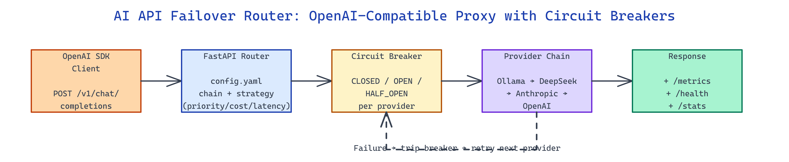

# AI API Failover Router: One Endpoint, Any Backend, Zero Downtime

[](https://github.com/dakshjain-1616/AI-API-Failover-Router)



## The Problem

> Production apps that depend on a single LLM provider get paged at 2am every time that provider has an incident, and migration pain locks teams into paying whatever rate hike lands next quarter.

NEO built AI API Failover Router to front any set of providers with one OpenAI-compatible endpoint that routes, fails over, and enforces circuit breakers automatically.

## OpenAI-Compatible Proxy with Provider Chains

**AI API Failover Router** exposes the standard `POST /v1/chat/completions` and `POST /v1/completions` endpoints, so any existing OpenAI SDK client works without code changes. Behind the endpoint, a `config.yaml` file defines ordered provider chains — Ollama, OpenAI, Anthropic, DeepSeek, or any OpenAI-compatible generic provider — and each request flows through according to a configurable strategy: `priority`, `cost`, `latency`, or `health`.

```yaml
providers:
  - name: ollama
    type: ollama
    endpoint: http://localhost:11434
    default_model: llama3
  - name: deepseek
    type: openai_compatible
    api_key: ${DEEPSEEK_API_KEY}
    default_model: deepseek-chat
  - name: anthropic
    type: anthropic
    api_key: ${ANTHROPIC_API_KEY}
    default_model: claude-haiku-4-5

routing:
  strategy: cost
  fallback_chain: [ollama, deepseek, anthropic]
```

Swapping the chain or re-ordering for a cost optimization is a config edit — no app redeploy required.

## Circuit Breakers and Health Endpoints

Each provider sits behind a classic three-state circuit breaker (`CLOSED → OPEN → HALF_OPEN`). Consecutive failures above threshold trip the breaker into `OPEN` and the router skips the provider for a cool-off window. After the window, a probe request moves the breaker to `HALF_OPEN`; success closes it, failure re-opens. This prevents one sick provider from cascading latency across the chain.

| State | Behaviour | Transition Trigger |
|---|---|---|
| CLOSED | Normal routing | 5 consecutive failures → OPEN |
| OPEN | Skip provider | 60s cool-off → HALF_OPEN |
| HALF_OPEN | Probe request | Success → CLOSED, failure → OPEN |

Live state is visible at `GET /health` for per-provider status, `GET /stats` for aggregated counters, and `GET /metrics` for Prometheus exposition. An admin endpoint (`POST /admin/circuit/{provider}/reset`) exists for manual recovery when the breaker is stuck after a provider-side fix.

## Rolling Latency Stats and Cost Tracking

Middleware records rolling p50/p95/p99 latency, token counts per direction, and cost per request using configurable per-provider pricing tables. The `cost` routing strategy consults these tables in real time, so as provider prices change, traffic follows the cheapest viable option that also meets the SLA. Request logging, optional auth, rate limiting, and idempotency caching ship in-box.

```bash
pip install -r requirements.txt
cp .env.example .env
uvicorn src.main:app --host 0.0.0.0 --port 8000
python3 -m pytest tests/ -v   # 55 tests
```

Point any OpenAI SDK at `http://localhost:8000/v1` and it routes through the chain transparently.

## How to Build This with NEO

Open NEO in VS Code or Cursor and describe what you want to build. A good starting prompt for this project:

> "Build a FastAPI proxy that exposes OpenAI-compatible /v1/chat/completions and /v1/completions endpoints and routes requests through configurable provider chains (Ollama, OpenAI, Anthropic, DeepSeek, generic). Support four routing strategies (priority, cost, latency, health). Implement three-state circuit breakers per provider with automatic recovery and admin reset endpoint. Expose Prometheus metrics, rolling latency stats, token and cost tracking. Include middleware for logging, optional auth, and rate limiting."

<a href="https://heyneo.com/dashboard?section=new-chat&prompt=Build%20a%20FastAPI%20proxy%20that%20exposes%20OpenAI-compatible%20%2Fv1%2Fchat%2Fcompletions%20and%20%2Fv1%2Fcompletions%20endpoints%20and%20routes%20requests%20through%20configurable%20provider%20chains%20%28Ollama%2C%20OpenAI%2C%20Anthropic%2C%20DeepSeek%2C%20generic%29.%20Support%20four%20routing%20strategies%20%28priority%2C%20cost%2C%20latency%2C%20health%29.%20Implement%20three-state%20circuit%20breakers%20per%20provider%20with%20automatic%20recovery%20and%20admin%20reset%20endpoint.%20Expose%20Prometheus%20metrics%2C%20rolling%20latency%20stats%2C%20token%20and%20cost%20tracking.%20Include%20middleware%20for%20logging%2C%20optional%20auth%2C%20and%20rate%20limiting." style="display:inline-block;background:#1e40af;color:#ffffff;padding:10px 22px;border-radius:6px;text-decoration:none;font-weight:600;font-size:14px;">Build with NEO →</a>

NEO generates the project structure and core implementation. From there you iterate — add per-model cost ceilings, build a dashboard for live circuit state, or wire in a Redis-backed idempotency cache so retries don't re-bill. Each request builds on what's already there.

To run the finished project:

```bash
git clone https://github.com/dakshjain-1616/AI-API-Failover-Router
cd AI-API-Failover-Router
pip install -r requirements.txt
uvicorn src.main:app --host 0.0.0.0 --port 8000
```

Point any OpenAI-compatible client at `http://localhost:8000/v1`; scrape `/metrics` for Prometheus and hit `/health` for per-provider circuit status.

NEO built a production-grade proxy that makes multi-provider LLM traffic a routing decision, not a code change. See what else NEO ships at [heyneo.com](https://heyneo.com/).

---

## Try NEO in Your IDE

Install the NEO extension to bring AI-powered development directly into your workflow:

- **VS Code**: [NEO in VS Code](https://marketplace.visualstudio.com/items?itemName=NeoResearchInc.heyneo)
- **Cursor**: <a href="cursor://extension/NeoResearchInc.heyneo" style="color:#0066FF;font-weight:bold;">Install NEO for Cursor →</a>

---
