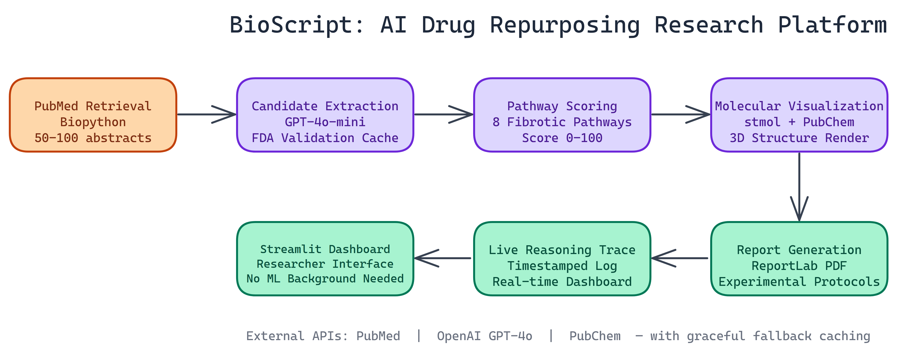

# Building a Drug Repurposing Research Platform with AI and Live Reasoning Traces

## The Problem

> Drug discovery is slow and expensive. Developing a new drug from scratch takes over a decade and billions of dollars. Repurposing approved drugs sidesteps the safety profile problem — those candidates are already validated. But identifying which approved drugs might work against a new disease context requires mining hundreds of recent abstracts, cross-referencing pathway databases, and synthesizing evidence that no single researcher can track manually.

NEO autonomously built BioScript to do exactly that: mine current scientific literature, extract viable drug candidates, score them against known disease pathways, and generate structured research reports. The focus is fibrotic diseases, but the architecture generalizes.

## What the Platform Does

BioScript pulls **50 to 100 recent abstracts** from PubMed, parses them for drug mentions, validates each candidate against an FDA approval database, and then scores them across a curated set of biological pathways. The output is a full report with visualizations, experimental protocols, and a live log of every reasoning step the system took.

That last part deserves attention. The live reasoning trace is a real-time, timestamped log of the AI's decision-making process. You can watch it work. Each extraction, each scoring decision, each hypothesis gets surfaced as it happens. That's not just useful for debugging. It's useful for building trust in a domain where treating the system as a black box is not an option.

## The Architecture

The platform breaks into seven core modules.

**Literature Retrieval** handles PubMed queries using Biopython. We pull structured abstracts with metadata so downstream modules have clean input to work with.

**Candidate Extraction** uses GPT-4o-mini with a structured prompting approach. The model reads each abstract and identifies drug mentions, then flags which ones are worth tracking based on disease relevance. FDA validation runs against a local cache of **30+ approved drugs**, which keeps API calls down during repeated analysis sessions.

**Pathway Scoring** is where the core scientific judgment happens. NEO built a set of **eight curated fibrotic pathways**, things like TGF-beta signaling, inflammation cascades, and collagen synthesis pathways. Each candidate gets scored **0 to 100** based on how many relevant pathway interactions appear in the literature. This is a weighted scoring system informed by what the abstracts actually say, not a rigid rule engine.

**Molecular Visualization** uses stmol and PubChem's API to render interactive 3D structures. You can rotate, zoom, and inspect property details for each candidate directly in the browser. This matters for researchers who need to think about binding geometry, not just pathway scores.

**Report Generation** produces comprehensive PDF documents via ReportLab. The reports include executive summaries, full scoring breakdowns, and suggested experimental protocols for the top candidates. These are designed to be shareable with wet-lab teams without any additional formatting work.

## Three External APIs, One Coherent Interface

BioScript integrates PubMed, OpenAI, and PubChem. Coordinating three external APIs in a single research workflow creates obvious failure points. We handled this by building local caching for FDA drug data and structuring API calls to fail gracefully rather than halting the pipeline. If PubChem is slow, the visualization degrades but the scoring still runs.

The Streamlit interface ties everything together into a dashboard that doesn't require any ML background to operate. A bench researcher who has never touched a transformer model can run a query, read the reasoning trace, and interpret the results.

## What 35 Development Cycles Produces

This project took **35 iterative development cycles** to reach production quality. That number is worth mentioning not as a boast but as a data point: roughly **3,500 lines of code** covering seven distinct modules, three API integrations, and a complete reporting pipeline. Each cycle tightened the scoring logic, improved the prompt structure, or hardened the error handling.

The iterative process is how you get a system that handles edge cases. Abstracts with ambiguous drug names. PubChem lookups that return multiple compound matches. Pathway scores that need normalization across different abstract volumes. These aren't problems you anticipate on day one.

## Who Uses This

The primary audience is biomedical researchers looking for an accelerated first-pass analysis. Instead of manually reviewing hundreds of abstracts and cross-referencing pathway databases, BioScript produces a ranked list with supporting evidence in minutes.

Secondary use cases include pharmaceutical analysts tracking the competitive landscape, academic labs building systematic literature reviews, and anyone doing exploratory work on fibrosis-adjacent mechanisms who needs a structured starting point.

## AI Research Tools Should Show Their Work

The design principle we returned to throughout development was transparency. An AI system making biomedical claims needs to be interrogable. The live reasoning trace isn't a nice-to-have. It's a requirement for any context where a researcher needs to know why the system ranked a particular candidate.

NEO built a drug repurposing research platform where live reasoning traces and transparent AI decision-making are built into the system, not bolted on as an afterthought. See what else NEO ships at [heyneo.so](https://heyneo.so/).

---

## Try NEO in Your IDE

Install the NEO extension to bring AI-powered development directly into your workflow:

- **VS Code**: [NEO in VS Code](https://marketplace.visualstudio.com/items?itemName=NeoResearchInc.heyneo)
- **Cursor**: [**Install NEO for Cursor →**](cursor:extension/NeoResearchInc.heyneo)
