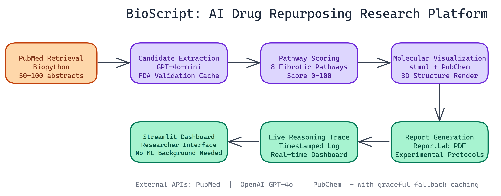

# BioScript: AI-Powered Drug Repurposing Platform That Identifies FDA-Approved Drugs for Fibrotic Diseases

## The Problem

> Drug discovery is slow and expensive. Bringing a new drug from lab to clinic takes 10+ years and billions in investment. But thousands of FDA-approved drugs exist for other indications. Some might work for fibrotic diseases. The challenge: searching through decades of published literature manually is infeasible.

NEO built BioScript to accelerate drug repurposing. It retrieves recent PubMed abstracts automatically, uses GPT-4o-mini to intelligently extract candidate drugs, scores them on fibrotic pathways, and generates testable hypotheses with experimental protocols ready for the lab.

## Literature-Powered Drug Discovery

BioScript starts with PubMed. It retrieves 50–100 abstracts on fibrotic disease mechanisms using Biopython's Entrez API, focusing on recent literature where novel connections are most likely to surface.

Rather than simple keyword matching, GPT-4o-mini reads abstracts, identifies FDA-approved drug candidates, and validates them against regulatory databases. This catches drugs mentioned in passing rather than only those highlighted as focus.

## Intelligent Pathway-Based Scoring

Candidates are scored on a 0–100 scale using a four-component pathway-based system emphasizing fibrotic mechanisms like TGF-β signaling, collagen deposition, and tissue stiffening.

A drug that modulates TGF-β but has no literature link to fibrosis gets a lower score than one with direct evidence in fibrotic models. The scoring system is transparent.

## Testable Hypotheses and Experimental Protocols

For top-scoring candidates, BioScript generates testable scientific hypotheses in standardized format—specific predictions that can be tested in the lab.

It then produces detailed experimental protocols for validation using LX-2 cells (a model for liver fibrosis). Protocols include reagent lists, timing, expected outcomes, and statistical power calculations.

## Interactive Visualization and PDF Reports

For selected drugs, BioScript pulls 3D molecular structures from PubChem API and renders them interactively. All results export as comprehensive PDF reports with executive summaries, ranked candidates, detailed scoring breakdowns, protocols, and citations.

## How to Build This with NEO

> "Build an AI-powered drug repurposing platform that: (1) retrieves 50-100 PubMed abstracts on fibrotic disease using Biopython Entrez API; (2) uses GPT-4o-mini to extract and validate FDA-approved drug candidates; (3) scores candidates on 0-100 scale using pathway-based system; (4) generates testable hypotheses and LX-2 cell experimental protocols; (5) displays live reasoning traces with timestamps; (6) provides interactive 3D molecular visualization via PubChem API; (7) exports comprehensive PDF reports."

<a href="https://heyneo.com/dashboard?section=new-chat&prompt=Build%20an%20AI-powered%20drug%20repurposing%20platform" style="display:inline-block;background:#1e40af;color:#ffffff;padding:10px 22px;border-radius:6px;text-decoration:none;font-weight:600;font-size:14px;">Build with NEO →</a>

NEO generates the PubMed integration, scoring engine, protocol generator, and visualization layers. Iterate to extend to other disease areas, add SMILES string-based molecular similarity analysis, or integrate ChEMBL API.

---

## Try NEO in Your IDE

- **VS Code**: [NEO in VS Code](https://marketplace.visualstudio.com/items?itemName=NeoResearchInc.heyneo)
- **Cursor**: <a href="cursor://extension/NeoResearchInc.heyneo" style="color:#0066FF;font-weight:bold;">Install NEO for Cursor →</a>
