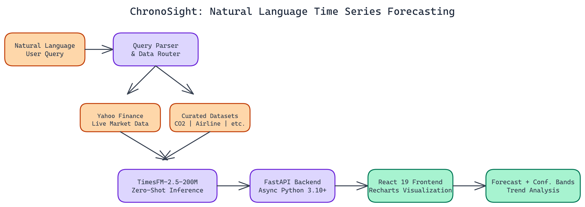

# Natural Language Time Series Forecasting with Google's TimesFM Model

[](https://github.com/dakshjain-1616/AI-Powered-Time-Series-Forecasting)



## The Problem

> Time series forecasting has a usability problem. The models are capable, but getting them to run requires a data science background, the right libraries, carefully shaped input data, and enough domain knowledge to interpret the output. Most people who would benefit from forecasting can't access it because the tooling is too technical.

NEO autonomously built ChronoSight to change that. Ask a question in plain language. Get a forecast with confidence bands and trend analysis. No data science background required.

## The Model Underneath

The forecasting engine is Google's [TimesFM-2.5-200M](https://huggingface.co/google/timesfm-2.5-200m-pytorch), a **200-million-parameter** foundation model for time series data from HuggingFace. The key property is zero-shot forecasting: the model produces useful predictions without any fine-tuning on your specific dataset. You don't train it, you don't provide historical examples, you just run inference.

This matters practically. Fine-tuning a forecasting model requires substantial historical data, compute time, and expertise in avoiding overfitting. Zero-shot removes all of that friction. Point the model at a data source, specify a forecast horizon, and you get predictions immediately.

TimesFM was trained on a diverse corpus of time series data, which is what enables zero-shot generalization. It has seen enough patterns across enough domains that it can reason about new series without domain-specific training. The confidence bands it produces reflect genuine uncertainty estimates, not arbitrary intervals.

## Natural Language Query Routing

The interface layer is what makes ChronoSight different from running TimesFM directly. You don't configure data sources manually. You type a question.

"Show me Apple stock price forecast for the next 30 days."
"What does CO2 concentration look like over the next year?"
"Forecast airline passenger numbers through Q4."

The system parses the query, identifies the relevant data source, fetches the appropriate historical data, runs inference through TimesFM, and returns a forecast with visualizations. The routing handles the gap between natural language intent and the precise data retrieval operations needed to fulfill it.

When a query doesn't match any available data source, the response is structured: it tells you what datasets are available and suggests how to reformulate the question. No silent failures or confusing empty results.

## Data Sources

The platform connects to two categories of data:

**Live market data via Yahoo Finance.** Any publicly traded asset with a ticker symbol. Equities, ETFs, indices, currencies. The data refreshes on each request, so forecasts are built on current prices.

**Curated economic datasets.** CO2 concentration measurements, airline passenger data, and other classic time series datasets from statsmodels. These are useful for understanding model behavior on well-studied series where you can verify whether the forecasts are directionally correct.

The architecture is designed to extend. Adding a new data source means implementing a retrieval function and adding it to the routing layer. The forecasting pipeline itself doesn't change.

## The Technical Stack

The backend is FastAPI with Python 3.10+. FastAPI's async capabilities handle the inference workload without blocking on I/O, which matters when waiting on model inference and data fetches simultaneously. The TimesFM model loads once at startup and stays resident in memory.

The frontend is React 19 with TypeScript, built with Vite, and styled with Tailwind CSS. Charts use Recharts, which handles the area chart visualizations for historical data and forecast projections. The confidence bands are rendered as shaded regions around the central forecast line.

Both servers run locally, backend on port 8000 and frontend on port 5173. Setup requires cloning the repository, running `pip install` for the backend dependencies, and `npm install` for the frontend. You need Python 3.10+ and Node.js 18+, plus about **2GB of disk space** for the model weights and **4GB of RAM** minimum.

## What the Output Looks Like

A completed forecast shows three things:

**The historical series.** The actual measured values up to the present. This grounds the forecast in observed reality and makes it easy to see trend and seasonality visually.

**The projected forecast.** The model's point estimate for each future period, displayed as a continuation of the historical line.

**Confidence bands.** Shaded regions above and below the point estimate representing forecast uncertainty. The bands widen as the forecast horizon extends, correctly reflecting that predictions become less certain further into the future.

The metrics panel alongside the chart shows trend direction (up, down, flat), trend magnitude, and a brief natural-language summary of the forecast. These make the forecast interpretable without requiring the user to read raw numbers off a chart.

## Appropriate Use of the Forecasts

ChronoSight surfaces a persistent disclaimer: the forecasts are for educational and exploratory purposes and should not drive financial decisions. This is genuine, not boilerplate.

Zero-shot forecasting is genuinely useful for understanding patterns and exploring scenarios. It is not a substitute for production financial forecasting, which requires careful model selection, validation against holdout periods, integration of fundamental data, and ongoing performance monitoring.

What TimesFM does well is give you a statistically grounded starting point quickly. For exploratory analysis, research, and applications where approximate forecasts are valuable, zero-shot works well. For high-stakes decisions, you need more than a foundation model running on public data.

## When to Use This Approach

Zero-shot forecasting with a foundation model makes sense when:

- You need quick exploratory analysis on multiple series without training separate models for each
- Your historical data is limited and fine-tuning would overfit
- You want a baseline to compare against more specialized approaches
- Speed of iteration matters more than squeezing out the last few percentage points of accuracy

It's less appropriate when you have abundant historical data, domain-specific patterns that foundation models haven't seen, or when forecast accuracy has direct financial consequences.

## ML Systems That Work End-to-End

## How to Build This with NEO

Open NEO in VS Code or Cursor and describe what you want to build. A good starting prompt for this project:

> "Build a full-stack natural language time series forecasting app with a FastAPI backend and React 19 + TypeScript + Vite frontend. The backend loads Google's [TimesFM-2.5-200M](https://huggingface.co/google/timesfm-2.5-200m-pytorch) zero-shot forecasting model from HuggingFace and parses plain-language queries to identify the data source — live Yahoo Finance tickers or curated statsmodels datasets. Run inference and return forecast point estimates with confidence bands. The frontend renders historical data, the projected forecast, and shaded uncertainty regions using Recharts, with a metrics panel showing trend direction and a plain-language summary."

<a href="https://heyneo.so/dashboard?section=new-chat&prompt=Build%20a%20full-stack%20natural%20language%20time%20series%20forecasting%20app%20with%20a%20FastAPI%20backend%20and%20React%2019%20%2B%20TypeScript%20%2B%20Vite%20frontend.%20The%20backend%20loads%20Google%27s%20TimesFM-2.5-200M%20zero-shot%20forecasting%20model%20from%20HuggingFace%20and%20parses%20plain-language%20queries%20to%20identify%20the%20data%20source%20%E2%80%94%20live%20Yahoo%20Finance%20tickers%20or%20curated%20statsmodels%20datasets.%20Run%20inference%20and%20return%20forecast%20point%20estimates%20with%20confidence%20bands.%20The%20frontend%20renders%20historical%20data%2C%20the%20projected%20forecast%2C%20and%20shaded%20uncertainty%20regions%20using%20Recharts%2C%20with%20a%20metrics%20panel%20showing%20trend%20direction%20and%20a%20plain-language%20summary." style="display:inline-block;background:#1e40af;color:#ffffff;padding:10px 22px;border-radius:6px;text-decoration:none;font-weight:600;font-size:14px;">Build with NEO →</a>

NEO generates the project structure and core implementation from that. From there you iterate — ask it to add the natural language query router that maps user input to the right data source, implement the confidence band calculation and shaded area chart rendering, or add a FORCE_CPU environment flag to override GPU detection. Each request builds on what's already there without re-explaining the context.

To run the finished project:

```bash
git clone https://github.com/dakshjain-1616/AI-Powered-Time-Series-Forecasting.git
cd AI-Powered-Time-Series-Forecasting/backend
pip install -r requirements.txt
python main.py
```

In a second terminal run `cd frontend && npm install && npm run dev`, then open `http://localhost:5173`. Type a query like "Apple stock price forecast for the next 30 days" and the chart renders with live AAPL data, the forecast line, and shaded confidence bands.

NEO built a natural language time series forecasting platform where zero-shot predictions from Google's TimesFM are accessible to anyone, not just data scientists. See what else NEO ships at [heyneo.so](https://heyneo.so/).

---

## Try NEO in Your IDE

Install the NEO extension to bring AI-powered development directly into your workflow:

- **VS Code**: [NEO in VS Code](https://marketplace.visualstudio.com/items?itemName=NeoResearchInc.heyneo)
- **Cursor**: <a href="cursor://extension/NeoResearchInc.heyneo" style="color:#0066FF;font-weight:bold;">Install NEO for Cursor →</a>

---
