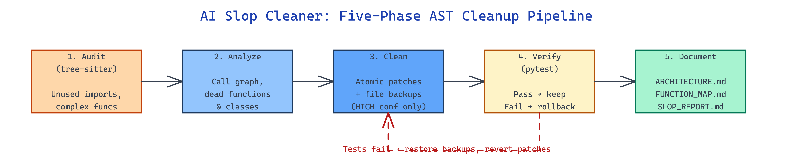

# AI Slop Cleaner: AST-Powered Dead Code Removal with Test-Verified Rollback

[](https://github.com/dakshjain-1616/Ai_Slop_Cleaner)



## The Problem

> Every codebase accumulates drift — imports left behind after refactors, functions no one calls anymore, helpers that quietly doubled in complexity. Manual sweeps are tedious and regex-based cleanups delete the wrong thing and break production.

NEO built AI Slop Cleaner to detect and safely remove that drift using tree-sitter AST analysis, with an atomic patch-and-verify pipeline that rolls back automatically when tests fail.

## Five-Phase Pipeline, Tree-Sitter Throughout

**AI Slop Cleaner** ships two CLI entry points — `slop-audit` for read-only scanning and `slop-clean` for full pipeline execution. Both walk Python and TypeScript/TSX files through tree-sitter parsers rather than regex, so aliased imports, string annotations, decorators, and multi-line import blocks are all resolved against the actual syntax tree.

| Phase | Module | Responsibility |
|---|---|---|
| 1. Audit | `engines/auditor.py` | Tree-sitter parse, flag unused imports (HIGH) and complex functions (MEDIUM) |
| 2. Analyze | `engines/analyzer.py` | Build call graphs across symbols, mark dead functions and classes |
| 3. Clean | `engines/cleaner.py` | Apply HIGH-confidence patches atomically with file backups |
| 4. Verify | `engines/verifier.py` | Run pytest; rollback every change if the suite fails |
| 5. Document | `engines/documenter.py` | Emit `ARCHITECTURE.md`, `FUNCTION_MAP.md`, `SLOP_REPORT.md` |

Only HIGH-confidence changes get applied automatically. Dead functions and high-complexity hot spots are flagged in the report rather than silently deleted, so a reviewer decides.

## CLI Shape and CI Integration

```bash
# Read-only scan — exit 0 if clean, 1 if issues (CI-friendly)
slop-audit <target> [--output JSON] [--threshold N] [--verbose]

# Full pipeline with atomic patches and rollback
slop-clean <target> [--output DIR] [--threshold N] [--dry-run] [--verbose]
```

The default cyclomatic-complexity threshold is 10; pass `--threshold 12` to loosen it for legacy code. `--dry-run` prints the patch set without touching disk. Because `slop-audit` returns non-zero on any finding, dropping it into a CI step fails the build when slop lands in a PR.

```bash
git clone https://github.com/dakshjain-1616/Ai_Slop_Cleaner
cd Ai_Slop_Cleaner
python3 -m venv .venv && source .venv/bin/activate
pip install -e .

slop-audit examples/todo_app/ --verbose
slop-clean examples/todo_app/ --dry-run
slop-clean examples/todo_app/
```

## What Gets Rewritten vs. Flagged

Unused imports in `from foo import a, b, c` where only `b` is referenced get surgically rewritten to `from foo import b`. Entirely-unused multi-line import blocks are deleted as a unit. Single-line unused imports are removed outright. Across every rewrite, the cleaner writes a backup of the file first; if the post-clean pytest run reports a failure, every backup is restored, so a broken test suite is never left behind.

Flagged-but-not-auto-fixed findings (dead functions, high-complexity methods, unreferenced classes) land in `SLOP_REPORT.md` with file and line references, and the call-graph view lives in `FUNCTION_MAP.md`. Dependencies stay minimal: `tree-sitter >= 0.25`, `tree-sitter-python`, `tree-sitter-typescript`, and `rich` for the CLI output.

## How to Build This with NEO

Open NEO in VS Code or Cursor and describe what you want to build. A good starting prompt for this project:

> "Build a Python CLI called slop-cleaner with two entry points, slop-audit and slop-clean, that walks Python and TypeScript/TSX files through tree-sitter parsers. Implement a five-phase pipeline: audit (flag unused imports and functions over a cyclomatic complexity threshold), analyze (build a call graph to identify dead code), clean (apply HIGH-confidence patches atomically with per-file backups), verify (run pytest and rollback all changes if it fails), and document (emit ARCHITECTURE.md, FUNCTION_MAP.md, and SLOP_REPORT.md). Support --dry-run, --threshold, --verbose, and return non-zero exit codes when issues are found so it works in CI."

<a href="https://heyneo.com/dashboard?section=new-chat&prompt=Build%20a%20Python%20CLI%20called%20slop-cleaner%20with%20two%20entry%20points%2C%20slop-audit%20and%20slop-clean%2C%20that%20walks%20Python%20and%20TypeScript%2FTSX%20files%20through%20tree-sitter%20parsers.%20Implement%20a%20five-phase%20pipeline%3A%20audit%20%28flag%20unused%20imports%20and%20functions%20over%20a%20cyclomatic%20complexity%20threshold%29%2C%20analyze%20%28build%20a%20call%20graph%20to%20identify%20dead%20code%29%2C%20clean%20%28apply%20HIGH-confidence%20patches%20atomically%20with%20per-file%20backups%29%2C%20verify%20%28run%20pytest%20and%20rollback%20all%20changes%20if%20it%20fails%29%2C%20and%20document%20%28emit%20ARCHITECTURE.md%2C%20FUNCTION_MAP.md%2C%20and%20SLOP_REPORT.md%29.%20Support%20--dry-run%2C%20--threshold%2C%20--verbose%2C%20and%20return%20non-zero%20exit%20codes%20when%20issues%20are%20found%20so%20it%20works%20in%20CI." style="display:inline-block;background:#1e40af;color:#ffffff;padding:10px 22px;border-radius:6px;text-decoration:none;font-weight:600;font-size:14px;">Build with NEO →</a>

NEO scaffolds the parsers, the phase engines, and the CLI wiring. From there you iterate — add a Go or Rust parser, wire in coverage data to raise confidence on dead-code flags, or emit a GitHub Actions workflow that opens a cleanup PR automatically. Each turn builds on the scaffolding already in place.

To run the finished project:

```bash
git clone https://github.com/dakshjain-1616/Ai_Slop_Cleaner
cd Ai_Slop_Cleaner
python3 -m venv .venv && source .venv/bin/activate
pip install -e .
slop-clean examples/todo_app/
```

Point it at a directory and every HIGH-confidence cleanup is applied, verified, and rolled back on failure — everything else lands in the report for a human to look at.

NEO built a safe, AST-aware cleanup pass that turns periodic dead-code purges into a single command. See what else NEO ships at [heyneo.com](https://heyneo.com/).

---

## Try NEO in Your IDE

Install the NEO extension to bring AI-powered development directly into your workflow:

- **VS Code**: [NEO in VS Code](https://marketplace.visualstudio.com/items?itemName=NeoResearchInc.heyneo)
- **Cursor**: <a href="cursor://extension/NeoResearchInc.heyneo" style="color:#0066FF;font-weight:bold;">Install NEO for Cursor →</a>

---
