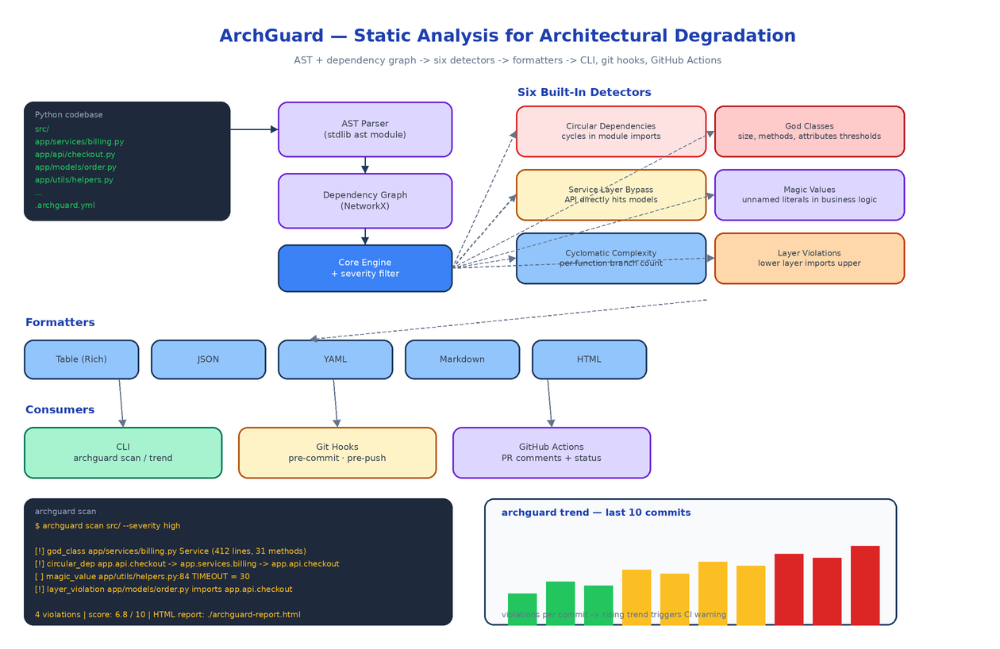

# ArchGuard: Catching Architectural Degradation Before It Becomes Technical Debt

[](https://github.com/dakshjain-1616/Arch-Guard)



## The Problem

> Nobody ships a god class on purpose. It happens one commit at a time. A method goes into a service because that is the file open in the editor. A model imports from the API layer because nothing technically stops it. Six months later the service file is 800 lines, every PR touches it, and the team starts using the phrase "we should really refactor that someday."

Linters catch style issues. Type checkers catch type issues. Neither of them catches the slow, accumulating structural rot that turns a clean codebase into one nobody wants to touch. ArchGuard is a static analysis CLI that looks for the patterns that actually predict technical debt, runs on every PR, and tells you when the trend is going the wrong way before the cleanup becomes a quarter-long project.

## What It Actually Looks For

ArchGuard ships with six detectors, each one mapped to a real failure mode that teams hit in production codebases.

**Circular dependencies.** Module A imports module B, B eventually imports A. The dependency graph contains a cycle. ArchGuard builds the import graph with NetworkX and reports every cycle it finds. Cycles are not just an aesthetic concern, they break lazy loading, make testing harder, and quietly couple things that should be independent.

**God classes.** Classes with too many methods, too many attributes, or too many lines of code. The thresholds are configurable in `.archguard.yml` so a small team can decide what "too many" means for their codebase. The default is conservative, and it catches the classic Service object that quietly absorbed business logic for two years.

**Service layer bypass.** Your API layer is supposed to call the service layer, the service layer is supposed to call the data layer. ArchGuard reads your layer configuration and flags imports that skip a layer. An API handler that imports a model directly is a violation. So is a model that reaches back up into the API.

**Magic values.** Unnamed literals embedded in business logic. `if retries > 3` looks innocent until you realise the same `3` appears in four other files and nobody knows which one is the source of truth.

**Cyclomatic complexity.** Per-function branch count. Functions with too many branches are hard to test, hard to read, and the place where edge-case bugs live.

**Layer violations.** Configurable via your project's layer definition. ArchGuard verifies that lower layers do not import upper layers, period.

Each detector returns structured findings with severity. You filter to the severity you care about right now, fix those, and let the rest sit until you have bandwidth.

## The Pipeline

ArchGuard parses every Python file with the standard library `ast` module, builds a global dependency graph with NetworkX, and hands both representations to the detectors. Detectors run independently against the same in-memory model, which keeps the analysis fast and makes it trivial to add a new detector later. Findings get collected, deduplicated, and passed to the formatter you asked for on the command line.

There are five formatters: a Rich-powered table for terminal output, JSON and YAML for downstream tooling, Markdown for PR comments, and HTML for the static report you can publish to your internal docs.

## Per-PR and Trend Modes

A single scan tells you what the codebase looks like right now. That is useful, but the more interesting question is whether things are getting better or worse.

`archguard scan` compares the current branch against the base branch and prints only the violations introduced by your PR. This is the form you wire into CI: if your branch adds a new circular dependency, the build fails. If it touches an existing god class and pushes it past the threshold, the build fails. Existing violations that you did not introduce are not your problem, and ArchGuard will not nag you about them.

`archguard trend` walks the last ten commits and produces a per-commit violation count. Look at the trend chart and you can see at a glance whether the codebase is improving or rotting. If the bars are climbing, your CI rules are not strict enough and the team is shipping debt faster than it is paying it down.

## CLI

The four commands cover the lifecycle:

```bash
archguard init                          # create .archguard.yml
archguard scan src/ --severity high     # one-shot analysis
archguard scan --base main              # compare branch against main
archguard trend --commits 10            # drift over last 10 commits
archguard config show
```

A representative violation block:

```
[!] god_class       app/services/billing.py  Service (412 lines, 31 methods)
[!] circular_dep    app.api.checkout -> app.services.billing -> app.api.checkout
[ ] magic_value     app/utils/helpers.py:84  TIMEOUT = 30
[!] layer_violation app/models/order.py imports app.api.checkout

4 violations  |  score: 6.8 / 10  |  HTML report: ./archguard-report.html
```

Severity icons follow `[!]` critical, `[*]` warning, `[ ]` informational. The composite score at the bottom is a weighted average, useful for tracking week-over-week.

## CI and Git Hooks

Two integrations come built in.

Pre-commit and pre-push hooks call `archguard scan` on the staged files only, so the commit blocks if you introduce a critical violation. The hook installer is part of the CLI: `archguard init --hooks`.

A GitHub Action runs the full scan on every PR, posts the Markdown formatter output as a sticky comment, and sets the check status. Reviewers see the architectural diff alongside the code diff, which means architectural concerns surface during review instead of three weeks later when the team notices the build slowing down.

## Configuration That Matches Your Project

The `.archguard.yml` config is the place where ArchGuard becomes opinionated about your particular codebase. You define your layers, your thresholds, the directories that should be excluded, and any detectors you do not want to run. Sensible defaults exist so you can start with `archguard init` and tune from there.

```yaml
layers:
  - name: api
    paths: [app/api/]
  - name: services
    paths: [app/services/]
  - name: models
    paths: [app/models/]
  - name: utils
    paths: [app/utils/]
  allowed_imports:
    api: [services, models, utils]
    services: [models, utils]
    models: [utils]

detectors:
  god_class:
    max_lines: 300
    max_methods: 20
  cyclomatic:
    max_complexity: 10

severity:
  fail_on: high
```

## How to Build This with NEO

Open NEO in VS Code or Cursor and describe what you want to build. A good starting prompt for this project:

> "Build a Python CLI called ArchGuard that does static analysis for architectural degradation in Python codebases. Use the stdlib ast module to parse all Python files and NetworkX to build the import dependency graph. Implement six detectors: circular dependencies (graph cycles), god classes (lines, methods, attributes thresholds), service layer bypass (imports that skip layers), magic values (unnamed literals in business logic), cyclomatic complexity (per-function branch count), and layer violations (lower layer importing upper). Implement five formatters: Rich table, JSON, YAML, Markdown, and HTML report. Add four CLI commands using Click: scan (single-pass or branch comparison), trend (analysis across the last 10 commits), init (write default .archguard.yml), and config (read or set). Wire pre-commit and pre-push git hooks via init --hooks, and ship a GitHub Action that posts the Markdown formatter output as a sticky PR comment. Make thresholds and layer definitions configurable in .archguard.yml. Use Ruff and Pyright for code quality."

<a href="https://heyneo.com/dashboard?section=new-chat&prompt=Build%20a%20Python%20CLI%20called%20ArchGuard%20that%20does%20static%20analysis%20for%20architectural%20degradation.%20Use%20the%20stdlib%20ast%20module%20and%20NetworkX%20for%20the%20import%20graph.%20Six%20detectors%3A%20circular%20deps%2C%20god%20classes%2C%20service%20layer%20bypass%2C%20magic%20values%2C%20cyclomatic%20complexity%2C%20layer%20violations.%20Five%20formatters%3A%20Rich%20table%2C%20JSON%2C%20YAML%2C%20Markdown%2C%20HTML.%20Commands%3A%20scan%2C%20trend%2C%20init%2C%20config.%20Pre-commit%20hook%20and%20GitHub%20Action%20integration.%20Config%20via%20.archguard.yml." style="display:inline-block;background:#1e40af;color:#ffffff;padding:10px 22px;border-radius:6px;text-decoration:none;font-weight:600;font-size:14px;">Build with NEO →</a>

NEO scaffolds the parser, the detectors, the formatters, the CLI surface, and the GitHub Action. From there you tune thresholds to your team's standards, add detectors for patterns specific to your codebase (a "no global state" detector, or a "no SQL in API handlers" detector), and wire it into the CI pipeline you already have.

NEO built a structural-rot scanner that runs on every PR and tells you when your architecture is drifting. See what else NEO ships at [heyneo.com](https://heyneo.com/).

---

## Try NEO in Your IDE

Install the NEO extension to bring AI-powered development directly into your workflow:

- **VS Code**: [NEO in VS Code](https://marketplace.visualstudio.com/items?itemName=NeoResearchInc.heyneo)
- **Cursor**: <a href="cursor://extension/NeoResearchInc.heyneo" style="color:#0066FF;font-weight:bold;">Install NEO for Cursor →</a>

---
