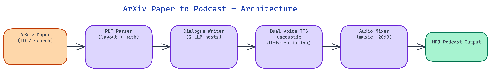

# Arxiv Paper to Podcast: ML Research You Can Listen To

## The Problem

> Machine learning research moves faster than most people can read. Hundreds of papers land on arxiv every day, and the academic writing style — dense with notation, passive voice, and field-specific jargon — makes them slow to consume even for specialists. Researchers, engineers, and enthusiasts increasingly learn on the go: during commutes, workouts, or household tasks where reading is impossible. There is no good automated way to turn a research paper into something listenable.

NEO built an end-to-end pipeline that takes an arxiv paper ID or search query, fetches the paper, uses LLMs to transform the academic text into a natural two-host podcast conversation, synthesizes speech with distinct voices, adds background music, and produces a finished MP3 episode. The result makes ML research genuinely accessible through audio without requiring any manual writing or production work.

## Fetching and Parsing Papers

The pipeline's first stage handles paper retrieval from arxiv using the official arxiv API. Users can provide a paper ID directly (e.g., `2301.07041`) or a keyword search query, which returns the top-N most recent matching papers for batch episode generation.

Once retrieved, the paper content requires careful parsing. arxiv papers are available in PDF and LaTeX source formats. NEO chose to work with the PDF layer via a structured extraction pipeline rather than raw LaTeX, because LaTeX source has inconsistent structure and many authors use custom macros that complicate parsing. The PDF extraction uses layout-aware parsing that preserves section headers, identifies and discards figure captions and reference list entries, and flags mathematical notation blocks for special handling.

Mathematical notation is a specific challenge for audio conversion. Equations that appear inline in text — `the loss is L = -log p(y|x)` — need to be either read as natural language ("the loss equals negative log probability of y given x") or briefly described and moved on from. NEO built a notation-to-speech converter that handles common ML notation patterns: summation signs, partial derivatives, argmax expressions, and Greek letter variables. For complex multi-line equations, the converter generates a simplified verbal approximation and flags it as an approximation in the transcript.

## Academic Text to Conversational Dialogue

The transformation from academic text to podcast dialogue is the most technically demanding stage of the pipeline. Academic writing is optimized for precision and verifiability — it hedges every claim, defines every term, and structures arguments for review rather than comprehension. Podcast dialogue is optimized for engagement and retention — it uses concrete examples, rhetorical questions, and conversational asides to maintain listener attention.

NEO designed a two-pass LLM transformation process. The first pass extracts the paper's core contributions — typically the problem statement, the proposed method, the key results, and the main limitations — into a structured intermediate representation. This extraction step is deliberately separate from the dialogue generation step because mixing them in a single prompt produces output that rushes through important content and over-expands on minor details.

The second pass converts the structured intermediate representation into a two-host dialogue script. The two hosts have distinct roles: Host A is the generalist who asks questions a smart non-specialist might ask, while Host B is the domain expert who provides answers and context. This dynamic naturally produces the explanatory back-and-forth that makes technical content accessible without requiring the listener to have background knowledge.

The dialogue generation prompt includes specific instructions for handling uncertainty — when the paper's claims are qualified, the host dialogue should reflect that qualification rather than presenting results as stronger than the authors intended. This is an important accuracy safeguard for scientific communication.

## Voice Synthesis and Differentiation

The two-host format requires perceptibly distinct voices to remain listenable over a 15-20 minute episode. NEO implemented voice differentiation using a combination of TTS voice selection and post-processing.

The voice selection assigns distinct TTS voice profiles to each host, choosing voices that differ in pitch range, speaking rate, and timbre. Host A uses a mid-range voice with a slightly faster speaking rate that conveys curiosity and engagement. Host B uses a deeper voice with a slightly measured pace that conveys expertise.

Post-processing adds speaker-specific acoustic fingerprints using EQ and subtle reverb settings. Host B receives a slight low-frequency emphasis that adds authority, while Host A receives a slight high-frequency boost that adds brightness and energy. These are subtle effects — the goal is to aid listener orientation without calling attention to the processing.

Dialogue transitions include synthesized non-verbal markers — brief hesitations, affirmative sounds — that make the exchange sound more like a real conversation. NEO curated a small library of these markers and inserts them probabilistically at natural conversation boundaries.

## Background Music and Episode Assembly

Background music uses the same library and selection logic as the LumosX Personalizer pipeline: an embedding-based matcher that selects tracks appropriate to the content's mood and complexity. Science and ML content tends to match best with ambient electronic or light orchestral tracks that provide energy without distraction.

The music is mixed at -20dB relative to the speech, far enough under to be imperceptible during dialogue but audible during the intro, outro, and brief musical transitions between paper sections. Section transitions use a half-second music swell — a brief volume increase — to signal the listener that a new topic is beginning, analogous to a chapter marker.

The final assembly stage stitches the per-host audio segments, inserts transition music, adds the intro and outro, and renders to MP3 at 128kbps — standard for spoken word podcast audio. Each episode includes ID3 metadata: paper title, authors, arxiv ID, and generation date. The ID3 thumbnail uses the paper's first figure if available, or a generated cover image otherwise.

## Batch Generation and Integration

For researchers who want to convert an entire reading list, NEO built a batch mode that accepts a list of arxiv IDs from a text file and generates episodes sequentially, writing each to a configurable output directory. A companion RSS feed generator produces a valid podcast feed XML from the output directory, making it straightforward to subscribe to personal arxiv-to-podcast feeds in any podcast app.

A webhook mode supports integration with arxiv mailing list notifications — when new papers arrive in configured categories, the pipeline automatically generates episodes and appends them to the feed. This creates a true "subscribe and listen" workflow for staying current with ML research without reading queues that pile up faster than you can clear them.

NEO built a complete arxiv-to-podcast pipeline that turns the fire hose of ML research into something you can actually keep up with. See what else NEO ships at [heyneo.so](https://heyneo.so/).

---

## Try NEO in Your IDE

Install the NEO extension to bring AI-powered development directly into your workflow:

- **VS Code**: [NEO in VS Code](https://marketplace.visualstudio.com/items?itemName=NeoResearchInc.heyneo)
- **Cursor**: <a href="cursor://extension/NeoResearchInc.heyneo" style="color:#0066FF;font-weight:bold;">Install NEO for Cursor →</a>

---
