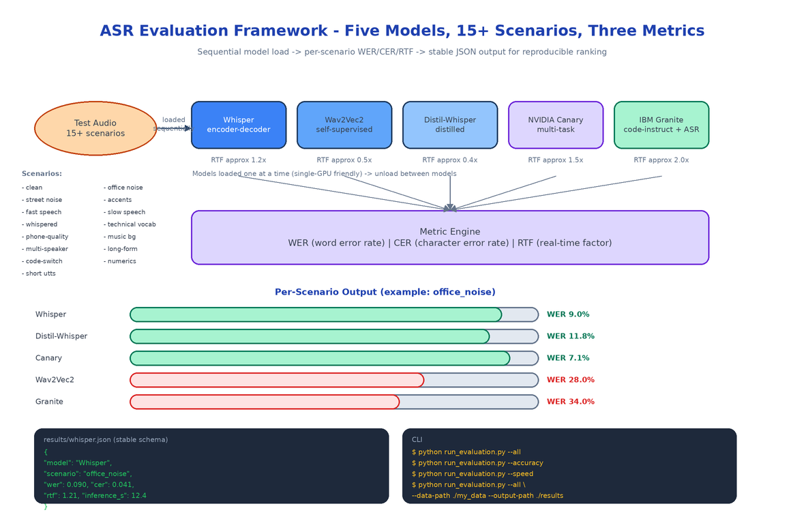

# ASR Evaluation Framework: Benchmarking Five Speech Models on Accuracy, Speed, and Robustness

[](https://github.com/dakshjain-1616/Asr-Evaluation)



## The Problem

> A product team needs to pick an ASR model. The leaderboards rank by WER on LibriSpeech, which is clean read speech with a microphone six inches from the speaker. The team's actual audio is a customer support call recorded over a phone codec with background office noise and a non-native English accent. The WER on LibriSpeech is interesting and basically irrelevant. What the team needs is a real comparison on the audio they actually have, across every model that's a candidate, on every metric that matters — and they need the comparison to be reproducible in three months when a new model ships.

The ASR Evaluation Framework is that comparison harness. Plug in your audio, point it at the five models, get a JSON report you can rank on whatever column matters for your use case.

## Five Models, Five Architectures

| Model | Architecture | RTF | Best For |
|-------|--------------|-----|----------|
| **OpenAI Whisper** | Encoder-decoder transformer | ~1.2× | General-purpose, multilingual |
| **Wav2Vec2** | Self-supervised conv | ~0.5× | Fast inference, real-time |
| **Distil-Whisper** | Distilled Whisper | ~0.4× | Edge devices, fast + accurate |
| **NVIDIA Canary** | Multi-task transformer | ~1.5× | Enterprise-grade accuracy |
| **IBM Granite** | Code-instruct LLM with ASR head | ~2.0× | Multi-task (ASR + downstream NLU) |

These five aren't an arbitrary picks. They cover the four positions on the accuracy/speed plane: fast and decent (Wav2Vec2), fast and accurate (Distil-Whisper), accurate and slow (Canary, Granite), and the well-known midpoint (Whisper). The output table makes the tradeoff visible at a glance.

## Three Metrics That Matter

**WER (Word Error Rate)**. The standard accuracy metric. Counts substitutions, deletions, and insertions per reference word. Lower is better.

**CER (Character Error Rate)**. Same idea at the character level. Useful when WER is dominated by a few proper-noun errors and you want a smoother signal.

**RTF (Real-Time Factor)**. Inference time divided by audio duration. RTF < 1.0 means the model is faster than real time and is a candidate for streaming. RTF > 1.0 means batch-only. The single most decision-relevant number after WER.

All three are reported per scenario per model, plus an aggregated row. The JSON schema is stable, so downstream analysis (a Streamlit dashboard, a CI gate, a sheet) can be written against it without breaking.

## 15+ Robustness Scenarios

Accuracy on clean speech is a starting point, not a conclusion. The framework runs each model against a battery of scenarios:

- Clean English speech (the baseline)
- Background office noise
- Background street noise
- Accented English (multiple)
- Fast speech rate
- Slow speech rate
- Whispered speech
- Technical vocabulary (medical, legal, programming)
- Phone-quality narrowband audio
- Music in the background
- Multiple speakers
- Long-form (>10 minute) audio
- Code-switching between languages
- Numbers and dates dense passages
- Short utterances (<2 seconds)

The point isn't that any one scenario will match your data exactly. The point is that the per-scenario breakdown shows you the model's *failure mode shape* — and the model whose shape best matches your data's adversities is the right pick, even if it isn't the highest WER on the clean baseline.

## Running an Evaluation

```bash
python run_evaluation.py --all                      # accuracy + speed across all models
python run_evaluation.py --accuracy                 # WER/CER only, skip speed
python run_evaluation.py --speed                    # RTF + inference time, skip accuracy
python run_evaluation.py --all \
    --data-path ./my_data \
    --output-path ./my_results
```

Each model loads once, runs against every scenario, and unloads before the next model loads. This matters on a single-GPU box where loading two large models at once would OOM. The framework handles the lifecycle so you don't.

Output lands in `results/` as a JSON file per model plus an aggregated summary. The schema is stable across runs, so a six-month-old result and a fresh one are directly comparable.

## How to Build This with NEO

Open NEO in VS Code or Cursor:

> "Build a benchmarking framework for automatic speech recognition models. Support five models: OpenAI Whisper, Wav2Vec2, Distil-Whisper, NVIDIA Canary, and IBM Granite. Load each model in sequence (not in parallel) to fit on a single GPU. Run each model across 15+ scenarios including clean speech, background noise (office, street), accented English, fast/slow speech, whispered, technical vocabulary, phone-quality narrowband, music background, multi-speaker, long-form, code-switching, dense numerics, and short utterances. Compute WER, CER, and Real-Time Factor (inference_time / audio_duration). Output a JSON schema with per-scenario per-model results plus an aggregated summary. Provide CLI flags --accuracy, --speed, --all, plus --data-path and --output-path."

<a href="https://heyneo.com/dashboard?section=new-chat&prompt=Build%20an%20ASR%20benchmarking%20framework%20comparing%20Whisper%2C%20Wav2Vec2%2C%20Distil-Whisper%2C%20NVIDIA%20Canary%2C%20and%20IBM%20Granite%20across%2015%2B%20scenarios%20(clean%2C%20noise%2C%20accents%2C%20phone-quality%2C%20technical%20vocab%2C%20etc).%20Report%20WER%2C%20CER%2C%20and%20RTF%20with%20a%20stable%20JSON%20schema%20and%20--accuracy%2F--speed%2F--all%20flags." style="display:inline-block;background:#1e40af;color:#ffffff;padding:10px 22px;border-radius:6px;text-decoration:none;font-weight:600;font-size:14px;">Build with NEO →</a>

NEO scaffolds the per-model adapter classes, the scenario runner, the metric engine (WER, CER, RTF), and the JSON result schema. From there you swap in your own audio data, add a model that isn't in the default five, or wire the JSON output into whatever dashboard your team prefers.

```bash
git clone https://github.com/dakshjain-1616/Asr-Evaluation
cd Asr-Evaluation
python3 -m venv venv && source venv/bin/activate
pip install -r requirements.txt

python run_evaluation.py --all
```

NEO built a reproducible ASR comparison that lets a product team defend a model choice with numbers tied to their actual audio, not someone else's leaderboard. See what else NEO ships at [heyneo.com](https://heyneo.com/).

---

## Try NEO in Your IDE

Install the NEO extension to bring AI-powered development directly into your workflow:

- **VS Code**: [NEO in VS Code](https://marketplace.visualstudio.com/items?itemName=NeoResearchInc.heyneo)
- **Cursor**: <a href="cursor://extension/NeoResearchInc.heyneo" style="color:#0066FF;font-weight:bold;">Install NEO for Cursor →</a>

---
