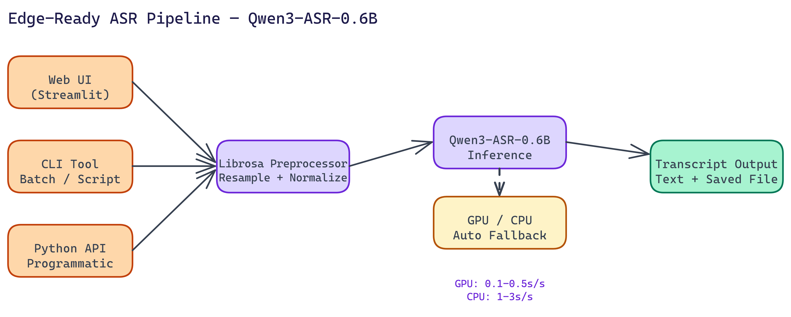

# Edge-Ready ASR: Building a Speech Recognition Pipeline with Qwen3 0.6B

[](https://github.com/dakshjain-1616/ASR-pipeline-using-Qwen3-ASR-0.6B---BY-NEO)



## The Problem

> Full-size automatic speech recognition models are not always practical. A 1B+ parameter model may run fine on a cloud server with dedicated GPU capacity, but deploy it to an edge device or a resource-constrained environment and you run into problems fast. The memory footprint alone rules it out for many real deployments — healthcare devices, legal recording hardware, mobile applications all need on-device transcription without cloud dependency.

NEO autonomously built an ASR pipeline around Qwen3-ASR-0.6B, a **0.6 billion parameter** model that requires only about **3GB of storage**. It transcribes speech accurately, handles multiple audio formats, and runs on GPU or CPU depending on what is available. NEO wrapped it in three different interfaces so it fits however you want to use it.

## Why 0.6B Parameters Is a Feature, Not a Compromise

The instinct when picking a model is to reach for the largest one available. More parameters means better performance, right? Usually. But the tradeoff is real.

A 0.6B model fits into memory on devices where a 7B or 13B model simply cannot run. It loads faster. It costs less per inference. And for speech recognition specifically, where the task is well-defined and the input is structured audio rather than open-ended text generation, a smaller well-trained model can match a much larger general model on the transcription task.

The Qwen3-ASR-0.6B model was designed for this. NEO built the surrounding pipeline to make it production-deployable.

## The Pipeline Architecture

### Audio Preprocessing

Audio input goes through librosa before reaching the model. Librosa handles format normalization, resampling, and the preprocessing steps that convert raw audio into the tensor representation the model expects. Supporting multiple audio formats is handled at this layer, so users do not need to convert files before submitting them.

### Inference

The model runs on GPU when available, with automatic fallback to CPU. Performance varies accordingly:

- **GPU:** roughly 0.1 to 0.5 seconds per second of audio
- **CPU:** roughly 1 to 3 seconds per second of audio

For a 60-second voice note, GPU processing finishes in under 30 seconds. CPU takes one to three minutes. Both are acceptable for non-real-time transcription workflows.

### Three Interface Options

NEO built three ways to interact with the pipeline because different use cases genuinely need different interfaces.

**Web Interface (Streamlit):** Browser-based recording and file upload. Transcriptions are saved automatically. This is the right choice for non-technical users or for demos. One important design decision: audio recording happens in the browser, which means no server-side audio hardware requirements. You can deploy this on a headless server and users record from their own devices.

**CLI Tool:** Command-line interface with flags for custom output directories and device selection. This fits naturally into scripting workflows, batch processing pipelines, and server environments where you want to transcribe a folder of files programmatically.

**Python API:** Direct programmatic access for integration into larger applications. If you are building a document processing pipeline that needs transcription as one step, the Python API is how you wire it in.

## Real-World Use Cases

Medical documentation is one of the clearest applications. Clinicians dictate notes, the pipeline transcribes them, and a downstream system formats or summarizes the content. The accuracy requirements are high, but the vocabulary is specialized enough that a well-tuned smaller model handles it well.

Podcast and video transcription is another strong fit. Content creators need transcripts for SEO, accessibility, and repurposing. Running transcription locally means no per-minute API costs and no data leaving your environment.

Legal transcription has similar requirements to medical: high accuracy, sensitive content, and a strong preference for on-premises processing rather than cloud services.

The edge deployment story is relevant across all of these. Healthcare devices, legal recording hardware, mobile applications. Anywhere you cannot guarantee a fast connection to a cloud inference endpoint, a model that runs locally is the right architecture.

## Storage and Deployment

The full pipeline requires approximately 3GB of storage for the model weights. That is deployable on laptops, embedded systems, and edge servers that would reject a full-size ASR model.

GPU acceleration is optional. The pipeline degrades gracefully to CPU when no GPU is present, which broadens the hardware it can run on significantly.

## Extending the Pipeline

The architecture is modular enough to extend. Speaker identification, real-time streaming transcription, additional language support, noise reduction preprocessing, automatic subtitle generation. These are all buildable on top of the existing pipeline structure.

## Watch It in Action

NEO recorded a live demo of the ASR pipeline transcribing audio through the Streamlit interface and the CLI. Seeing the 0.6B model run on CPU makes the edge deployment story concrete.

[](https://youtu.be/Fn-jEt5wLmw)

## How to Build This with NEO

Open NEO in VS Code or Cursor and describe what you want to build. A good starting prompt for this project:

> "Build a speech recognition pipeline in Python using the Qwen3-ASR-0.6B model from HuggingFace. Use librosa for audio preprocessing and format normalization before inference. Support GPU with automatic CPU fallback. Expose three interfaces: a Streamlit web app where users record audio in the browser or upload files and see the transcript, a CLI tool with flags for output directory and device selection, and a Python API for programmatic integration. The model should download automatically on first use and the pipeline should handle WAV, MP3, and other common formats."

<a href="https://heyneo.so/dashboard?section=new-chat&prompt=Build%20a%20speech%20recognition%20pipeline%20in%20Python%20using%20the%20Qwen3-ASR-0.6B%20model%20from%20HuggingFace.%20Use%20librosa%20for%20audio%20preprocessing%20and%20format%20normalization%20before%20inference.%20Support%20GPU%20with%20automatic%20CPU%20fallback.%20Expose%20three%20interfaces%3A%20a%20Streamlit%20web%20app%20where%20users%20record%20audio%20in%20the%20browser%20or%20upload%20files%20and%20see%20the%20transcript%2C%20a%20CLI%20tool%20with%20flags%20for%20output%20directory%20and%20device%20selection%2C%20and%20a%20Python%20API%20for%20programmatic%20integration.%20The%20model%20should%20download%20automatically%20on%20first%20use%20and%20the%20pipeline%20should%20handle%20WAV%2C%20MP3%2C%20and%20other%20common%20formats." style="display:inline-block;background:#1e40af;color:#ffffff;padding:10px 22px;border-radius:6px;text-decoration:none;font-weight:600;font-size:14px;">Build with NEO →</a>

NEO generates the project structure and core implementation from that. From there you iterate — ask it to add the browser-based recording component to the Streamlit interface so no server-side audio hardware is needed, implement the `--output-dir` flag and batch file processing in the CLI, or add GPU/CPU performance benchmarking output to the transcript result. Each request builds on what's already there without re-explaining the context.

To run the finished project:

```bash
git clone https://github.com/dakshjain-1616/ASR-pipeline-using-Qwen3-ASR-0.6B---BY-NEO.git
cd ASR-pipeline-using-Qwen3-ASR-0.6B---BY-NEO
pip install -r requirements.txt
streamlit run streamlit_app.py
```

Open `http://localhost:8501`, record or upload an audio file, and the transcript appears below. For CLI use, run `python cli.py --audio path/to/audio.wav` and the transcript prints to stdout.

NEO built an edge-ready speech recognition pipeline where accurate transcription with a 0.6B model runs on-device without cloud dependency, not as a compromise but as a deliberate architecture choice. See what else NEO ships at [heyneo.so](https://heyneo.so/).

---

## Try NEO in Your IDE

Install the NEO extension to bring AI-powered development directly into your workflow:

- **VS Code**: [NEO in VS Code](https://marketplace.visualstudio.com/items?itemName=NeoResearchInc.heyneo)
- **Cursor**: <a href="cursor://extension/NeoResearchInc.heyneo" style="color:#0066FF;font-weight:bold;">Install NEO for Cursor →</a>

---
