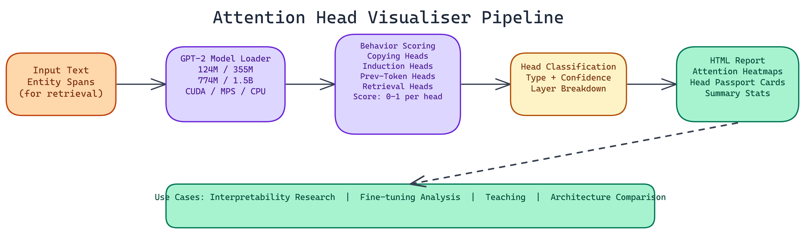

# Attention Head Visualiser: Mapping What Each Head in GPT-2 Actually Does

[](https://github.com/dakshjain-1616/Attention-Head-Visualiser)



## The Problem

> Transformer models are full of attention heads, and most of them don't get studied individually. The default assumption is that they collectively handle something useful, but identifying what specific heads are doing requires careful analysis that most teams skip. Without this understanding, diagnosing unexpected model behavior, improving task-specific performance, or explaining model decisions becomes guesswork.

NEO autonomously built the Attention Head Visualiser to automate that analysis for GPT-2 models. It classifies every head into one of four behavior types, scores each head's confidence in that classification, and produces interactive reports you can explore without writing any code.

## Four Head Behaviors

The classification scheme covers the four attention head behaviors that recur across transformer models and have the clearest interpretive significance.

**Copying heads** reproduce identical tokens from earlier in the sequence. They attend to exact matches and propagate those values forward. These show up reliably across model sizes and are often among the first heads to form stable behavior patterns during training.

**Induction heads** complete repeated patterns. If a sequence contains "A B ... A", an induction head attends to the position after the earlier "A" and predicts "B". This is one of the most studied mechanisms in mechanistic interpretability because induction heads appear to be central to in-context learning behavior in language models.

**Previous token heads** attend consistently to the token immediately preceding the current position. They're simpler than induction heads but appear frequently and play a role in local syntactic processing.

**Retrieval heads** pull factual associations from earlier context. Given a sequence mentioning an entity, a retrieval head attends back to positions where relevant attributes of that entity appeared. These are particularly interesting for understanding how models handle factual recall tasks.

## How the Classification Works

The tool runs each head through a set of vectorized scoring functions, one per behavior type. Each function calculates a score between 0 and 1 reflecting how consistently the head exhibits the target behavior across the input text.

For induction heads, this means measuring how often the head attends to the token following the previous occurrence of the current token. For previous token heads, it's measuring how often the maximum attention weight falls on position i-1. For retrieval heads, the tool requires you to specify entity spans so it can check whether attention flows toward those spans when related tokens appear.

Scoring is vectorized and runs fast. Load time for the small GPT-2 variant is around **2 seconds** on GPU. Even the 1.5B parameter variant loads in **under 20 seconds**. The scoring computation itself adds **less than 8 seconds** regardless of model size.

## Supported Models

The tool supports four GPT-2 variants: the base **124M** parameter model, the medium **355M**, the large **774M**, and the XL at **1.5B** parameters. Device detection is automatic. It will use CUDA if available, Apple Silicon MPS on compatible Macs, and fall back to CPU. The CPU path is slower but produces the same results.

## Interactive Reports

The output is an HTML report that you open in any browser. Three components make up the visualization layer.

**Heatmaps** show attention weight distributions for each head across the input text. You can see which positions each head attends to and how that pattern changes across tokens.

**Head passport cards** provide a summary view for each head: its classified behavior type, its confidence score, and a compact visualization of its attention pattern. The passport format makes it easy to scan across all heads and identify the ones worth investigating further.

**Summary statistics** give you aggregate counts by behavior type, distribution of confidence scores, and layer-level breakdowns showing which layers contain the most heads of each type.

## Practical Uses

**Model interpretability research.** If you're trying to understand why a model produces a specific output, knowing which heads are responsible for copying, pattern completion, or factual retrieval gives you a starting point for causal tracing.

**Fine-tuning analysis.** Running the probe before and after fine-tuning shows how head behaviors shift. If induction head counts drop significantly after fine-tuning on a narrow task, that's a signal the model may have lost general in-context learning capability.

**Teaching.** The interactive reports are well-suited for explaining attention mechanisms to people who learn better from visual examples than from equations.

**Architecture comparison.** The tool's design makes it straightforward to compare head behavior distributions across model sizes. The 124M and 1.5B variants of GPT-2 have different head behavior profiles, and the visualiser makes those differences tangible.

## Running the Analysis

The CLI accepts arguments for the input text, which behavior types to score, entity spans for retrieval head detection, output format, and scoring thresholds. A basic run is a single command with your input text and an output path. The report generates in the same directory.

The six-module codebase covers model loading, behavior scoring, visualization generation, report assembly, CLI handling, and shared utilities. Each module is independently testable, which makes it straightforward to add new behavior types or modify the scoring logic for specific research questions.

## Understanding Attention Heads Changes How You Build Models

Most people who use transformer models treat the attention mechanism as a black box. That's fine for many applications. But when you need to diagnose unexpected behavior, improve performance on specific task types, or explain model decisions to stakeholders, knowing what the individual heads are doing is genuinely useful.

## How to Build This with NEO

Open NEO in VS Code or Cursor and describe what you want to build. A good starting prompt for this project:

> "Build a GPT-2 attention head analysis tool in Python using PyTorch and HuggingFace transformers. For each attention head across all layers, run vectorized scoring functions to classify it as a copying head, induction head, previous-token head, or retrieval head — with a confidence score between 0 and 1. Support all four GPT-2 variants (124M to 1.5B) and auto-detect CUDA, MPS, or CPU. Generate an interactive HTML report with per-head heatmaps, head passport cards showing behavior type and confidence, and layer-level summary statistics. Expose a CLI with flags for input text, model size, behavior filter, entity spans for retrieval detection, and top-k output limiting."

<a href="https://heyneo.so/dashboard?section=new-chat&prompt=Build%20a%20GPT-2%20attention%20head%20analysis%20tool%20in%20Python%20using%20PyTorch%20and%20HuggingFace%20transformers.%20For%20each%20attention%20head%20across%20all%20layers%2C%20run%20vectorized%20scoring%20functions%20to%20classify%20it%20as%20a%20copying%20head%2C%20induction%20head%2C%20previous-token%20head%2C%20or%20retrieval%20head%20%E2%80%94%20with%20a%20confidence%20score%20between%200%20and%201.%20Support%20all%20four%20GPT-2%20variants%20%28124M%20to%201.5B%29%20and%20auto-detect%20CUDA%2C%20MPS%2C%20or%20CPU.%20Generate%20an%20interactive%20HTML%20report%20with%20per-head%20heatmaps%2C%20head%20passport%20cards%20showing%20behavior%20type%20and%20confidence%2C%20and%20layer-level%20summary%20statistics.%20Expose%20a%20CLI%20with%20flags%20for%20input%20text%2C%20model%20size%2C%20behavior%20filter%2C%20entity%20spans%20for%20retrieval%20detection%2C%20and%20top-k%20output%20limiting." style="display:inline-block;background:#1e40af;color:#ffffff;padding:10px 22px;border-radius:6px;text-decoration:none;font-weight:600;font-size:14px;">Build with NEO →</a>

NEO generates the project structure and core implementation from that. From there you iterate — ask it to implement the induction head scoring function that measures how often a head attends to the token following the previous occurrence of the current token, build out the head passport card layout with compact attention pattern thumbnails, or add a before/after comparison mode for analyzing fine-tuning effects on head behavior distributions. Each request builds on what's already there without re-explaining the context.

To run the finished project:

```bash
git clone https://github.com/dakshjain-1616/Attention-Head-Visualiser.git
cd Attention-Head-Visualiser
pip install -r requirements.txt
python attn_probe.py --text "The Eiffel Tower is in Paris" --model gpt2-medium --output report.html
```

Open `report.html` in any browser to see heatmaps for every head, behavior classifications with confidence scores, and layer-level summary statistics.

NEO built an attention head visualiser where every GPT-2 head is automatically classified into copying, induction, previous-token, or retrieval behavior—making transformer internals inspectable, not opaque. See what else NEO ships at [heyneo.so](https://heyneo.so/).

---

## Try NEO in Your IDE

Install the NEO extension to bring AI-powered development directly into your workflow:

- **VS Code**: [NEO in VS Code](https://marketplace.visualstudio.com/items?itemName=NeoResearchInc.heyneo)
- **Cursor**: <a href="cursor://extension/NeoResearchInc.heyneo" style="color:#0066FF;font-weight:bold;">Install NEO for Cursor →</a>

---
