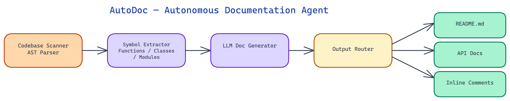

# AutoDoc: An Autonomous Agent That Reads Your Codebase and Writes the Docs

[](https://github.com/dakshjain-1616/AutoDoc---Autonomous-Documentation-Agent)



## The Problem

> Documentation is the part of software development that almost everyone agrees is important and almost no one has time to do well. The gap between "the code works" and "someone new can use this code" is documentation — and that gap costs teams far more in onboarding time, support burden, and maintenance overhead than the time it would have taken to write the docs in the first place. The problem isn't that engineers don't value documentation; it's that writing it is tedious, it goes stale, and there's always something more pressing.

NEO built AutoDoc to close that gap autonomously. The agent reads a codebase, builds a structural understanding of what it does and how it works, and produces documentation artifacts — README files, API reference docs, and inline comments — without requiring manual effort for each.

## How the Agent Explores a Codebase

AutoDoc operates as an autonomous agent rather than a simple static analysis tool. The distinction matters. A static analysis tool extracts structure mechanically — function signatures, class definitions, call graphs. An agent makes decisions about what to read next, what questions to ask about the code, and how to synthesize understanding across multiple files.

The agent begins with an entry-point discovery pass: it identifies the repository structure, finds configuration files, locates test files (which are often the best documentation of intended behavior), and identifies the primary entry points. This gives it a map before it starts reading in detail.

The detail pass works through the codebase in dependency order. The agent reads modules that are widely imported before modules that depend on them, building up a model of core abstractions before reading code that uses those abstractions. When it encounters a function call or class instantiation it hasn't seen yet, it follows the reference and reads the source, much like a human engineer would when exploring an unfamiliar codebase.

As it reads, the agent maintains a working model of the codebase: what each module does, how the major components relate to each other, what the data flows look like, and what assumptions are embedded in the code. This working model is what gets translated into documentation.

## Understanding Code Structure Beyond Signatures

Function signatures tell you what a function takes and returns. They don't tell you why it exists, what problem it solves, what the common usage patterns are, or what the gotchas are. AutoDoc goes beyond signature extraction to produce documentation that's actually useful.

For each function, the agent identifies: the purpose (inferred from the function name, its position in the call graph, and its implementation), the parameters with their roles (not just types but what they control), the return value and what conditions affect it, and any side effects or state mutations that aren't obvious from the signature.

For classes, the agent documents: the abstraction the class represents, the lifecycle of instances, which methods are part of the public interface versus implementation details, and how the class relates to other classes in the hierarchy.

For modules, the agent produces summaries that describe the module's role in the broader system — the kind of description you'd want at the top of a file to orient a new reader.

This level of understanding requires reading the implementation, not just the interface. AutoDoc reads implementations to extract information that can't be inferred from signatures alone.

## The Three Documentation Artifacts

**README generation** produces a project-level document that covers: what the project does (in plain language), how to install and configure it, basic usage examples, description of major components, and a quick-start guide. The agent infers examples from test files and usage patterns in the existing code, so examples are grounded in how the code is actually used rather than invented.

**API documentation** covers every public function and class with full parameter documentation, usage examples, and return value descriptions. The format is configurable — the agent can produce Markdown, RST for Sphinx, or JSDoc-style comments depending on the target format. For REST APIs, it produces OpenAPI-compatible descriptions when it can identify route handlers and their schemas.

**Inline comment generation** adds docstrings and comments to functions and modules that lack them, and improves or expands existing comments that are minimal or outdated. The agent is conservative here — it won't overwrite detailed existing comments, but it will add where nothing exists and expand where comments are present but thin.

## Handling Stale Documentation

One of the persistent problems with documentation is that it goes stale. Code changes; documentation doesn't always keep up. AutoDoc addresses this with a diff-aware mode: when run in a repository with git history, it can identify which functions and modules have changed since documentation was last updated and regenerate documentation only for those components.

This makes AutoDoc usable as a CI/CD component. After each pull request merge, run AutoDoc in diff-aware mode and open a PR with updated documentation for any components that changed. This keeps documentation continuously synchronized with code changes without requiring manual documentation updates in every PR.

The agent also flags potential documentation staleness: when it encounters inline comments that describe behavior that doesn't match the current implementation, it surfaces these as documentation debt items in a separate report.

## Quality and Accuracy

Generated documentation is only useful if it's accurate. AutoDoc uses several mechanisms to improve accuracy.

Test-grounded examples: when the codebase has tests, the agent uses test cases as the basis for usage examples in documentation. This guarantees that examples are runnable and that they reflect actual intended usage.

Implementation consistency checking: after generating documentation for a function, the agent performs a consistency check — does the generated description accurately reflect what the code actually does? This catches cases where naming or context is misleading about actual behavior.

Confidence scoring: each generated documentation element gets a confidence score reflecting how much information the agent could infer. Low-confidence items are flagged for human review rather than silently included. This gives engineers a prioritized review list rather than requiring full review of all generated content.

AutoDoc doesn't replace engineering judgment — it handles the tedious mechanical parts of documentation and flags the areas where human input is most needed.

## How to Build This with NEO

Open NEO in VS Code or Cursor and describe what you want to build. A good starting prompt for this project:

> "Build an autonomous documentation agent in Python that analyzes a source directory and generates README files, API reference docs, and inline docstrings. The agent should do an entry-point discovery pass first, then read files in dependency order — widely imported modules before their dependents. For each function document purpose, parameter roles, return value conditions, and side effects inferred from the implementation. Use test files as the basis for usage examples. Add a diff-aware mode that uses git history to only regenerate docs for components changed since the last run. Support Python, JavaScript, TypeScript, and Go with language-appropriate output formats."

<a href="https://heyneo.so/dashboard?section=new-chat&prompt=Build%20an%20autonomous%20documentation%20agent%20in%20Python%20that%20analyzes%20a%20source%20directory%20and%20generates%20README%20files%2C%20API%20reference%20docs%2C%20and%20inline%20docstrings.%20The%20agent%20should%20do%20an%20entry-point%20discovery%20pass%20first%2C%20then%20read%20files%20in%20dependency%20order%20%E2%80%94%20widely%20imported%20modules%20before%20their%20dependents.%20For%20each%20function%20document%20purpose%2C%20parameter%20roles%2C%20return%20value%20conditions%2C%20and%20side%20effects%20inferred%20from%20the%20implementation.%20Use%20test%20files%20as%20the%20basis%20for%20usage%20examples.%20Add%20a%20diff-aware%20mode%20that%20uses%20git%20history%20to%20only%20regenerate%20docs%20for%20components%20changed%20since%20the%20last%20run.%20Support%20Python%2C%20JavaScript%2C%20TypeScript%2C%20and%20Go%20with%20language-appropriate%20output%20formats." style="display:inline-block;background:#1e40af;color:#ffffff;padding:10px 22px;border-radius:6px;text-decoration:none;font-weight:600;font-size:14px;">Build with NEO →</a>

NEO generates the project structure and core implementation from that. From there you iterate — ask it to add the confidence scoring system that flags low-confidence generated docs for human review, implement the implementation consistency checker that verifies generated descriptions match the actual code behavior, or build out the dry-run mode that previews changes without writing any files. Each request builds on what's already there without re-explaining the context.

To run the finished project:

```bash
git clone https://github.com/dakshjain-1616/AutoDoc---Autonomous-Documentation-Agent.git
cd AutoDoc---Autonomous-Documentation-Agent
pip install requests
python3 autodoc.py ./trial
```

AutoDoc scans the directory, reads files in dependency order, and writes docstrings and module summaries. Use `--dry-run` to preview output without modifying any files, or point it at your own codebase with `python3 autodoc.py ./src`.

NEO built an autonomous documentation agent that treats documentation as a first-class engineering artifact, generated continuously and kept synchronized with code. See what else NEO ships at [heyneo.so](https://heyneo.so/).

---

## Try NEO in Your IDE

Install the NEO extension to bring AI-powered development directly into your workflow:

- **VS Code**: [NEO in VS Code](https://marketplace.visualstudio.com/items?itemName=NeoResearchInc.heyneo)
- **Cursor**: <a href="cursor://extension/NeoResearchInc.heyneo" style="color:#0066FF;font-weight:bold;">Install NEO for Cursor →</a>

---
