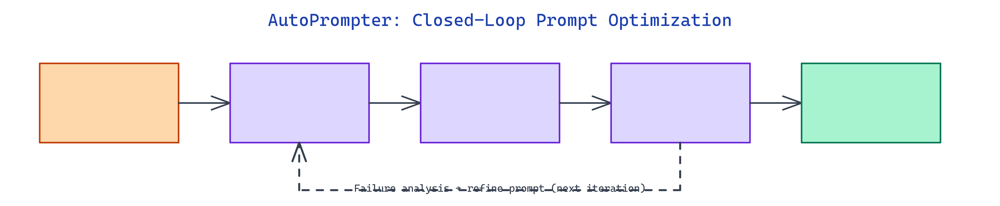

# AutoPrompter: Closed-Loop Autonomous Prompt Optimization

[](https://github.com/gauravvij/autoprompter)



## The Problem

> Writing a good LLM prompt is mostly trial and error. You test a few examples, tweak wording, and ship something that looks reasonable. But there is no systematic feedback loop. Failures are not analyzed. Improvements are not measured. The process does not scale.

NEO built AutoPrompter to close that loop: a system that generates test data, measures prompt performance, analyzes failures, and produces a refined prompt, all without human intervention between iterations.

## Dual-Model Architecture

AutoPrompter separates two concerns into two models. The **Optimizer LLM** (Gemini 3.1 Flash Lite Preview by default) acts as the meta-learner. It writes prompts, generates synthetic test datasets, and reads failure cases to reason about what went wrong. The **Target LLM** (Qwen 3.5 9b by default) is the model being improved. It executes against each prompt under test conditions and gets scored.

This separation matters. You do not want the same model optimizing and evaluating itself. The Optimizer runs at higher temperature (0.7) to produce diverse prompt candidates. The Target runs at low temperature (0.1) to keep outputs deterministic for reliable scoring.

The two models communicate indirectly through the experiment loop. The Optimizer never sees the Target's raw outputs directly — it sees structured failure summaries, which keeps the feedback signal clean and compression manageable.

## The Optimization Loop

Each iteration follows four steps.

The Optimizer generates a synthetic dataset of input examples based on the task description. For a sentiment classification task, that means generating text samples that cover edge cases, ambiguous cases, and common patterns. These are written to `generated_dataset.json`.

The Target LLM runs against every example in the batch using the current prompt. Results are scored against the configured metric. For classification tasks, that is **accuracy**. For open-ended generation, **semantic similarity** using sentence-transformer embeddings from `scikit-learn` and `sentence-transformers`.

The scoring engine computes a batch score. If the score crosses the `convergence_threshold` (default 0.95) or improvement over the previous iteration falls below `min_improvement` (0.01), the loop stops. Otherwise, failures are collected and passed back to the Optimizer with instructions to generate a better prompt.

The Optimizer analyzes the failures and writes a new prompt. That prompt becomes the input to the next iteration.

## Experiment Ledger

Every iteration is written to a persistent **experiment ledger** (`experiment_ledger.json`). The ledger stores the prompt text, the dataset used, the score achieved, and a timestamp. Before starting any new iteration, the system checks the ledger to avoid re-running experiments already completed in a prior session.

The ledger also solves a context window problem. After enough iterations, passing full experiment history to the Optimizer would exceed token limits. AutoPrompter uses `max_experiments_in_context` (default 20) and `compression_threshold` (default 50) to control how much history is kept in the prompt context. Older experiments are summarized rather than included verbatim.

## YAML Configuration

All parameters are controlled through YAML configuration files. The default `config.yaml` sets up a sentiment classification task, but the repository includes pre-configured files for blogging, mathematical problem-solving, and logical reasoning tasks.

```yaml
experiment:
  max_iterations: 10
  convergence_threshold: 0.95
  min_improvement: 0.01
  batch_size: 50

metric:
  type: "accuracy"
  target_score: 0.95
```

Runtime overrides work without editing files:

```bash
python main.py --config config.yaml --max-iterations 5 --override experiment.batch_size=20
```

The `--override` flag accepts `key=value` pairs with automatic type detection. Pass an integer string and it is stored as an integer. Pass `true` and it becomes a boolean.

## Backend Options

AutoPrompter supports three inference backends configured per model block in the YAML file. **OpenRouter** routes to cloud-hosted models via API key. **Ollama** runs models locally through a local server endpoint. **llama.cpp** connects to a locally compiled inference server. Switching backends requires only changing `api_base` in the config, not touching any code.

## How to Build This with NEO

Open NEO in VS Code or Cursor and describe what you want to build. A good starting prompt for this project:

> "Build a closed-loop prompt optimization system in Python. Use two LLMs: an Optimizer LLM that writes prompts and analyzes failures, and a Target LLM that executes prompts against synthetic test datasets. Score results with accuracy or semantic similarity metrics. Store every iteration in a persistent JSON ledger to avoid re-running experiments. Support YAML config files with CLI overrides and multiple inference backends including OpenRouter, Ollama, and llama.cpp."

<a href="https://heyneo.so/dashboard?section=new-chat&prompt=Build%20a%20closed-loop%20prompt%20optimization%20system%20in%20Python.%20Use%20two%20LLMs%3A%20an%20Optimizer%20LLM%20that%20writes%20prompts%20and%20analyzes%20failures%2C%20and%20a%20Target%20LLM%20that%20executes%20prompts%20against%20synthetic%20test%20datasets.%20Score%20results%20with%20accuracy%20or%20semantic%20similarity%20metrics.%20Store%20every%20iteration%20in%20a%20persistent%20JSON%20ledger%20to%20avoid%20re-running%20experiments.%20Support%20YAML%20config%20files%20with%20CLI%20overrides%20and%20multiple%20inference%20backends%20including%20OpenRouter%2C%20Ollama%2C%20and%20llama.cpp." style="display:inline-block;background:#1e40af;color:#ffffff;padding:10px 22px;border-radius:6px;text-decoration:none;font-weight:600;font-size:14px;">Build with NEO →</a>

NEO generates the project structure and core implementation. From there you iterate — ask it to add support for custom evaluation metrics, build a results dashboard that visualizes score progression across iterations, or extend the ledger with deduplication logic that detects semantically similar prompts already tested. Each request builds on what's already there.

To run the finished project:

```bash
git clone https://github.com/gauravvij/autoprompter
cd autoprompter
pip install -r requirements.txt
python main.py --config config.yaml
```

The system prints a configuration summary on startup, runs up to 10 optimization iterations, and produces a final report showing score progression and the best prompt found. Swap in your own task description and initial prompt in `config.yaml` to optimize prompts for any classification or generation task.

NEO built a closed-loop autonomous prompt optimizer where an Optimizer LLM iteratively refines prompts for a Target LLM using synthetic datasets, structured failure analysis, and a persistent experiment ledger. See what else NEO ships at [heyneo.so](https://heyneo.so/).

---

## Try NEO in Your IDE

Install the NEO extension to bring AI-powered development directly into your workflow:

- **VS Code**: [NEO in VS Code](https://marketplace.visualstudio.com/items?itemName=NeoResearchInc.heyneo)
- **Cursor**: <a href="cursor://extension/NeoResearchInc.heyneo" style="color:#0066FF;font-weight:bold;">Install NEO for Cursor →</a>

---
