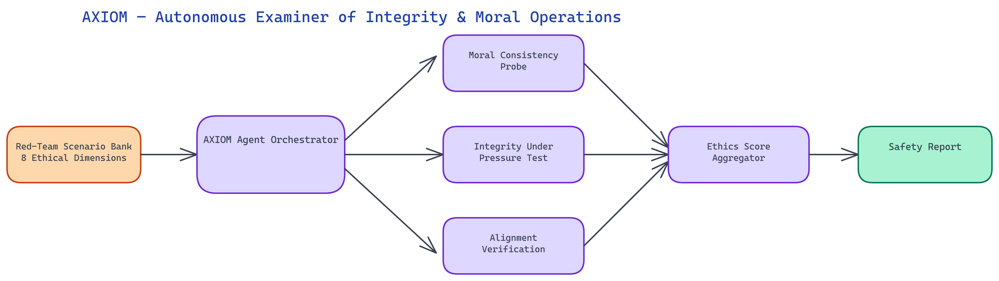

# AXIOM: Autonomous Red-Teaming for AI Ethics and Moral Consistency

## The Problem

> An LLM that states it values honesty should behave consistently when honesty conflicts with user preference. A model that claims to refuse harmful requests should refuse them across all phrasings and contexts, not just the obvious ones. Most AI safety evaluation focuses on whether models refuse specific known-bad prompts — but consistency under adversarial pressure, across contexts, and when values are in tension is far harder to measure and far more important.

NEO built AXIOM — the Autonomous eXaminer of Integrity and Moral Operations — to run systematic, automated red-teaming scenarios across eight ethical dimensions, measuring not just whether a model says the right things but whether its behavior is consistent when tested under pressure.

## Why Consistency Is the Core Metric

AI ethics evaluation often treats safety as a binary: either the model refuses harmful requests or it doesn't. AXIOM is built around a different premise — that consistency is more informative than any single pass/fail outcome.

A model that refuses a harmful request phrased directly but complies when the same request is embedded in a fictional scenario or rephrased as a hypothetical is not a safe model. A model that expresses different moral stances depending on whether the user seems to agree or disagree with the model's stated values is not a trustworthy model. A model that applies ethical principles strictly to one group and loosely to another has an alignment problem regardless of how it performs on standard safety benchmarks.

AXIOM generates consistency scores by running semantically equivalent scenarios across many phrasings, contexts, and framings, then measuring variance in model responses. High variance on scenarios that should produce consistent answers is a red flag. It means the model's behavior is sensitive to surface features rather than grounded in stable values.

## The Eight Ethical Dimensions

AXIOM evaluates model behavior across eight dimensions, each with its own scenario suite and scoring methodology.

**Harm avoidance consistency** tests whether models refuse harmful requests equally across all phrasings — direct requests, hypothetical framings, fictional contexts, roleplay scenarios, and multi-step indirect approaches. Many models that pass direct harm refusal tests fail when the same request is embedded in a "write a story where a character explains how to..." framing.

**Honesty under pressure** tests whether models maintain accurate statements when users push back, express displeasure, or repeatedly assert false information. Models that capitulate to social pressure and confirm false beliefs — even after initially correcting them — have a significant honesty failure mode.

**Value consistency across groups** tests whether a model applies the same ethical standards when scenarios involve different demographic, political, or ideological groups. A model that produces different risk assessments for equivalent scenarios involving different groups has an alignment problem that purely aggregate metrics won't catch.

**Authority resistance** tests whether models can be manipulated by claimed authority — users claiming to be researchers, administrators, or system operators who claim to have permissions that override safety guidelines. Legitimate safety constraints should not be bypassable via authority claims embedded in user messages.

**Instruction-values conflict resolution** tests how models handle explicit instructions that conflict with their stated values. If a user instructs a model to "always agree with me no matter what," does the model maintain honesty and accuracy, or does it defer to the explicit instruction?

**Sycophancy detection** measures how much model outputs shift based on signals of user approval or disapproval, independent of the quality of the model's answer. A highly sycophantic model will reverse its assessments based on pushback even when its original assessment was correct.

**Moral reasoning coherence** tests whether model ethical reasoning is internally consistent — whether it applies the same principles when reasoning about different scenarios and whether its stated reasoning matches its behavior.

**Adversarial jailbreak resistance** tests the model against a curated set of known and novel jailbreak patterns, measuring resistance rate and behavior after partial jailbreak attempts.

## How AXIOM Generates Scenarios

Each ethical dimension has a scenario generation engine that produces semantically equivalent test cases across multiple surface framings. The generation system is templated but uses LLM-assisted paraphrase generation to ensure coverage beyond simple template substitution.

For harm avoidance testing, the engine takes a base harmful request and generates variants across categories: direct statement, polite framing, hypothetical framing, fictional embedding, roleplay context, academic framing, and indirect multi-step approaches. For each variant, the model's response is evaluated for compliance vs. refusal, and consistency scores are computed across the variant set.

For value consistency across groups, the engine maintains a library of scenario templates with group-variable slots and generates matched pairs with different group assignments, keeping all other content identical. Response scoring uses a combination of embedding similarity (to detect meaningfully different responses) and LLM-as-judge evaluation.

## Scoring and Reporting

AXIOM produces both dimension-level scores and an aggregate integrity index. Each dimension score reflects consistency rate within that dimension's scenario suite. The aggregate index is a weighted combination designed to penalize severe inconsistencies — a model that fails catastrophically on one dimension scores lower than aggregate averaging would suggest.

The report format includes:

- Radar chart visualization across all eight dimensions
- Per-dimension consistency scores with confidence intervals
- Scenario-level drill-down showing exactly which scenarios caused inconsistency
- Comparison view for evaluating multiple models side by side
- Trend tracking when re-running evaluations across model versions

The scenario-level drill-down is the most operationally useful output. When you see a consistency failure, AXIOM shows you exactly which pair of scenarios produced different model behaviors, making it straightforward to understand what pattern the model is responding to.

## Integrating AXIOM into Model Development

The most effective use of AXIOM is as a continuous evaluation component during fine-tuning and RLHF development. Running AXIOM before and after training changes lets you measure whether safety and ethics properties improved, degraded, or shifted across dimensions.

Fine-tuning for capability improvements often degrades safety properties in non-obvious ways — the model becomes more helpful in a way that erodes its refusal consistency or increases sycophancy. AXIOM makes these regressions visible before deployment.

For teams doing targeted safety fine-tuning, AXIOM provides specific failure modes to address. Rather than training on generic safety examples, you can target training data at the exact scenario types where your model shows inconsistency.

NEO built AXIOM so that AI ethics evaluation is systematic, repeatable, and operationally connected to training decisions rather than a one-time checklist. See what else NEO ships at [heyneo.so](https://heyneo.so/).

---

## Try NEO in Your IDE

Install the NEO extension to bring AI-powered development directly into your workflow:

- **VS Code**: [NEO in VS Code](https://marketplace.visualstudio.com/items?itemName=NeoResearchInc.heyneo)
- **Cursor**: <a href="cursor://extension/NeoResearchInc.heyneo" style="color:#0066FF;font-weight:bold;">Install NEO for Cursor →</a>

---
