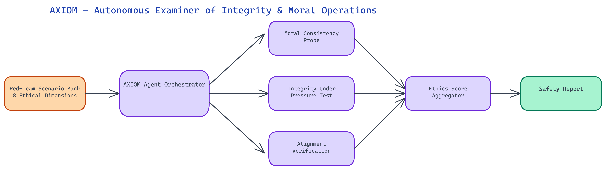

# AXIOM: Autonomous Ethics Auditor That Scans Code for Bias, Surveillance, and Compliance Violations

## The Problem

> Code carries ethical weight. Tracking systems, algorithmic bias, dark patterns, and privacy violations are often buried in implementation details that code review misses. Most teams lack systematic ways to audit these dimensions.

NEO built AXIOM to run ethical audits automatically through a five-phase pipeline: detecting ethical issues, debating tradeoffs, proposing alternatives, estimating impact, and generating compliance documentation.

## Five-Phase Audit Pipeline

**Detection Phase**: Scans code for tracking mechanisms, algorithmic bias, surveillance capabilities, and deceptive design patterns. Each finding is tagged with severity and specific code patterns.

**Debate Phase**: Runs a structured debate where one perspective argues for business utility and another argues for user rights. This surfaces real tradeoffs that a single perspective misses.

**Resolution Phase**: Proposes privacy-respecting code alternatives with tradeoff annotations explaining what functionality is preserved and what's lost.

**Impact Phase**: Estimates carbon and computational impact of original code versus proposed alternatives using complexity analysis.

**Legalization Phase**: Generates GDPR and CCPA compliance documentation plus custom terms of service clauses covering specific data practices.

## Comprehensive Ethics Reports

The audit produces a master ethics report with findings, debate summaries, refactored code samples, impact analysis, and legal documentation. Teams can accept refactored versions, cherry-pick suggestions, or use results as baseline for manual review.

## How to Build This with NEO

> "Build an autonomous ethics auditing agent that performs a five-phase pipeline on Python code: (1) Detection phase scans for tracking mechanisms, algorithmic bias, surveillance capabilities, and deceptive design patterns; (2) Debate phase weighs business utility vs. user rights through two contrasting perspectives; (3) Resolution phase proposes privacy-respecting code alternatives with tradeoff annotations; (4) Impact phase estimates carbon/computational impact using complexity analysis; (5) Legalization phase generates GDPR/CCPA compliance documentation and custom ToS clauses."

<a href="https://heyneo.com/dashboard?section=new-chat&prompt=Build%20an%20autonomous%20ethics%20auditing%20agent" style="display:inline-block;background:#1e40af;color:#ffffff;padding:10px 22px;border-radius:6px;text-decoration:none;font-weight:600;font-size:14px;">Build with NEO →</a>

NEO generates the detection rules, debate framework, code transformation logic, and documentation generator. Iterate to add domain-specific detection patterns, extend to TypeScript/JavaScript, or integrate real-time regulatory updates.

---

## Try NEO in Your IDE

- **VS Code**: [NEO in VS Code](https://marketplace.visualstudio.com/items?itemName=NeoResearchInc.heyneo)
- **Cursor**: <a href="cursor://extension/NeoResearchInc.heyneo" style="color:#0066FF;font-weight:bold;">Install NEO for Cursor →</a>
