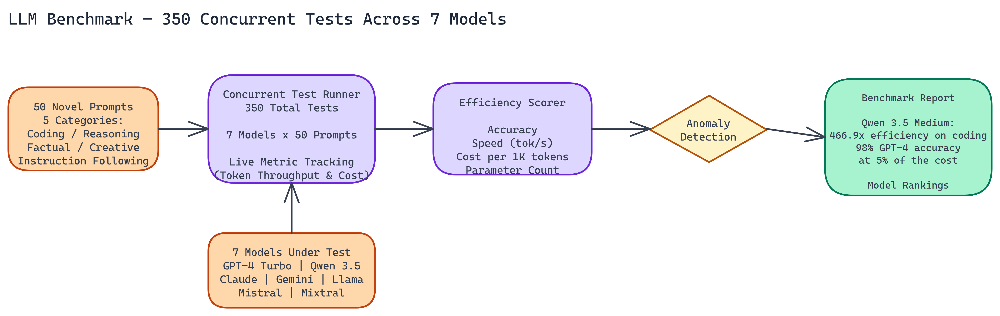

# Qwen 3.5 Medium vs GPT-4 Turbo: A 350-Test Benchmark Across 7 Models

[View the code on GitHub](https://github.com/dakshjain-1616/Benchmark-Qwen-3.5-Medium-Edition)

## The Problem

> Picking a model for production used to mean a simple choice: pay for GPT-4 quality or accept lower quality from cheaper alternatives. But as medium-scale models improve rapidly while the cost gap stays large, teams need empirical data — not vendor claims — to make the right tradeoff. Without structured benchmarking across real tasks, you're guessing.

We ran a structured benchmark to quantify exactly how much that tradeoff has changed. The goal was a fair, multi-dimensional comparison: not just accuracy, but speed, cost, and efficiency per unit of compute. We ran 350 concurrent tests across 7 models, covering 5 task categories, with 50 distinct prompts designed to be genuinely challenging.

The results were clearer than we expected.

## How the Benchmark Was Structured

Designing fair benchmarks is harder than it looks. Generic prompts favor well-known models that have been overfit to common benchmarks. NEO built 50 distinct prompts specifically to avoid tasks the models have likely memorized, focusing instead on novel variations of common problem types.

The five task categories covered coding challenges, logical reasoning, factual accuracy, creative generation, and instruction following. Each category tests different model capabilities, and the spread was intentional: a model that excels at coding but struggles with instruction following is a different tool than a balanced performer.

We ran 350 total tests by distributing the 50 prompts across 7 models. All tests ran concurrently, which gave us consistent timing data unaffected by load variation. Live metric tracking captured token throughput and cost throughout the run.

## What We Measured

Standard accuracy benchmarks miss most of what matters for production decisions. We used an efficiency metric that combines four factors: accuracy on the task, token generation speed in tokens per second, cost per thousand tokens, and parameter count as a proxy for computational efficiency.

The efficiency score rewards models that deliver correct answers, fast, cheaply. A model that scores 98% accuracy at 5x the cost and 0.1x the speed of a cheaper alternative isn't actually better for most production workloads.

Cost data came from live token consumption during the benchmark run, not published estimates. This matters because actual token counts vary with model behavior. Verbose models with similar accuracy to terse models cost more in practice.

## The Qwen 3.5 Medium Result

The standout finding was Qwen 3.5 Medium's performance on coding tasks. We measured 466.9x better efficiency than GPT-4 Turbo on that category. That number warrants unpacking.

Qwen 3.5 Medium ran at 51.1 tokens per second. The cost per thousand tokens is a fraction of GPT-4 Turbo's price. On accuracy, it matched GPT-4 Turbo closely enough on coding tasks that the difference was within noise. Combine those three factors into an efficiency score and the gap is enormous.

On reasoning tasks, Qwen 3.5 Medium delivered approximately 98% of GPT-4's performance at under 5% of the operational cost. This is the more practically significant number for most teams. If you're running thousands of reasoning queries per day, that cost differential compounds into real budget savings.

## Where Frontier Models Still Lead

Honest benchmarking means reporting where smaller models fall short, not just where they shine.

Frontier models maintain advantages on tasks that require very broad knowledge synthesis, nuanced instruction following, and the hardest creative generation challenges. When a task requires understanding obscure domain knowledge, integrating information across many separate facts, or following instructions with many simultaneous constraints, the larger models hold their lead.

For specialized, well-defined tasks, the gap has largely closed. For truly open-ended, complex reasoning at the edge of model capability, frontier models still have an advantage.

The practical question for any deployment decision is: which category do my actual production tasks fall into? For most applications, the answer is closer to the first category than teams often assume.

## Anomaly Detection During the Run

One of the more interesting aspects of running concurrent tests is catching unexpected patterns in real time. We identified several instances where smaller models exceeded expected performance benchmarks, overperforming the capability predictions based on parameter count and published scores.

We also caught the inverse: cases where models that perform well on published leaderboards underperformed on our specific task distribution. This reinforces the value of task-specific benchmarking. Leaderboard scores reflect performance on a specific distribution of evaluation tasks. Your production distribution may be quite different.

## Practical Guidance for Model Selection

The benchmark data points toward a few clear conclusions.

For coding-heavy applications, Qwen 3.5 Medium deserves serious consideration. The efficiency advantage is large, and the accuracy is competitive with much more expensive models.

For mixed workloads with heavy reasoning requirements, the 98% accuracy at 5% cost figure makes Qwen 3.5 Medium a strong default with frontier model fallback for the hardest queries.

For tasks at the frontier of model capability, where the difference between a 96% and 98% correct answer rate has real consequences, frontier models remain the right choice despite the cost.

Running your own benchmark on your specific task distribution will give you more reliable guidance than any published comparison. The task distribution matters.

## The Benchmark Was Run Entirely by NEO

This entire benchmark, including prompt design, concurrent test execution, metric tracking, anomaly identification, and report generation, was run autonomously by NEO without human intervention at each step. The process took the time to execute 350 concurrent tests rather than days of manual analysis and documentation.

That's what autonomous ML engineering looks like in practice: systematic, fast, and documented.

NEO built a 350-test LLM benchmark where empirical cost-performance tradeoffs across seven models—not vendor claims—drive model selection decisions. See what else NEO ships at [heyneo.so](https://heyneo.so/).

---

## Try NEO in Your IDE

Install the NEO extension to bring AI-powered development directly into your workflow:

- **VS Code**: [NEO in VS Code](https://marketplace.visualstudio.com/items?itemName=NeoResearchInc.heyneo)
- **Cursor**: [**Install NEO for Cursor →**](cursor:extension/NeoResearchInc.heyneo)

---
