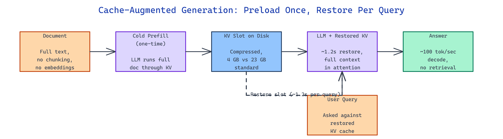

# Cache-Augmented Generation: Preload the KV Cache, Skip the Vector Database

[](https://github.com/dakshjain-1616/Cache-Augmented-Generation-CAG-System)



## The Problem

> Traditional RAG pipelines chunk documents, embed them, push them into a vector database, and retrieve fragments at query time — and every one of those steps is a place where context gets dropped, relevance gets mis-ranked, or infrastructure falls over. On long documents where the whole thing actually matters, retrieval is the bug, not the fix.

NEO built Cache-Augmented Generation (CAG) to load the entire document into the LLM's KV cache once, persist that cache to disk, and restore it for every query — no embeddings, no chunking, no vector database.

## Full-Document Context via Persistent KV Cache

**Cache-Augmented Generation** is a document QA system that takes the opposite bet from RAG: instead of splitting a document and retrieving fragments, it runs a single cold prefill across the full text, saves the resulting key-value cache to disk, and restores it before each query. The complete document stays in the model's context for every question, which eliminates the whole class of failures caused by bad chunking or weak retrieval ranking.

The trade-off is laid out clearly in the repo's metrics on an NVIDIA RTX A6000 (48 GB VRAM) running Qwen3.5-35B at a 1M-token context:

| Stage | Measurement |
|---|---:|
| Cold prefill (War and Peace, 922K tokens) | 24.3 minutes |
| KV slot restoration per query | ~1.2 seconds |
| Decode speed | ~100 tokens/sec |
| Compressed KV cache on disk | 4 GB (vs 23 GB standard) |

The cold prefill is expensive, but it happens once per corpus. Every query after that pays only the ~1.2 second restore and the decode cost — no retrieval latency, no embedding calls, no index rebuilds.

## Three CLI Tools and a REST API

The project is structured as four Python modules under `src/` with a companion pair of shell scripts. `api_server.py` is a FastAPI service exposing ingestion, query, and corpus management endpoints. `ingest.py` is the CLI that runs the cold prefill and writes the KV slot to disk. `query.py` loads a slot and answers a question against it. `demo.py` walks through the end-to-end flow.

```bash
./setup.sh
./start_server.sh
python3 src/api_server.py
python3 src/ingest.py my_document.txt --corpus-id my_doc
python3 src/query.py my_doc "Your question here"
```

The REST surface mirrors the CLI — `POST /ingest` to prefill and save a corpus, `POST /query` to answer against it, `GET /corpora` to list what's cached, and `GET /health` for liveness. API key auth is optional.

## How It Differs from RAG

RAG and CAG answer the same question — "ground this LLM in my documents" — with opposite architectures. The README frames it as three concrete wins for CAG:

| Concern | RAG | CAG |
|---|---|---|
| Context at query time | Retrieved fragments | Full document |
| Per-query latency | Embedding + vector search + LLM call | ~1.2s restore + LLM call |
| Infrastructure | Embedder + vector DB + chunker | KV slot files on disk |
| Indexing cost | Embed once per chunk | Prefill once per corpus |

The catch is honest and documented in the repo: CAG requires Linux with an NVIDIA GPU, the initial prefill is slow, only one corpus is active at a time, and very long documents can still hit the "lost-in-the-middle" attention problem where content far from the document boundaries receives less weight. This is a tool for workloads where the whole document genuinely matters and where you can amortize the prefill over many queries — contracts, codebases, books, long reports.

## How to Build This with NEO

Open NEO in VS Code or Cursor and describe what you want to build. A good starting prompt for this project:

> "Build a Cache-Augmented Generation system in Python that loads a full document into an LLM's KV cache, persists the cache to disk, and restores it for queries. Include a FastAPI server with /ingest, /query, /corpora, and /health endpoints plus optional API key auth. Add CLI tools for ingestion and querying, use a compressed on-disk KV slot format, and target NVIDIA GPUs on Linux with an 8GB+ VRAM minimum. Document cold prefill vs restore latency and compare to RAG."

<a href="https://heyneo.com/dashboard?section=new-chat&prompt=Build%20a%20Cache-Augmented%20Generation%20system%20in%20Python%20that%20loads%20a%20full%20document%20into%20an%20LLM%27s%20KV%20cache%2C%20persists%20the%20cache%20to%20disk%2C%20and%20restores%20it%20for%20queries.%20Include%20a%20FastAPI%20server%20with%20%2Fingest%2C%20%2Fquery%2C%20%2Fcorpora%2C%20and%20%2Fhealth%20endpoints%20plus%20optional%20API%20key%20auth.%20Add%20CLI%20tools%20for%20ingestion%20and%20querying%2C%20use%20a%20compressed%20on-disk%20KV%20slot%20format%2C%20and%20target%20NVIDIA%20GPUs%20on%20Linux%20with%20an%208GB%2B%20VRAM%20minimum.%20Document%20cold%20prefill%20vs%20restore%20latency%20and%20compare%20to%20RAG." style="display:inline-block;background:#1e40af;color:#ffffff;padding:10px 22px;border-radius:6px;text-decoration:none;font-weight:600;font-size:14px;">Build with NEO →</a>

NEO generates the project structure and core implementation. From there you iterate — ask it to support multiple concurrent corpora by paging slots in and out of VRAM, add a sliding-window attention variant to mitigate lost-in-the-middle on very long documents, or wire in an automatic corpus eviction policy keyed on query recency. Each request builds on what's already there.

To run the finished project:

```bash
git clone https://github.com/dakshjain-1616/Cache-Augmented-Generation-CAG-System
cd Cache-Augmented-Generation-CAG-System
./setup.sh
./start_server.sh
python3 src/ingest.py my_document.txt --corpus-id my_doc
python3 src/query.py my_doc "Your question here"
```

The prefill runs once and persists; every subsequent query restores the slot in ~1.2 seconds and decodes at roughly 100 tokens/sec.

NEO built a working CAG implementation that replaces the vector database with a KV slot file and keeps the full document in context for every query. See what else NEO ships at [heyneo.com](https://heyneo.com/).

---

## Try NEO in Your IDE

Install the NEO extension to bring AI-powered development directly into your workflow:

- **VS Code**: [NEO in VS Code](https://marketplace.visualstudio.com/items?itemName=NeoResearchInc.heyneo)
- **Cursor**: <a href="cursor://extension/NeoResearchInc.heyneo" style="color:#0066FF;font-weight:bold;">Install NEO for Cursor →</a>

---
