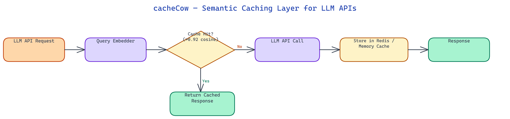

# cacheCow: Semantic Caching for LLM APIs That Actually Cuts Costs

[](https://github.com/dakshjain-1616/cachecow)



## The Problem

> LLM API costs compound quickly in production applications. Support chatbots, documentation assistants, and code helpers all receive large volumes of queries that are semantically equivalent but phrased differently: "how do I reset my password", "forgot my password", "password reset steps", "can't log in, need password help." Exact-match caching handles none of these as hits. You pay for the same effective answer dozens of times per day, every day.

NEO built cacheCow to apply semantic similarity to the caching decision — if a new query means the same thing as a cached query, serve the cached response and skip the API call entirely.

## The Semantic Caching Model

cacheCow sits in front of your LLM API calls as a middleware layer. Every incoming query goes through a three-stage pipeline: embed, search, decide.

**Embed**: The query is converted to a vector embedding using a fast, lightweight embedding model. The default is `all-MiniLM-L6-v2` (sentence-transformers), which produces 384-dimensional embeddings in under 5ms on CPU. For applications where embedding latency is critical, cacheCow supports quantized ONNX versions of the same model that run in under 2ms. For higher-accuracy applications, `text-embedding-3-small` via the OpenAI API is available as the embedding backend, though this adds API round-trip latency.

**Search**: The query embedding is compared to all cached entries using approximate nearest neighbor search. The similarity metric is cosine similarity. The search returns the top-k most similar cached queries, typically k=3 to k=10 depending on your confidence threshold strategy.

**Decide**: cacheCow computes the similarity score between the incoming query and the best matching cached entry. If the score exceeds a configurable threshold (default 0.92), the cached response is returned. Below the threshold, the query is forwarded to the LLM API, and the response is stored in the cache for future queries.

## Threshold Tuning and Precision/Recall Tradeoff

The similarity threshold is the most important parameter in cacheCow's configuration. It directly controls the tradeoff between cache hit rate (and therefore cost savings) and accuracy (serving the right response for the user's actual query).

A threshold of 0.95 is very conservative — only near-identical queries hit the cache. A threshold of 0.88 is aggressive — more semantically similar but meaningfully different queries might get the same cached response, which could be wrong.

The right threshold depends on your application. For a customer support bot answering questions about a fixed knowledge base, 0.90 is typically safe because the response to "how do I reset my password" is genuinely appropriate for "forgot my password." For a coding assistant where "fix the bug in line 42" and "explain what line 42 does" should produce different outputs, you want a much higher threshold, or per-topic threshold configuration.

cacheCow includes a threshold calibration tool that takes a sample of historical query pairs (with human labels for whether they should share a cached response), runs them through the similarity computation, and plots the precision-recall curve as a function of threshold. This takes the guesswork out of threshold selection.

## Cache Storage Backends

cacheCow supports two storage backends with identical interfaces.

**In-memory backend** uses FAISS for the vector index and a Python dictionary for key-value storage. This is appropriate for single-process deployments and for development. The in-memory backend has zero infrastructure dependencies — just install cacheCow and it works. The vector index is rebuilt from the stored entries at startup, so cache state persists across restarts as long as you dump and reload the key-value store.

**Redis backend** stores embeddings in Redis with the Redis Vector Similarity (RediSearch) module. This supports multi-process and distributed deployments where multiple instances of your application share a single cache. Cache entries include a configurable TTL (time-to-live), allowing stale responses to expire automatically for topics where the correct answer changes over time. The Redis backend also supports pipeline operations for batching multiple cache lookups into a single round-trip.

## Cache Entry Management

cacheCow uses a composite key for cache entries. The key includes the embedding of the query and the full original query text. The value is the LLM response, along with metadata: the model that generated it, the timestamp, the token count, and the original query that populated the entry.

Cache entries support explicit invalidation. If you update your system prompt or change how your application handles a category of queries, you can invalidate all cached entries for that category by embedding a representative query and deleting all entries with cosine similarity above a threshold. This batch invalidation is more practical than exact-key invalidation for semantic caches, where you cannot enumerate all the equivalent phrasings that might be cached.

Cache warming is supported via a seed file. Provide a list of expected high-frequency queries with their expected responses, and cacheCow will populate the cache before any real traffic arrives. This is valuable for customer-facing launches where you know the first wave of queries will cluster around a predictable set of topics.

## Integration

cacheCow exposes a Python wrapper that follows the same interface as the OpenAI and Anthropic Python clients. Wrapping an existing application is typically a two-line change: import cacheCow's wrapper instead of the native client, and pass your cache configuration. The wrapper intercepts `chat.completions.create` calls, checks the cache, and falls back to the actual API when needed.

For applications that do not use the Python SDK, cacheCow provides an HTTP proxy mode. Point your application's LLM API base URL at the cacheCow proxy, and it intercepts and caches transparently without any code changes.

Observability is built in. cacheCow logs every request with a hit/miss flag, the similarity score, the tokens saved on hits, and the running cost savings estimate. These metrics are exported in Prometheus format for integration with Grafana dashboards. The cost savings estimate uses the token count from cached entries and the configured API price per token to produce a cumulative dollar figure.

## Real Cost Reduction

In production deployments on applications with repetitive query patterns — customer support, documentation Q&A, onboarding assistants — cacheCow typically achieves 40-70% cache hit rates after the cache warms up over the first few days of traffic. A 50% hit rate on an application spending $2,000/month on LLM API calls translates to roughly $1,000/month in savings, compounding indefinitely as the cache matures.

The embedding and search overhead adds approximately 5-15ms to cache-miss requests (the embedding computation plus the ANN search). Cache hits are served in under 5ms total, significantly faster than an LLM API round-trip. For many applications, cacheCow improves latency on average by reducing the fraction of requests that wait for an LLM response.

## How to Build This

Install from PyPI:

```bash
pip install cachecow
```

Or clone and install in editable mode:

```bash
git clone https://github.com/dakshjain-1616/cachecow.git
cd cachecow
pip install -e .
```

Create a `.env` file to configure your backend and API keys:

```
DEEPSEEK_API_KEY=your_key
CACHECOW_BACKEND=memory
CACHECOW_DEFAULT_TTL=3600
```

The `DEEPSEEK_API_KEY` is optional — cacheCow falls back to heuristic similarity matching if no key is set. The default backend is in-memory, which requires no additional infrastructure.

Wrap any function with the `@cachecow` decorator:

```python
from cachecow import cachecow

@cachecow
def call_llm(prompt):
    # your existing API call here
    return response
```

Subsequent calls with semantically equivalent prompts return the cached result. The wrapper also follows the OpenAI and Anthropic client interfaces directly, so wrapping an existing application is a two-line change: import cacheCow's client wrapper instead of the native SDK and pass your cache configuration.

Run the interactive demo to see hit/miss behavior without an API key:

```bash
cachecow demo
```

To switch to Redis for distributed or multi-process deployments, set `CACHECOW_BACKEND=redis` and `REDIS_URL=redis://localhost:6379/0`. Cache metrics export in Prometheus format for Grafana dashboards.

NEO built cacheCow to make semantic caching a drop-in feature for any LLM-powered application — embedding-based similarity matching, configurable thresholds, Redis or in-memory backends, and built-in cost observability. See what else NEO ships at [heyneo.so](https://heyneo.so/).

---

## Try NEO in Your IDE

Install the NEO extension to bring AI-powered development directly into your workflow:

- **VS Code**: [NEO in VS Code](https://marketplace.visualstudio.com/items?itemName=NeoResearchInc.heyneo)
- **Cursor**: <a href="cursor://extension/NeoResearchInc.heyneo" style="color:#0066FF;font-weight:bold;">Install NEO for Cursor →</a>

---
