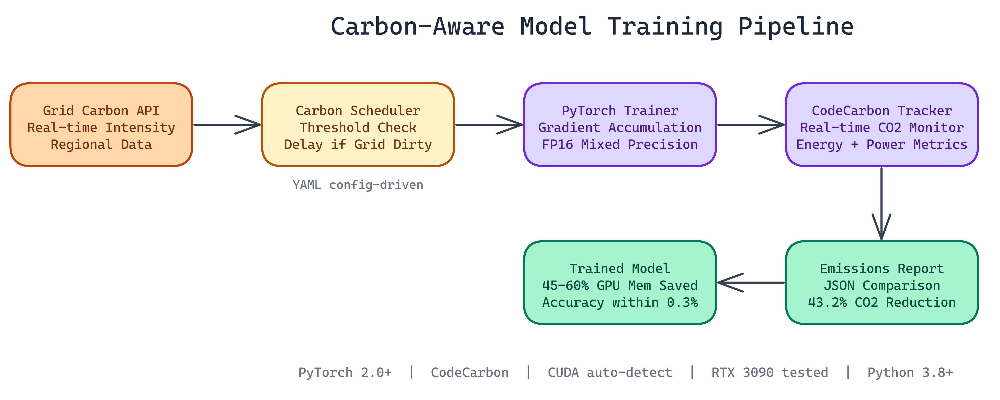

# Carbon-Aware Model Training: Cutting CO2 by 43% Without Sacrificing Accuracy

[](https://github.com/dakshjain-1616/CarbonAwareModelTraining)



## The Problem

> Training machine learning models is expensive — not just in compute costs, but in carbon. Large training runs can produce hundreds of kilograms of CO2 depending on where and when they run, and most teams simply ignore this. There's no standard tooling to schedule training around cleaner energy windows or to measure emissions as a first-class metric alongside accuracy and loss.

NEO built a PyTorch training pipeline that monitors real-time grid carbon intensity, schedules training during cleaner energy windows, and tracks emissions throughout the run. On MNIST with an RTX 3090, it achieved a **43.2% CO2 reduction** while keeping accuracy **within 0.3%** of baseline.

## The Core Insight: Timing Matters

Electrical grids are not constant. Carbon intensity varies based on what energy sources are feeding the grid at any given moment. Wind and solar generation push intensity down. Coal and gas push it up. In some regions, the difference between the cleanest and dirtiest hours of the day can exceed **300%**.

Training a model at the right time costs the same compute but produces significantly less carbon. The problem is that most training pipelines do not know or care about grid state. They run whenever you submit the job.

NEO built a scheduler that checks carbon intensity before starting a training run and can delay the start until conditions improve.

## Three Optimization Strategies Working Together

### Carbon-Aware Scheduling

The scheduler pulls real-time carbon intensity data from an electricity grid API. If the current intensity exceeds a configurable threshold, the run waits. If the API is unavailable, the system falls back to realistic mock patterns that approximate typical grid behavior for the configured region.

This alone accounts for most of the emissions reduction. Shifting training from a high-carbon window to a low-carbon window does not change the amount of compute you use. It changes what that compute costs the atmosphere.

### Gradient Accumulation

NEO combined carbon-aware scheduling with gradient accumulation, a memory optimization that lets you train with effectively larger batch sizes without proportionally larger GPU memory requirements.

The technique processes smaller mini-batches sequentially, accumulates their gradients, and only performs the weight update after accumulating gradients across what would have been the full batch. This reduces peak GPU memory usage by **45-60%** in NEO's tests, without meaningfully affecting the loss landscape the optimizer sees.

This matters for carbon efficiency in a practical way. A smaller memory footprint means you can train on less expensive, more power-efficient hardware without degrading accuracy. It also enables mixed precision (FP16) training more reliably, which reduces power draw further.

### Continuous Emissions Tracking

NEO integrated CodeCarbon throughout the training loop. It monitors CO2 emissions, energy consumption, and power draw in real time. At the end of each run, it generates a JSON-formatted report comparing the optimized run against a baseline.

This is the piece most sustainability-focused teams are missing. You cannot improve what you do not measure. CodeCarbon makes the carbon cost of a training run a first-class metric alongside accuracy and loss.

## Results

Training on MNIST with an RTX 3090:

- **CO2 reduction: 43.2%**
- **Accuracy delta vs. baseline: within 0.3%**
- **GPU memory reduction: 45-60%**

Training time increased. That is the honest tradeoff. If you delay a run waiting for a cleaner grid window, it does not start immediately. For many workloads, that is an acceptable cost. Nightly retraining jobs, batch fine-tuning runs, evaluation pipelines. These are all schedulable.

For jobs that need to start immediately, the system can run without the scheduling delay and still benefit from gradient accumulation and emissions tracking.

## Technical Setup

The stack is Python 3.8+ with PyTorch 2.0+ and CodeCarbon. Configuration is YAML-based, so you specify your training parameters, carbon intensity threshold, target region, and gradient accumulation steps in a single file. CUDA is detected automatically with CPU fallback.

The codebase is split into clean modules: the scheduler handles carbon monitoring, the tracker handles emissions measurement, and the trainer handles the optimization loop. They are independently testable and composable.

## Who This Is For

The most immediate audience is ML teams with regular retraining workflows who want to reduce environmental impact without switching infrastructure. If you are retraining models daily or weekly, carbon-aware scheduling compounds over time.

It is also useful for any organization with emissions reporting requirements. The CodeCarbon integration produces structured, quantified emissions data that sustainability reports actually need, not estimates or rough calculations.

Longer term, as energy costs and carbon pricing become more significant factors in infrastructure decisions, building carbon awareness into your ML pipeline from the start is good engineering practice.

## Watch It in Action

NEO put together a video walkthrough of the pipeline in action, showing the carbon intensity scheduler, gradient accumulation, and the live CodeCarbon emissions readout.

[](https://youtu.be/71Se6aNaWTM)

## How to Build This with NEO

Open NEO in VS Code or Cursor and describe what you want to build. A good starting prompt for this project:

> "Build a PyTorch training pipeline in Python that integrates carbon-aware scheduling, gradient accumulation, and real-time emissions tracking with CodeCarbon. The scheduler pulls real-time carbon intensity from an electricity grid API and delays training start until intensity drops below a configurable YAML threshold, with fallback to mock grid patterns when the API is unavailable. Gradient accumulation processes mini-batches sequentially and only performs weight updates after the configured accumulation steps, reducing peak GPU memory by 45-60%. CodeCarbon monitors CO2, energy, and power draw throughout the training loop and outputs a structured JSON report. Generate a comparison report showing CO2 reduction, accuracy delta, and GPU memory usage between baseline and optimized runs."

<a href="https://heyneo.com/dashboard?section=new-chat&prompt=Build%20a%20PyTorch%20training%20pipeline%20in%20Python%20that%20integrates%20carbon-aware%20scheduling%2C%20gradient%20accumulation%2C%20and%20real-time%20emissions%20tracking%20with%20CodeCarbon.%20The%20scheduler%20pulls%20real-time%20carbon%20intensity%20from%20an%20electricity%20grid%20API%20and%20delays%20training%20start%20until%20intensity%20drops%20below%20a%20configurable%20YAML%20threshold%2C%20with%20fallback%20to%20mock%20grid%20patterns%20when%20the%20API%20is%20unavailable.%20Gradient%20accumulation%20processes%20mini-batches%20sequentially%20and%20only%20performs%20weight%20updates%20after%20the%20configured%20accumulation%20steps%2C%20reducing%20peak%20GPU%20memory%20by%2045-60%25.%20CodeCarbon%20monitors%20CO2%2C%20energy%2C%20and%20power%20draw%20throughout%20the%20training%20loop%20and%20outputs%20a%20structured%20JSON%20report.%20Generate%20a%20comparison%20report%20showing%20CO2%20reduction%2C%20accuracy%20delta%2C%20and%20GPU%20memory%20usage%20between%20baseline%20and%20optimized%20runs." style="display:inline-block;background:#1e40af;color:#ffffff;padding:10px 22px;border-radius:6px;text-decoration:none;font-weight:600;font-size:14px;">Build with NEO →</a>

NEO generates the project structure and core implementation from that. From there you iterate — ask it to add the YAML config schema for carbon threshold, target region, and accumulation steps, implement the graceful API fallback to regional mock carbon intensity patterns, or build the comparison report generator that produces the side-by-side baseline vs. optimized summary. Each request builds on what's already there without re-explaining the context.

To run the finished project:

```bash
git clone https://github.com/dakshjain-1616/CarbonAwareModelTraining.git
cd CarbonAwareModelTraining
pip install -r requirements.txt
python src/train.py configs/optimized.yaml
```

After training completes, run `python generate_comparison.py` to see the CO2 reduction, accuracy delta, and GPU memory savings in `output/comparison_report.json`.

NEO built a carbon-aware model training pipeline where grid carbon intensity and emissions tracking are first-class training metrics, not afterthoughts—delivering a 43% CO2 reduction without sacrificing accuracy. See what else NEO ships at [heyneo.com](https://heyneo.com/).

---

## Try NEO in Your IDE

Install the NEO extension to bring AI-powered development directly into your workflow:

- **VS Code**: [NEO in VS Code](https://marketplace.visualstudio.com/items?itemName=NeoResearchInc.heyneo)
- **Cursor**: <a href="cursor://extension/NeoResearchInc.heyneo" style="color:#0066FF;font-weight:bold;">Install NEO for Cursor →</a>
