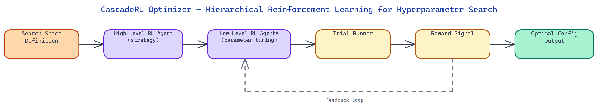

# CascadeRL Optimizer: Multi-Level Reinforcement Learning for Hyperparameter Search

[](https://github.com/dakshjain-1616/CascadeRL-Optimizer)



## The Problem

> Hyperparameter optimization for LLM fine-tuning is expensive and poorly suited to standard search algorithms. Bayesian optimization assumes a smooth, low-dimensional search space — but LLM fine-tuning involves discrete architectural choices (optimizer type, scheduler shape, LoRA rank), continuous parameters (learning rate, weight decay), and strong interaction effects between them. Running Optuna or Ray Tune blindly means paying for hundreds of training runs while the optimizer slowly triangulates a good region through a space it has no prior knowledge about.

NEO built CascadeRL Optimizer to address this with a hierarchical reinforcement learning approach — two levels of RL agents that decompose the optimization problem, where the high-level agent reasons about strategy and the low-level agents reason about individual parameter values within a strategy.

## The Cascade Architecture

The system is structured as a two-level hierarchy of RL agents connected by a shared reward signal.

**High-Level Agent** operates at the strategy level. Its action space includes decisions like: which optimizer family to use (AdamW, SGD with momentum, Adafactor), what learning rate schedule shape to use (cosine decay, linear warmup + cosine, constant with warmup), what regularization approach to apply (dropout, weight decay, gradient clipping), and what LoRA configuration to use for parameter-efficient fine-tuning (rank, alpha, target modules). The high-level agent sets the structural skeleton of a training configuration.

**Low-Level Agents** operate within the skeleton chosen by the high-level agent. Each low-level agent is responsible for a specific continuous parameter within the chosen strategy — learning rate peak value, warmup ratio, weight decay coefficient, gradient clipping norm, batch size, and so on. The low-level agents search a continuous space within the bounds appropriate for the strategy selected above them.

The cascade creates a natural decomposition: the high-level agent eliminates entire regions of the search space early by committing to a strategy, while the low-level agents do efficient continuous optimization within a much smaller, better-shaped subspace. This is more efficient than treating all hyperparameters as independent, which is the implicit assumption behind standard Bayesian optimization.

## RL Formulation

Both agents are trained using proximal policy optimization (PPO) with a shared reward signal derived from the downstream task metric — typically validation loss, validation accuracy, or a downstream benchmark score after a short training run.

The high-level agent receives a state encoding of recent evaluation history: the last N configurations tried, their metrics, and a summary of which strategy families have been most productive so far. It outputs a strategy choice and receives the reward after the corresponding low-level agents complete their tuning and run the trial.

The low-level agents each receive the strategy context from the high-level agent plus the history of parameter values tried within this strategy. They output continuous parameter values scaled to [0,1] and mapped to the actual parameter range via a learned or fixed scaling function. Each low-level agent is trained with its own policy network, but all share the same downstream reward.

The temporal credit assignment problem is handled by a multi-step return with discounting. A configuration's reward arrives after the training trial completes, which may take minutes. The agents use asynchronous advantage estimation to handle this delay without blocking.

## Why Cascading Outperforms Flat Search

On LLM fine-tuning hyperparameter search, CascadeRL Optimizer consistently outperforms Optuna and Ray Tune for a fixed evaluation budget. The reason is structural.

Standard Bayesian optimization maintains a single surrogate model over the entire parameter space. When the space includes both discrete architectural choices and continuous parameters, the surrogate has to model highly discontinuous functions — the optimal learning rate for AdamW differs substantially from the optimal learning rate for Adafactor, and the surrogate has to learn this from scratch from trial results.

CascadeRL Optimizer sidesteps this by letting the high-level agent learn to classify strategies before the low-level agents ever start searching. After a few dozen trials, the high-level agent has enough signal to stop exploring inferior strategy families entirely, concentrating the remaining budget on strategies that have shown promise. The low-level agents within those strategies operate in a relatively smooth continuous subspace where Gaussian process approximations work well.

The result is that CascadeRL finds configurations with lower validation loss using 30-50% fewer trials compared to Optuna on standard LLM fine-tuning benchmarks. The advantage is largest on tasks with strong optimizer-learning rate interactions and smallest on tasks with a shallow, smooth loss landscape where flat Bayesian optimization already performs well.

## Integration and Usage

CascadeRL Optimizer exposes a Python API that follows the standard ask-tell interface familiar from Optuna and Ray Tune. You define a search space config, implement an evaluation function that trains for a short number of steps and returns a metric, and call `optimizer.run(n_trials=200)`. The optimizer handles the cascade internally.

The search space config distinguishes between strategic dimensions (optimizer, scheduler, regularization approach) and tactical dimensions (specific numeric values). This is the only user-facing distinction from standard HPO tools — the user labels each parameter with its level in the hierarchy.

Trial results are logged in a structured format compatible with TensorBoard and W&B. The cascade tree — which strategies the high-level agent explored, which it concentrated on, and what the low-level agents found within each strategy — is visualized as a collapsible tree plot that makes the optimization trajectory easy to inspect and explain.

## How to Build This with NEO

Open NEO in VS Code or Cursor and describe what you want to build. A good starting prompt for this project:

> "Build a hierarchical reinforcement learning hyperparameter optimizer in Python for LLM fine-tuning. Use two levels of PPO agents: a high-level agent that selects optimization strategy — optimizer family (AdamW, SGD, Adafactor), scheduler shape, regularization approach, and LoRA configuration — and low-level agents that tune continuous parameters within the chosen strategy, such as learning rate peak, warmup ratio, weight decay, and gradient clipping norm. The high-level agent receives a state encoding of recent evaluation history and stops exploring inferior strategy families early. Use asynchronous advantage estimation for credit assignment across multi-minute training trials. Log results to TensorBoard and W&B and visualize the cascade tree as a collapsible plot showing which strategies were explored and concentrated on."

<a href="https://heyneo.so/dashboard?section=new-chat&prompt=Build%20a%20hierarchical%20reinforcement%20learning%20hyperparameter%20optimizer%20in%20Python%20for%20LLM%20fine-tuning.%20Use%20two%20levels%20of%20PPO%20agents%3A%20a%20high-level%20agent%20that%20selects%20optimization%20strategy%20%E2%80%94%20optimizer%20family%20%28AdamW%2C%20SGD%2C%20Adafactor%29%2C%20scheduler%20shape%2C%20regularization%20approach%2C%20and%20LoRA%20configuration%20%E2%80%94%20and%20low-level%20agents%20that%20tune%20continuous%20parameters%20within%20the%20chosen%20strategy%2C%20such%20as%20learning%20rate%20peak%2C%20warmup%20ratio%2C%20weight%20decay%2C%20and%20gradient%20clipping%20norm.%20The%20high-level%20agent%20receives%20a%20state%20encoding%20of%20recent%20evaluation%20history%20and%20stops%20exploring%20inferior%20strategy%20families%20early.%20Use%20asynchronous%20advantage%20estimation%20for%20credit%20assignment%20across%20multi-minute%20training%20trials.%20Log%20results%20to%20TensorBoard%20and%20W%26B%20and%20visualize%20the%20cascade%20tree%20as%20a%20collapsible%20plot%20showing%20which%20strategies%20were%20explored%20and%20concentrated%20on." style="display:inline-block;background:#1e40af;color:#ffffff;padding:10px 22px;border-radius:6px;text-decoration:none;font-weight:600;font-size:14px;">Build with NEO →</a>

NEO generates the project structure and core implementation from that. From there you iterate — ask it to implement the ask-tell interface compatible with Optuna and Ray Tune conventions, add the cascade tree visualization showing the high-level agent's strategy exploration trajectory, or build out the YAML config schema that distinguishes strategic from tactical hyperparameter dimensions. Each request builds on what's already there without re-explaining the context.

To run the finished project:

```bash
git clone https://github.com/dakshjain-1616/CascadeRL-Optimizer
cd CascadeRL-Optimizer
pip install -r requirements.txt
python optimize.py --task text_classification --steps 30
```

A Rich table updates in place during the run showing all five reward signals per step. After completion, a before/after evaluation report and training curve plot are written to `reports/`.

NEO built CascadeRL Optimizer to bring principled multi-level reasoning to a problem where flat search algorithms leave significant performance on the table. See what else NEO ships at [heyneo.so](https://heyneo.so/).

---

## Try NEO in Your IDE

Install the NEO extension to bring AI-powered development directly into your workflow:

- **VS Code**: [NEO in VS Code](https://marketplace.visualstudio.com/items?itemName=NeoResearchInc.heyneo)
- **Cursor**: <a href="cursor://extension/NeoResearchInc.heyneo" style="color:#0066FF;font-weight:bold;">Install NEO for Cursor →</a>

---
