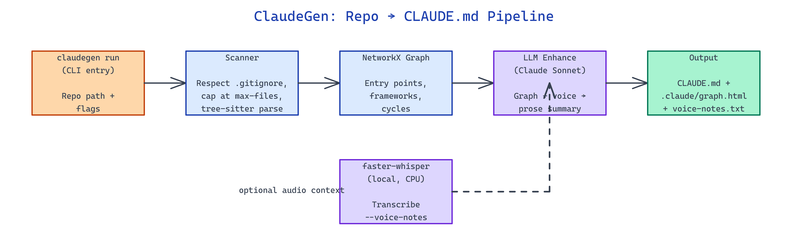

# ClaudeGen: Auto-Generate CLAUDE.md for Any Repo in One Command

[](https://github.com/dakshjain-1616/Claude_gen_setup)



## The Problem

> Every new repo you point Claude Code at needs a hand-written CLAUDE.md to get decent answers, and writing one by hand means spelunking through dependency graphs you could have generated in seconds.

NEO built ClaudeGen to scan a repository, extract its real import graph, and emit a ready-to-use `CLAUDE.md` plus an interactive dependency visualization with one command.

## One CLI, Three Commands

**ClaudeGen** is a Python 3.11+ package that installs a single `claudegen` entry point. It ships three subcommands covering generation, visualization, and a Gradio web UI:

```bash
# Generate CLAUDE.md for a repo
claudegen run /path/to/repo

# Only produce the dependency graph
claudegen graph /path/to/repo

# Launch the Gradio web interface
claudegen ui --host 127.0.0.1 --port 8080
```

The `run` command writes `CLAUDE.md` at the repo root and populates a `.claude/` directory with `dependency-graph.html` (interactive D3.js), `dependency-graph.json` (raw edges), and optionally `voice-notes.txt` when you attach audio context.

## Tree-Sitter Import Extraction + NetworkX

ClaudeGen doesn't regex-grep for imports — it runs proper AST extraction via tree-sitter parsers for Python, JavaScript, and TypeScript, then loads the edges into a NetworkX graph. That gives you accurate dependency edges even when imports sit inside conditionals, try/except blocks, or dynamic module paths.

From the graph, the tool derives:

| Signal | How it's detected |
|---|---|
| Entry points | Nodes with high out-degree, low in-degree |
| Framework | Import patterns (FastAPI, Django, Next.js, etc.) |
| Cycles | `networkx.simple_cycles` on the directed graph |
| Critical files | PageRank / betweenness centrality |
| Skipped files | `.gitignore` rules via `gitignore-parser` |

Those signals become the sections of the generated `CLAUDE.md` — architecture summary, framework detection, entry points to start reading, and cycles to watch out for.

## Flags, Budgets, and Voice Notes

The `run` command accepts a tight, practical set of flags:

| Flag | Default | Purpose |
|---|---|---|
| `--output, -o` | `<repo>/CLAUDE.md` | Output path |
| `--max-files, -m` | `1000` | Hard cap on files scanned |
| `--voice-notes, -v` | None | Path to audio file for context |
| `--model` | `anthropic/claude-sonnet-4-6` | LLM for enhancement pass |
| `--token-budget` | `4000` | Max tokens for LLM summary |
| `--dry-run` | `False` | Preview without writing files |

If you pass `--voice-notes meeting.wav`, faster-whisper transcribes it locally — no audio leaves your machine — and the transcript is folded into the LLM prompt so the generated doc reflects what the team actually discussed. Without API keys, ClaudeGen still emits a template-mode `CLAUDE.md` from the graph alone.

```bash
git clone https://github.com/dakshjain-1616/Claude_gen_setup
cd Claude_gen_setup
python3 -m venv .venv
source .venv/bin/activate
pip install -e .
claudegen run ~/my-project --voice-notes standup.m4a
```

## How to Build This with NEO

Open NEO in VS Code or Cursor and describe what you want to build. A good starting prompt for this project:

> "Build a Python CLI called claudegen that auto-generates CLAUDE.md files for any repository. Use tree-sitter to extract imports from Python, JavaScript, and TypeScript source files, build a NetworkX dependency graph, detect entry points, frameworks, and cycles, and render an interactive D3.js visualization. Add an optional faster-whisper voice-notes transcription step that runs locally. Expose three commands: run, graph, and ui (Gradio). Support flags for --max-files, --voice-notes, --model, --token-budget, and --dry-run. Respect .gitignore."

<a href="https://heyneo.com/dashboard?section=new-chat&prompt=Build%20a%20Python%20CLI%20called%20claudegen%20that%20auto-generates%20CLAUDE.md%20files%20for%20any%20repository.%20Use%20tree-sitter%20to%20extract%20imports%20from%20Python%2C%20JavaScript%2C%20and%20TypeScript%20source%20files%2C%20build%20a%20NetworkX%20dependency%20graph%2C%20detect%20entry%20points%2C%20frameworks%2C%20and%20cycles%2C%20and%20render%20an%20interactive%20D3.js%20visualization.%20Add%20an%20optional%20faster-whisper%20voice-notes%20transcription%20step%20that%20runs%20locally.%20Expose%20three%20commands%3A%20run%2C%20graph%2C%20and%20ui%20%28Gradio%29.%20Support%20flags%20for%20--max-files%2C%20--voice-notes%2C%20--model%2C%20--token-budget%2C%20and%20--dry-run.%20Respect%20.gitignore." style="display:inline-block;background:#1e40af;color:#ffffff;padding:10px 22px;border-radius:6px;text-decoration:none;font-weight:600;font-size:14px;">Build with NEO →</a>

NEO scaffolds the package, wires tree-sitter grammars, and ships a working CLI. From there you iterate — add Rust and Go parsers, push the CLAUDE.md into a PR as a bot, or emit a per-directory mini-CLAUDE.md instead of one monolith. Each request builds on what's already there.

To run the finished project:

```bash
git clone https://github.com/dakshjain-1616/Claude_gen_setup
cd Claude_gen_setup
python3 -m venv .venv && source .venv/bin/activate
pip install -e .
claudegen run /path/to/your/repo
```

Open `CLAUDE.md` in the target repo; open `.claude/dependency-graph.html` in a browser to explore the interactive graph.

NEO turned "write a CLAUDE.md for this repo" from an afternoon of manual spelunking into one command. See what else NEO ships at [heyneo.com](https://heyneo.com/).

---

## Try NEO in Your IDE

Install the NEO extension to bring AI-powered development directly into your workflow:

- **VS Code**: [NEO in VS Code](https://marketplace.visualstudio.com/items?itemName=NeoResearchInc.heyneo)
- **Cursor**: <a href="cursor://extension/NeoResearchInc.heyneo" style="color:#0066FF;font-weight:bold;">Install NEO for Cursor →</a>

---
