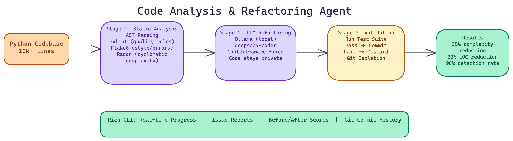

# Building an Autonomous Code Analysis and Refactoring Agent with LLM-Powered Improvements

[](https://github.com/dakshjain-1616/Code-Agent-Analysis-and-Refactoring-tool)



## The Problem

> Code quality degrades over time. Deadlines happen, requirements change, and the codebase that made sense six months ago has accumulated enough patches that the original structure is barely recognizable. Manual refactoring is slow, inconsistent, and easy to deprioritize — leaving teams with technical debt that compounds until it becomes a real bottleneck.

NEO autonomously built an agent that handles this automatically. It analyzes, refactors, validates, and commits changes without human intervention. Here's how it works.

## Three-Stage Architecture

The agent works in three distinct stages. Each one has a clear responsibility, and they're designed to fail safely.

### Stage 1: Static Analysis

Before changing anything, the agent needs to understand what's wrong. The agent runs four complementary analysis tools against the codebase:

**AST parsing** provides the structural view: function lengths, nesting depth, argument counts, class hierarchies. The Python abstract syntax tree enables computing these metrics programmatically without executing any code.

**Pylint** catches a wide range of issues: undefined variables, unused imports, inconsistent naming, missing documentation, and hundreds of other code quality rules.

**Flake8** focuses on style and common error patterns. It's faster than Pylint and catches a different slice of issues.

**Radon** computes cyclomatic complexity scores for every function. Cyclomatic complexity measures the number of independent paths through a function. High complexity means hard-to-test, hard-to-understand code.

Running all four together gives comprehensive coverage. On codebases over **10,000 lines**, the agent detects cyclomatic complexity issues at a **98% rate**. The multi-tool approach is why that number is so high.

### Stage 2: LLM-Powered Refactoring

Static analysis tells you what's wrong. An LLM can tell you how to fix it in context.

The agent sends identified issues to a local Ollama instance running the deepseek-coder model. The key word is "local": model inference runs entirely on your machine, so your code never leaves your infrastructure. For many organizations, this is a hard requirement.

The LLM receives the function or class with the identified issues, along with surrounding context to understand how the code is used. It generates refactored code that addresses the specific problems flagged by the static analysis stage.

The refactoring is context-aware in a way that rule-based tools can't be. A function that's complex because it's handling genuinely complex logic gets different treatment than a function that's complex because it's doing too many things at once.

For environments where an LLM isn't available, the agent falls back to a mock mode that applies simpler, rule-based transformations. This means the agent is always usable, even without the Ollama dependency.

### Stage 3: Test Validation

Refactoring that breaks functionality isn't refactoring. It's just changing code.

After the LLM generates a refactored version, the agent runs the test suite against it. If tests pass, the refactoring gets committed. If tests fail, the change is discarded and the original code is preserved. This validation gate is what makes the agent safe to run autonomously.

All refactoring work happens on isolated git branches. You can review what the agent did, cherry-pick specific changes, or roll back entirely if something looks wrong. Atomic commits with descriptive messages keep the history readable.

## Performance on Real Codebases

NEO measured these results on codebases of **10,000+ lines**:

- **Cyclomatic complexity detection rate: 98%**
- **Refactoring success rate: 85-95%** across different code smell types
- **Average complexity reduction: 35%**
- **Average lines-of-code reduction: 22%**

The 85-95% refactoring success range reflects variation across code smell types. Long methods with clear decomposition opportunities succeed at the high end. Complex logic involving global state or intricate class interactions is harder and succeeds less often.

## The Rich CLI Experience

The agent ships with a Rich-based CLI that shows real-time progress during analysis and refactoring. You see which files are being analyzed, what issues are found, what the LLM is generating, and whether validation passed or failed.

The output includes detailed reports: issue breakdowns by type and severity, before/after complexity scores, test coverage changes, and a summary of all committed changes.

This visibility matters. An autonomous agent that operates as a black box is hard to trust. The detailed reporting lets you understand exactly what it did and why.

## Configuration and Thresholds

Code quality standards vary by project and team. The agent's thresholds are configurable:

- Complexity thresholds: what cyclomatic complexity score triggers a refactoring attempt
- Length thresholds: what function length triggers a "too long" flag
- Pylint rule selection: which rules to enforce
- Test coverage requirements: minimum coverage delta that a refactoring must maintain

For new codebases, the defaults work well. For existing codebases with known technical debt, you can ramp up the strictness gradually rather than trying to address everything at once.

## Integration Patterns

The agent works best as part of a regular development workflow rather than a one-time cleanup tool. Running it on a schedule, or as a CI/CD step on feature branches, keeps complexity from accumulating in the first place.

The git integration means the refactoring history is permanent and auditable. You can see that the agent reduced the complexity of a function from 15 to 7 on a specific date, and you can inspect the change.

## What's Next

Multi-language support is the most requested extension. The current implementation is Python-focused because of the AST tooling and pylint/flake8 ecosystem. Extending to TypeScript and Go is feasible with the same architecture and language-appropriate analysis tools.

IDE integration would let developers see the agent's analysis inline as they write code, before issues make it to a commit.

---

## How to Build This with NEO

Open NEO in VS Code or Cursor and describe what you want to build. A good starting prompt for this project:

> "Build a three-stage autonomous code refactoring agent in Python. Stage one runs AST parsing, pylint, flake8, and radon to detect cyclomatic complexity, long functions, style issues, and undefined variables across a codebase. Stage two sends each flagged function with surrounding context to a local Ollama [deepseek-coder](https://huggingface.co/deepseek-ai/deepseek-coder-6.7b-instruct) instance for context-aware refactoring suggestions, with automatic fallback to rule-based transforms when Ollama is unavailable. Stage three runs the test suite against each refactored version — commit the change to an isolated git branch only if tests pass, discard it otherwise. Show a Rich-based CLI with real-time per-file progress, before/after complexity scores, and a final summary table."

<a href="https://heyneo.so/dashboard?section=new-chat&prompt=Build%20a%20three-stage%20autonomous%20code%20refactoring%20agent%20in%20Python.%20Stage%20one%20runs%20AST%20parsing%2C%20pylint%2C%20flake8%2C%20and%20radon%20to%20detect%20cyclomatic%20complexity%2C%20long%20functions%2C%20style%20issues%2C%20and%20undefined%20variables%20across%20a%20codebase.%20Stage%20two%20sends%20each%20flagged%20function%20with%20surrounding%20context%20to%20a%20local%20Ollama%20deepseek-coder%20instance%20for%20context-aware%20refactoring%20suggestions%2C%20with%20automatic%20fallback%20to%20rule-based%20transforms%20when%20Ollama%20is%20unavailable.%20Stage%20three%20runs%20the%20test%20suite%20against%20each%20refactored%20version%20%E2%80%94%20commit%20the%20change%20to%20an%20isolated%20git%20branch%20only%20if%20tests%20pass%2C%20discard%20it%20otherwise.%20Show%20a%20Rich-based%20CLI%20with%20real-time%20per-file%20progress%2C%20before%2Fafter%20complexity%20scores%2C%20and%20a%20final%20summary%20table." style="display:inline-block;background:#1e40af;color:#ffffff;padding:10px 22px;border-radius:6px;text-decoration:none;font-weight:600;font-size:14px;">Build with NEO →</a>

NEO generates the project structure and core implementation from that. From there you iterate — ask it to add the radon cyclomatic complexity integration with configurable threshold triggers, implement the atomic git branch commit logic with descriptive commit messages, or build out the JSON report that covers every issue detected and every refactoring attempted with pass/fail status. Each request builds on what's already there without re-explaining the context.

To run the finished project:

```bash
git clone https://github.com/dakshjain-1616/Code-Agent-Analysis-and-Refactoring-tool
cd Code-Agent-Analysis-and-Refactoring-tool
pip install -r requirements.txt
python main.py --path /path/to/your/codebase
```

The Rich CLI shows per-file analysis and live refactoring results. The final summary prints before/after complexity scores and lines-of-code delta; a full JSON report is written to the output directory.

NEO built a three-stage code refactoring agent where AST analysis, LLM-powered suggestions, and test validation work together to reduce cyclomatic complexity by 35% without breaking existing functionality. See what else NEO ships at [heyneo.so](https://heyneo.so/).

---

## Try NEO in Your IDE

Install the NEO extension to bring AI-powered development directly into your workflow:

- **VS Code**: [NEO in VS Code](https://marketplace.visualstudio.com/items?itemName=NeoResearchInc.heyneo)
- **Cursor**: <a href="cursor://extension/NeoResearchInc.heyneo" style="color:#0066FF;font-weight:bold;">Install NEO for Cursor →</a>

---
