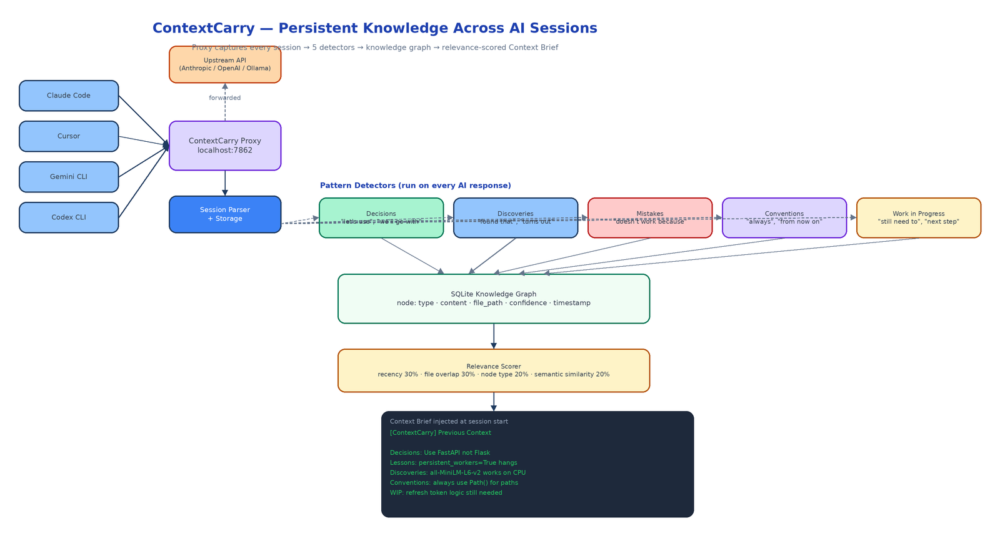

# ContextCarry: A Local Proxy That Remembers What Every AI Session Taught You

[](https://github.com/dakshjain-1616/Context-Carry-)



## The Problem

> You open a new chat with your AI coding assistant. It has no idea that you decided to use FastAPI over Flask last Tuesday, that you spent two hours last Thursday discovering that `persistent_workers=True` hangs with more than two workers, or that you're in the middle of implementing the refresh token logic. So you spend the first ten minutes re-explaining things the AI already helped you figure out.

Every AI session starts from scratch. Not because the AI forgot — it was never told. The decisions you made, the mistakes you burned time on, the conventions you established, the threads you left open: all of that lives in old chat windows nobody reads again. ContextCarry intercepts the API calls your AI tools already make, extracts durable knowledge from every conversation, and surfaces the most relevant pieces at the start of your next session. The AI gets context. You get to start where you left off.

## How the Proxy Works

ContextCarry runs a local proxy daemon on port 7862. You point your AI tool's API base URL at it instead of the upstream provider:

```bash
contextcarry start

export OPENAI_BASE_URL=http://localhost:7862/proxy/openai/v1    # Claude Code, Cursor, Codex
export ANTHROPIC_BASE_URL=http://localhost:7862/proxy/anthropic  # Claude CLI
export OLLAMA_HOST=http://localhost:7862/proxy/ollama            # Ollama
```

Every request is forwarded unchanged — your API keys stay the same, your tools stay the same. As a side effect, ContextCarry reads both sides of every conversation and runs five pattern detectors over each AI response to classify knowledge into its graph.

## Five Knowledge Types

**Decisions** — phrases like "let's use", "we'll go with", "I recommend" signal an architectural or technical choice was made. These are the highest-value nodes because they explain why the codebase looks the way it does. When the AI surfaces a decision at the start of the next session, it no longer needs to re-derive it.

**Discoveries** — phrases like "found that", "turns out", "realized" capture things learned through investigation. These prevent you from re-running the same experiment twice.

**Mistakes** — phrases like "doesn't work because", "avoid", "the issue was" capture hard-won lessons. These are surfaced prominently so the AI doesn't repeat past errors in new sessions.

**Conventions** — phrases like "always", "from now on", "we should always" capture evolving team standards. These complement a `RULES.yaml` with session-specific context that hasn't made it into a formal rule yet.

**Work in Progress** — phrases like "still need to", "next step is", "I've started" capture open threads. These help the AI pick up mid-task without losing orientation.

Each node receives a confidence rating (HIGH / MEDIUM / LOW) based on how strongly the signal phrases indicate that knowledge type.

## The Context Brief

At the start of every new session, ContextCarry prepends a brief tuned to your current project and open files:

```
[ContextCarry] Previous Context

## Decisions
- Use FastAPI instead of Flask for the API layer
- Store embeddings as BLOB in SQLite for portability

## Lessons Learned
- Don't use persistent_workers=True with num_workers > 2 — causes hangs
- Blanket sed/regex on imports breaks stdlib imports

## Discoveries
- sentence-transformers all-MiniLM-L6-v2 works well on CPU
- tiktoken cl100k_base is compatible with most models

## Conventions
- Always use Path() instead of string paths
- Use async/await for all DB operations

## Work in Progress
- Still need to implement the graph browser UI
- Next step is adding export functionality
```

Not everything ever captured appears — only the most relevant nodes for this project and these files. Relevance is scored across four dimensions: recency (30%), file overlap (30%), node type (20%), and semantic similarity via `sentence-transformers all-MiniLM-L6-v2` embeddings (20%).

## Commands

| Command | What it does |
|---------|-------------|
| `contextcarry start` | Start the proxy daemon |
| `contextcarry stop` | Stop the daemon |
| `contextcarry status` | Show daemon health and captured session count |
| `contextcarry brief` | Preview the context brief for the current project |
| `contextcarry query <text>` | Semantic search across the knowledge graph |
| `contextcarry sessions` | List captured sessions |
| `contextcarry graph` | Open the web graph browser |
| `contextcarry export` | Export the knowledge graph as Markdown or JSON |
| `contextcarry forget` | Archive or remove specific nodes |

Use `contextcarry brief --file <path>` to target the brief toward specific files. Use `contextcarry brief --tool cursor` for Cursor-formatted output. The graph browser runs at `http://localhost:7863` — useful for reviewing what was captured and removing stale nodes.

## How to Build This with NEO

Open NEO in VS Code or Cursor:

> "Build a Python proxy daemon called ContextCarry. It intercepts AI coding session API calls on port 7862 by acting as a transparent local proxy for OpenAI, Anthropic, and Ollama. For every AI response, run five pattern detectors to classify knowledge into: Decisions, Discoveries, Mistakes, Conventions, and Work in Progress — each with a HIGH/MEDIUM/LOW confidence rating. Store extracted nodes in a SQLite knowledge graph with recency, file path, and content fields. At the start of each new session, inject a Context Brief that ranks nodes by a four-dimension relevance score: recency 30%, file overlap 30%, node type 20%, semantic similarity 20% using sentence-transformers all-MiniLM-L6-v2. Commands: start, stop, status, brief, query, sessions, graph, export, forget."

<a href="https://heyneo.com/dashboard?section=new-chat&prompt=Build%20a%20Python%20proxy%20daemon%20called%20ContextCarry%20that%20intercepts%20AI%20coding%20session%20API%20calls%2C%20runs%20five%20pattern%20detectors%20(Decisions%2C%20Discoveries%2C%20Mistakes%2C%20Conventions%2C%20WIP)%20over%20every%20AI%20response%2C%20stores%20extracted%20nodes%20in%20a%20SQLite%20knowledge%20graph%2C%20and%20injects%20a%20relevance-ranked%20Context%20Brief%20at%20the%20start%20of%20each%20new%20session%20using%20four-dimension%20scoring%20with%20sentence-transformers%20embeddings." style="display:inline-block;background:#1e40af;color:#ffffff;padding:10px 22px;border-radius:6px;text-decoration:none;font-weight:600;font-size:14px;">Build with NEO →</a>

NEO scaffolds the full proxy layer for OpenAI, Anthropic, and Ollama endpoints, the five pattern detectors, the SQLite knowledge graph schema, the four-dimension relevance scorer, the context brief generator, and all CLI commands including the web graph browser. From there you tune the pattern phrases to match how your team talks during AI sessions and adjust the relevance weights to emphasize the dimensions you care about most.

```bash
git clone https://github.com/dakshjain-1616/Context-Carry-
cd Context-Carry-
pip install -e .

contextcarry start
# point your AI tools at the proxy, work normally
contextcarry brief     # preview what would be injected next session
contextcarry graph     # browse captured knowledge at localhost:7863
```

The best way to stop re-explaining things the AI already helped you figure out is to stop discarding what was figured out. ContextCarry turns every session into accumulated knowledge. See what else NEO ships at [heyneo.com](https://heyneo.com/).

---

## Try NEO in Your IDE

Install the NEO extension to bring AI-powered development directly into your workflow:

- **VS Code**: [NEO in VS Code](https://marketplace.visualstudio.com/items?itemName=NeoResearchInc.heyneo)
- **Cursor**: <a href="cursor://extension/NeoResearchInc.heyneo" style="color:#0066FF;font-weight:bold;">Install NEO for Cursor →</a>

---
