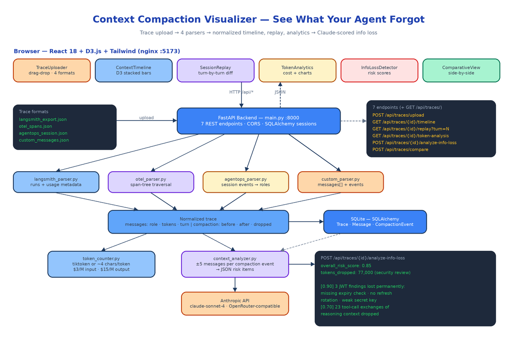

# Context Compaction Visualizer: Seeing Exactly What Your Agent Forgot

[](https://github.com/dakshjain-1616/Context-Compaction-Visualizer)



## The Problem

> Your agent ran for 40 turns, hit the context limit at turn 23, summarized everything before turn 18 into four paragraphs, and kept going. At turn 31 it re-introduced a bug it had already fixed, because the fix lived in a message that no longer exists. Nothing in your logs says this happened. The trace looks fine. The agent just quietly got dumber halfway through.

Every long-running agent eventually compacts its context — summarize, truncate, or drop. The frameworks do it automatically and almost none of them show you what was lost. When an agent forgets a constraint, a user preference, or a prior decision, the failure shows up turns later and looks like a model problem, not a memory problem. Context Compaction Visualizer is a web app that takes the trace your agent already produces and reconstructs the whole story: which messages existed at every turn, which survived compaction verbatim, which were summarized, which were dropped, and what that cost you in tokens and dollars.

## Four Trace Formats, One Normalized Shape

The backend ships four parsers behind a single registry in `main.py`:

```python
PARSERS = {
    "langsmith": LangSmithParser(),
    "opentelemetry": OTelParser(),
    "agentops": AgentOpsParser(),
    "custom": CustomParser(),
}
```

Each one knows the quirks of its source. The LangSmith parser extracts runs, per-run messages, and token counts from usage metadata. The OTEL parser walks the span tree, reconstructs message history from span attributes, and treats spans whose names contain "compress" or "summarize" as compaction events. The AgentOps parser flattens session-level events and normalizes their event types into roles. The custom parser accepts any agent framework that can emit a `messages` array with `role`, `content`, and optional `tokens` and `timestamp` — any event with `type: "compaction"` or `type: "summarization"` becomes a compaction event.

Everything downstream consumes one normalized structure: messages with roles, turn numbers, and token counts, plus compaction events with `tokens_before`, `tokens_after`, and `tokens_dropped`. The timeline, replay, analytics, and comparison views have no idea which platform the trace came from. That decision is why the whole feature set is format-agnostic, and it is enforced by 29 pytest tests covering all four parsers against realistic multi-turn fixtures — the suite runs in under 100ms because nothing touches the network.

Parsed traces land in SQLite via SQLAlchemy as three tables: `Trace`, `Message`, and `CompactionEvent`.

## Seven Endpoints

The FastAPI surface is small and maps one-to-one onto the frontend tabs:

| Method | Path | What it does |
|--------|------|--------------|
| POST | `/api/traces/upload` | Upload a trace file with a format selector |
| GET | `/api/traces/` | List all ingested traces |
| GET | `/api/traces/{id}/timeline` | Per-turn token data for the D3 chart |
| GET | `/api/traces/{id}/replay` | Context window state at `?turn=N` |
| GET | `/api/traces/{id}/token-analysis` | Token breakdown + cost estimate |
| POST | `/api/traces/{id}/analyze-info-loss` | Claude-powered loss analysis |
| POST | `/api/traces/compare` | Diff two traces side by side |

The timeline endpoint does the interesting accounting. It groups messages by turn, accumulates context tokens turn over turn, and when it hits a compaction event it resets the accumulator to `tokens_after` and labels the turn `summarized` — or `dropped` if the event discarded more than half the context. The replay endpoint returns the exact messages in the window at any turn plus the compaction event if one fired there, which is what powers the before/after diff in the UI.

## The Frontend: Timeline, Replay, Analytics, Compare

The React 18 + Tailwind frontend is a six-tab layout in `App.tsx`: Upload, Timeline, Replay, Analytics, Info Loss, Compare. Each tab is one component.

**TraceUploader** handles drag-and-drop plus the four-format dropdown. **ContextTimeline** is a D3.js stacked bar chart of token consumption across all turns, color-coded by retained / summarized / dropped. **SessionReplay** steps turn by turn and renders a diff when a compaction event occurs at the current turn. **TokenAnalytics** shows the stats panel with D3 line and bar charts. **ComparativeView** puts two traces side by side — useful when you are A/B testing two compaction strategies and want to know which one preserved more context for less money.

D3 and React both want to own the DOM, so the integration goes through a `useD3.ts` hook: D3 takes ownership of the SVG inside the hook's effect, React manages the wrapping div and props. No fighting over the virtual DOM.

## Counting Tokens and Costing the Session

`token_counter.py` uses tiktoken's `cl100k_base` encoding when the package is installed and falls back to a ~4-characters-per-token approximation when it is not, so the platform never hard-depends on tiktoken. Cost estimates use Claude pricing as defaults — $3 per million input tokens, $15 per million output — defined as parameters in one place:

```python
def estimate_cost(self, input_tokens, output_tokens,
                  input_rate_per_m=3.0, output_rate_per_m=15.0):
    input_cost = (input_tokens / 1_000_000) * input_rate_per_m
    output_cost = (output_tokens / 1_000_000) * output_rate_per_m
```

The token-analysis endpoint combines this with the compaction events to report `tokens_saved_by_compaction` and a `compression_ratio` — so you can see not just what compaction cost you in fidelity, but what it saved you in spend.

## Claude-Powered Info Loss Detection

This is the feature the rest of the platform builds toward. For every compaction event, `ContextAnalyzer` sends the event metadata plus the five messages before and after compaction to Claude (default `claude-sonnet-4-20250514`, or any model via OpenRouter with `MODEL_NAME`), with a system prompt that frames the task as an AI safety audit. The model returns structured JSON: an overall risk score from 0 to 1 and a list of specific losses, each with its own risk score, a description of what was lost, and a recommended action.

Run against a real compaction event that dropped 77,000 tokens from a security code review session, the analyzer returned an overall risk of **0.85** and flagged the permanent loss of three specific JWT findings — a missing expiry check, absent refresh token rotation, and a weak secret key — at risk 0.90, plus the loss of 23 tool-call exchanges of reasoning context at 0.70. Those are exactly the kinds of details no summary preserves and no human notices until the agent ships the vulnerable code anyway.

The fallback behavior matters: without `ANTHROPIC_API_KEY` or `OPENROUTER_API_KEY`, the endpoint returns `analysis_available: false` with a clear message instead of a 500. Every other feature — timeline, replay, analytics, compare — works fully with no API key at all.

## Running It

Two containers via docker-compose: the FastAPI backend on port 8000 with a named volume for the SQLite database, and the frontend built and served by nginx on 5173.

```bash
git clone https://github.com/dakshjain-1616/Context-Compaction-Visualizer
cd Context-Compaction-Visualizer
cp .env.example .env          # optionally add an API key for info loss detection
docker compose up --build
```

Backend docs at `http://localhost:8000/docs`, UI at `http://localhost:5173`. For local dev, `uvicorn main:app --reload` and `npm run dev` work the same way. The only required configuration is none; `ANTHROPIC_API_KEY`, `DATABASE_URL`, `HOST`, and `PORT` all have working defaults.

## How to Build This with NEO

Open NEO in VS Code or Cursor and describe what you want to build. A good starting prompt for this project:

> "Build a web platform called Context Compaction Visualizer that shows how long-running AI agents compress context over time. Backend: FastAPI + SQLAlchemy + SQLite with Trace, Message, and CompactionEvent models. Write four trace parsers — LangSmith JSON exports, OpenTelemetry spans, AgentOps sessions, and a generic custom JSON format — that all normalize into a common structure of messages (role, content, tokens, turn_number) and compaction events (tokens_before, tokens_after, tokens_dropped). Expose seven endpoints: upload with format selector, list traces, per-turn timeline data, replay state at a given turn, token analysis with cost estimates at $3/M input and $15/M output, Claude-powered info loss analysis, and two-trace comparison. Add a token counter with tiktoken when available and a 4-chars-per-token fallback. The info loss analyzer should call the Anthropic API (claude-sonnet-4-20250514, OpenRouter-compatible) per compaction event and return risk scores 0-1 with specific losses and recommended actions, degrading gracefully without an API key. Frontend: React 18 + TypeScript + Tailwind + D3.js with six tabs — TraceUploader (drag-drop), ContextTimeline (D3 stacked bars color-coded retained/summarized/dropped), SessionReplay (turn navigation with compaction diff), TokenAnalytics, InfoLossDetector, ComparativeView — using a useD3 hook to reconcile D3 with React rendering. Ship docker-compose with the backend on 8000 and nginx-served frontend on 5173, plus pytest coverage for all four parsers with realistic fixtures."

<a href="https://heyneo.com/dashboard?section=new-chat&prompt=Build%20a%20web%20platform%20called%20Context%20Compaction%20Visualizer%20that%20shows%20how%20AI%20agents%20compress%20context%20over%20time.%20FastAPI%20%2B%20SQLite%20backend%20with%20four%20trace%20parsers%20(LangSmith%2C%20OpenTelemetry%2C%20AgentOps%2C%20custom%20JSON)%20normalizing%20to%20a%20common%20message%2Fcompaction-event%20shape%2C%20seven%20endpoints%20(upload%2C%20timeline%2C%20replay%2C%20token%20analysis%20with%20cost%20estimates%2C%20Claude-powered%20info%20loss%20detection%2C%20compare)%2C%20React%2018%20%2B%20D3.js%20frontend%20with%20stacked-bar%20token%20timeline%2C%20turn-by-turn%20session%20replay%20with%20compaction%20diffs%2C%20analytics%2C%20and%20side-by-side%20trace%20comparison.%20Docker-compose%20deployment%2C%20graceful%20fallback%20without%20an%20API%20key%2C%20pytest%20coverage%20for%20all%20parsers." style="display:inline-block;background:#1e40af;color:#ffffff;padding:10px 22px;border-radius:6px;text-decoration:none;font-weight:600;font-size:14px;">Build with NEO →</a>

NEO scaffolds the parser layer, the ORM models, all seven endpoints, the D3 components, and the docker-compose setup. From there you add a parser for your own framework's trace format (the base parser interface makes that a single file), tune the info-loss prompt for your domain, and point the comparative view at two compaction strategies to settle the retention-versus-cost argument with data instead of vibes.

Context compaction is invisible by default, and invisible is where agents lose the plot. This makes it visible. See what else NEO ships at [heyneo.com](https://heyneo.com/).

---

## Try NEO in Your IDE

Install the NEO extension to bring AI-powered development directly into your workflow:

- **VS Code**: [NEO in VS Code](https://marketplace.visualstudio.com/items?itemName=NeoResearchInc.heyneo)
- **Cursor**: <a href="cursor://extension/NeoResearchInc.heyneo" style="color:#0066FF;font-weight:bold;">Install NEO for Cursor →</a>

---
