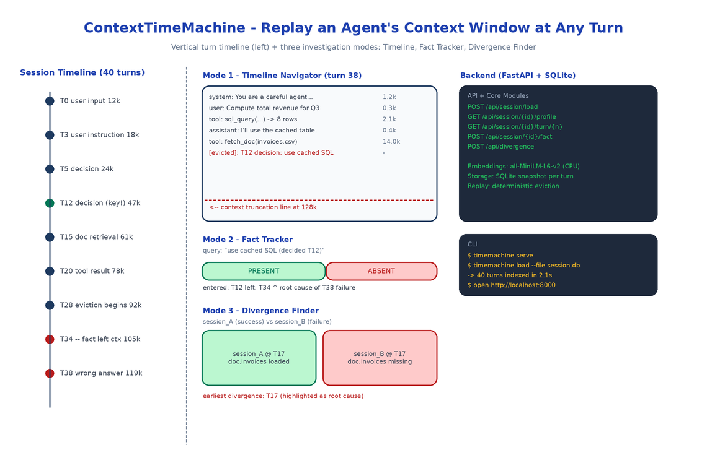

# ContextTimeMachine: Replay an Agent's Context Window at Any Turn You Choose

[](https://github.com/dakshjain-1616/ContextTimeMachine)



## The Problem

> You start a long agent session. The agent runs for 40 turns. At turn 38 it produces a wrong answer that contradicts a decision it made at turn 12. The logs show both turns. The trace shows the tool calls. What you cannot see, anywhere, is what the context window looked like at turn 38. Was the turn 12 decision still in there? Was it evicted ten turns ago? Was it still technically present but buried under 25 turns of tool noise the model stopped attending to?

ContextTimeMachine answers that question. It treats the context window as a deterministic function of the conversation log: given the same history, the window at turn N is reproducible. So you reconstruct it, render it, scrub through it like a timeline, and search inside it.

LiveContext (its sibling project) is for watching a session as it runs. ContextTimeMachine is the forensic tool for the morning after.

## Three Investigation Modes

### Mode 1: Timeline Navigator

A vertical timeline of every turn. Each row shows the turn number, the agent that produced it, whether it was an LLM call, a tool call, or user input, the running token count, and a small sparkline of how the context composition changed at that turn.

Click any turn and the main panel reconstructs the context window at that exact point: every message in order, with token counts, with a red line marking where truncation would have occurred against the model's max context. Arrow keys scrub forward and backward. Watch evictions happen in slow motion. Watch a tool result arrive and shove three older turns past the truncation line.

### Mode 2: Fact Tracker

The single most useful mode and the reason the project exists. You know a specific thing: a user instruction at turn 3, a decision at turn 12, a retrieved doc at turn 15. You want to know when the agent stopped having that thing in context.

Paste the snippet into the Fact Tracker. ContextTimeMachine embeds it locally with `sentence-transformers/all-MiniLM-L6-v2`, scans every turn's reconstructed context for the nearest matching content, and renders a **presence chart**: a horizontal bar across all turns, colored green where the fact is present and red where it isn't. The transition point is the exact turn the agent forgot.

This is the answer to the most common debugging question in long agent sessions: *when exactly did the agent stop knowing X?*

### Mode 3: Divergence Finder

You have two sessions. Same starting prompt. One succeeded, one didn't. Load both. ContextTimeMachine walks them turn by turn, comparing context windows, and stops at the first turn where the windows diverge. Renders a side-by-side diff. That divergence point is almost always where the root cause lives, because everything before it was identical and everything after it was a consequence.

This is the automated version of the manual "compare the run that worked to the run that didn't" process every team eventually does by hand.

## Architecture

A FastAPI backend exposes six endpoints: load a session, list sessions, get token profile, reconstruct context at a turn, track a fact across all turns, find the divergence between two sessions. SQLite stores session metadata and turn-level snapshots. A React frontend renders the four panels (TimelineNavigator, ContextPanel, FactTracker, DivergenceFinder).

The reconstruction logic is the heart of the system. It replays the conversation up to turn N applying the same eviction policy the agent used, so the window it renders matches what the model actually saw. Eviction strategies are pluggable — LRU, semantic relevance, oldest-first — because real agents use different ones.

## Loading Sessions

Two input formats:

```bash
# From a LiveContext export
timemachine load --file session.db

# From generic JSON
timemachine load --file session.json
```

The generic JSON format is just `{"turns": [{"turn": 0, "messages": [...]}, ...]}`. If your agent framework logs anything close to that, you can load it directly. If it logs nothing close to that, you can write a 30-line adapter.

## Why Local Embeddings

Fact Tracker uses `all-MiniLM-L6-v2` on CPU. Two reasons. First, fact tracking runs on every turn of every session you load, so an API-backed embedding call would burn a meaningful amount of money for a debugging tool you might leave open for an hour. Second, the sessions you debug often contain PII, internal infrastructure names, customer data — exactly the kind of thing you do not want to ship to an embedding provider, even one with a no-training policy.

Local CPU embeddings are slower than a hosted call. For a 200-turn session the initial indexing takes a few seconds. After that, fact searches are millisecond-fast against the local SQLite store.

## How to Build This with NEO

Open NEO in VS Code or Cursor:

> "Build a post-hoc context window explorer for long LLM agent sessions. Load a session from SQLite or JSON. Reconstruct the exact context window at any turn by replaying the conversation with the agent's eviction policy. Render a vertical timeline of turns with token counts and a context-composition sparkline per turn. Add a Fact Tracker that embeds a query locally with sentence-transformers/all-MiniLM-L6-v2 and renders a green/red presence chart across all turns showing exactly when the fact left the window. Add a Divergence Finder that takes two sessions and locates the first turn where their context windows diverge, with a side-by-side diff. FastAPI backend, React frontend, SQLite storage."

<a href="https://heyneo.com/dashboard?section=new-chat&prompt=Build%20a%20post-hoc%20context%20window%20explorer%20for%20LLM%20agent%20sessions.%20Reconstruct%20the%20context%20window%20at%20any%20turn%2C%20track%20when%20a%20specific%20fact%20leaves%20the%20window%20using%20local%20sentence-transformers%20embeddings%2C%20and%20find%20the%20divergence%20point%20between%20two%20sessions.%20FastAPI%20%2B%20React%20%2B%20SQLite." style="display:inline-block;background:#1e40af;color:#ffffff;padding:10px 22px;border-radius:6px;text-decoration:none;font-weight:600;font-size:14px;">Build with NEO →</a>

NEO scaffolds the SessionLoader for both formats, the ContextReconstructor with pluggable eviction strategies, the FactTracker with local embeddings, the DivergenceFinder, and the React frontend with all four panels. From there you add the eviction policy your specific agent uses, or a loader for whatever weird format your traces are in.

```bash
git clone https://github.com/dakshjain-1616/ContextTimeMachine
cd ContextTimeMachine
pip install -e .

timemachine serve
# open http://localhost:8000
timemachine load --file my_session.json
```

NEO built the forensic tool for long agent sessions: every turn replayable, every fact searchable, every divergence findable. See what else NEO ships at [heyneo.com](https://heyneo.com/).

---

## Try NEO in Your IDE

Install the NEO extension to bring AI-powered development directly into your workflow:

- **VS Code**: [NEO in VS Code](https://marketplace.visualstudio.com/items?itemName=NeoResearchInc.heyneo)
- **Cursor**: <a href="cursor://extension/NeoResearchInc.heyneo" style="color:#0066FF;font-weight:bold;">Install NEO for Cursor →</a>

---
