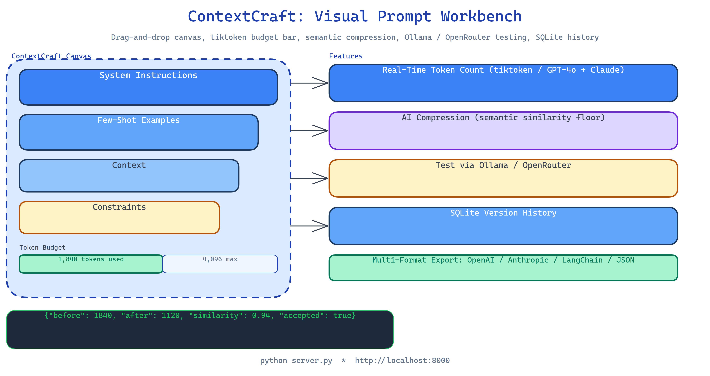

# ContextCraft: Visual Workbench for Prompt Assembly, Compression, and Testing

[](https://github.com/dakshjain-1616/ContextCraft)



## The Problem

> Prompt engineering happens in a text editor. You accumulate sections, system instructions, few-shot examples, context, constraints, until the prompt is too long. You start cutting. You cut too much and quality drops. You add it back. You lose track of which version worked best. You export to a different format for the API call and the structure breaks. None of this has to be this hard.

NEO built ContextCraft to give prompt engineering a visual, interactive workbench: see your token budget in real time as you assemble, compress intelligently rather than blindly cutting, test directly from the canvas, and version every state that worked.

## Drag-and-Drop Canvas

The canvas organizes prompts as blocks, named, draggable, resizable sections that represent distinct parts of your prompt: a system instruction block, a few-shot examples block, a context block, a constraints block. You drag them to reorder, collapse the ones you're not actively editing, and see the combined token count update live as you type.

Each block has a role tag (system, user, assistant) for structured prompt formats. Blocks can be enabled or disabled without deletion, useful when A/B testing whether a specific section improves quality.

## Real-Time Token Budget Tracking

The token counter uses tiktoken with GPT-4o and Claude tokenizer support. As you add or edit blocks, a budget bar shows current usage against the model's context limit. Color coding: green (within budget), yellow (within 90%), red (over budget). You see exactly which block is the heaviest consumer without opening a separate tokenizer tool.

## AI-Powered Compression

When a section is over budget, the compression tool shrinks it while preserving semantic meaning. The compressor uses an LLM to rewrite each block, then scores the compressed version against the original with semantic similarity. If similarity stays above your threshold, the compression is accepted. If it drops, the compressor tries again with less aggressive compression settings.

This is not naive summarization, it's iterative compression with a quality floor.

## Direct LLM Testing

Send the assembled prompt to a model without leaving the workbench:

- **Ollama**: local models, no API cost, runs offline
- **OpenRouter**: cloud models, full catalogue

The response renders inline. You see how the model handles your prompt without switching to a separate API tool, copying the prompt, reformatting it, and pasting it back.

## Version Control with Save/Restore

Every time you reach a prompt state you want to keep, save a version. SQLite stores the full canvas state, all blocks, their content, order, and enabled/disabled status. You can browse version history, restore any previous state, and diff two versions to see exactly what changed between them.

## Multi-Format Export

When the prompt is ready, export it in the format your code expects:
- **OpenAI**: array of `{role, content}` messages
- **Anthropic**: Claude's system/human/assistant format
- **LangChain**: ChatPromptTemplate structure
- **JSON**: raw block array for custom integrations

## How to Build This with NEO

Open NEO in VS Code or Cursor and describe what you want to build. A good starting prompt for this project:

> "Build a visual prompt engineering workbench with a FastAPI backend and React frontend. Implement a drag-and-drop canvas where prompt sections are named blocks with roles (system, user, assistant). Show real-time token counting using tiktoken with GPT-4o and Claude tokenizer support. Add AI-powered compression that uses an LLM to rewrite blocks while checking semantic similarity stays above a threshold. Support direct LLM testing via Ollama and OpenRouter from the canvas. Save canvas states to SQLite with version history and restore. Export in OpenAI, Anthropic, LangChain, and JSON formats."

<a href="https://heyneo.com/dashboard?section=new-chat&prompt=Build%20a%20visual%20prompt%20engineering%20workbench%20with%20FastAPI%20backend%20and%20React%20frontend.%20Drag-and-drop%20canvas%20with%20named%20blocks%20and%20roles.%20Real-time%20token%20counting%20via%20tiktoken.%20AI-powered%20compression%20with%20semantic%20similarity%20quality%20floor.%20Direct%20LLM%20testing%20via%20Ollama%20and%20OpenRouter.%20SQLite%20version%20history%20with%20restore.%20Export%20in%20OpenAI%2C%20Anthropic%2C%20LangChain%2C%20and%20JSON%20formats." style="display:inline-block;background:#1e40af;color:#ffffff;padding:10px 22px;border-radius:6px;text-decoration:none;font-weight:600;font-size:14px;">Build with NEO →</a>

NEO scaffolds the FastAPI backend, the React drag-and-drop canvas, the tiktoken integration, the semantic compression pipeline, the LLM test runner, the SQLite version store, and the export formatters. From there you iterate: add collaborative editing so your team shares prompt versions, add an evaluation mode that runs your prompt across a test dataset and shows pass rates per block, or add a diff view that highlights what changed between two saved versions.

To run the finished project:

```bash
git clone https://github.com/dakshjain-1616/ContextCraft
cd ContextCraft
pip install -r requirements.txt
cd frontend && npm install && npm run build && cd ..

python server.py
```

Open `http://localhost:8000`, the canvas, token counter, and test panel are live.

NEO built a visual prompt workbench where you assemble blocks with real-time token tracking, compress with semantic quality gating, test directly against Ollama and OpenRouter, and version every state that worked. See what else NEO ships at [heyneo.com](https://heyneo.com/).

---

## Try NEO in Your IDE

Install the NEO extension to bring AI-powered development directly into your workflow:

- **VS Code**: [NEO in VS Code](https://marketplace.visualstudio.com/items?itemName=NeoResearchInc.heyneo)
- **Cursor**: <a href="cursor://extension/NeoResearchInc.heyneo" style="color:#0066FF;font-weight:bold;">Install NEO for Cursor →</a>

---
