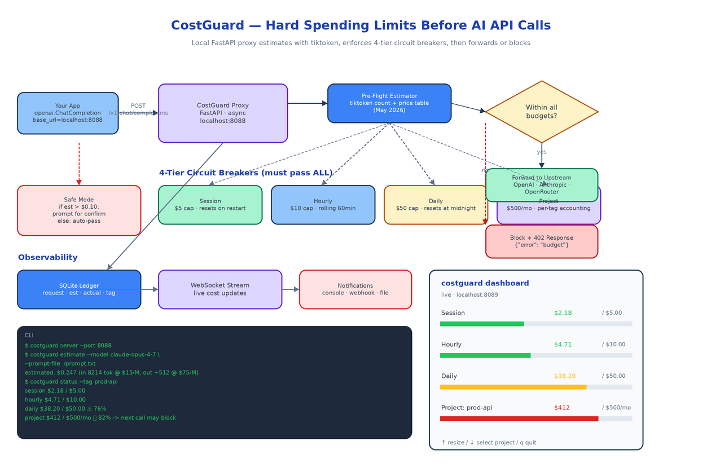

# CostGuard: A Local Proxy That Hard-Stops AI API Spending Before the Call Goes Out

[](https://github.com/dakshjain-1616/cost-Guard)



## The Problem

> A junior teammate writes a recursive agent loop that calls Claude Opus inside a `while True` block. Nobody notices for forty minutes. The bill arrives the next day and someone has to explain to finance how a one-line bug cost the team more than their laptop.

The cloud-provider dashboards are not built to save you from this. They show you what already happened, on a delay, in aggregate. By the time you see the spike, the money is gone. The only place to enforce a hard limit is on the way out, before the request reaches the provider. That is what CostGuard does. It runs locally as a drop-in proxy for the OpenAI-style chat completions endpoint, estimates the cost of every request before sending it, and refuses to forward calls that would push you past any of four configurable budget caps.

## How It Sits in Your Stack

CostGuard binds to `localhost:8088` and speaks the OpenAI chat completions API. To use it you change one line of your client setup:

```python
from openai import OpenAI

client = OpenAI(
    base_url="http://localhost:8088/v1",
    api_key="sk-...",  # real upstream key
)
```

Every request now flows through CostGuard. The proxy is async, so concurrent calls from your application do not serialize on the budget check. Under the hood it is FastAPI plus a small amount of state in SQLite.

The proxy supports three upstreams out of the box: OpenAI, Anthropic, and OpenRouter. The pricing table is bundled and current as of May 2026, with per-model input and output rates for the popular families (the Claude 4.x line, GPT-4o, Gemini 2.5, and the open models hosted on OpenRouter).

## Pre-Flight Estimation

Before any request is forwarded, CostGuard counts the input tokens with tiktoken. For models whose tokenizer is not OpenAI-compatible (the Claude family in particular), it uses the provider's own counting endpoint, or a tokenizer shim where one is available.

Output tokens are not knowable in advance, so the estimator uses two strategies. If the request specifies `max_tokens`, that ceiling is used as the worst-case output count. If not, a model-specific historical average is used and the estimate is flagged as approximate. Either way the proxy errs on the side of overestimating, because the goal is to prevent budget overruns and not to be cheap with reservations.

The estimate becomes a number of dollars and that number is checked against every budget tier before the proxy decides what to do.

## Four Budget Tiers, All Must Pass

CostGuard enforces a layered budget. A request is allowed only if it would not exceed any of these caps:

**Session.** Resets on proxy restart. The smallest cap, designed for the kind of "I just want to iterate on a prompt for half an hour" workflow where five dollars of accidental spend is annoying.

**Hourly.** Rolling 60-minute window. Catches runaway loops fast, even if a single request looks innocent.

**Daily.** Resets at local midnight. The cap most teams calibrate first because it maps onto the rhythm people already use to think about cost.

**Project.** Tagged spending with a monthly cap. Requests carry an optional `X-CostGuard-Tag` header that maps them to a project. The project tier supports per-tag accounting, so your `prod-api` workload and your `experimental-rag` workload have separate budgets and either can hit its ceiling without affecting the other.

Tiers are configurable in YAML. If you do not want a tier, set its cap to infinity, but the four-tier shape is the one most teams settle on after a week of using it.

## Safe Mode and the Circuit Breaker

A simple block-on-overage policy is too blunt for real workflows. CostGuard adds a second knob called safe mode.

When safe mode is on, any request whose estimated cost exceeds a threshold (default ten cents) prompts for confirmation. The confirmation appears in the dashboard if you have it open, or as a CLI prompt for interactive sessions. Below the threshold the request goes through automatically. This lets you trust the proxy with small calls and only step in when something expensive is about to happen.

When a request fails the budget check, CostGuard responds with HTTP 402 and a structured error body:

```json
{
  "error": {
    "type": "cost_guard_block",
    "tier": "project",
    "tag": "prod-api",
    "estimated": 0.247,
    "remaining": 0.085,
    "message": "would exceed project budget; current $412.00 of $500.00/mo"
  }
}
```

Your client sees a 402, not a successful but garbage response. The error code is intentional because 402 Payment Required has been sitting in the HTTP spec since 1992 waiting for a use case, and this is exactly it.

## The Dashboard

`costguard dashboard` opens a terminal UI that streams budget state in real time over a local WebSocket. It shows the four tiers as labelled progress bars, coloured green under fifty percent, amber up to eighty, red beyond that. A request that just got blocked appears at the top of the live log. You can switch the active project tag, resize the panels, and quit when you are done. It is the kind of small, focused tool you keep open in a tmux pane while you work.

For the non-interactive side, CostGuard ships notifications over three channels: console, webhook, and a structured log file. The webhook fires on threshold crossings (seventy-five percent and ninety percent of any tier) so your team Slack can warn you before a block actually happens.

## CLI

```bash
costguard server --port 8088
costguard estimate --model claude-opus-4-7 --prompt-file ./prompt.txt
costguard status --tag prod-api
costguard dashboard
```

The `estimate` subcommand is the one you reach for when writing a prompt and wondering whether it is going to be expensive before you ever send it:

```
$ costguard estimate --model claude-opus-4-7 --prompt-file ./prompt.txt
estimated: $0.247  (in 8214 tok @ $15/M, out ~512 @ $75/M)
```

## Why a Local Proxy

There are alternatives to this shape. You could put cost limits in the application code, but every codebase that calls a model would need to do this consistently, and nobody does. You could put limits in a cloud-hosted gateway, but then the gateway becomes a single point of failure and a latency tax. CostGuard runs on the developer's machine, in front of the developer's keys, with no network hop between the app and the proxy. The latency overhead is microseconds. The budget state lives in SQLite on disk so a restart does not lose your hourly and daily counters.

The proxy is also the right place to do this because it sees every request, including the ones you forgot existed. The forgotten cron job hitting Anthropic at 3am is exactly the call that needs to be caught.

## How to Build This with NEO

Open NEO in VS Code or Cursor and describe what you want to build. A good starting prompt for this project:

> "Build a Python local proxy called CostGuard that protects against accidental AI API overspending. Use FastAPI for the proxy (async, OpenAI-compatible chat completions endpoint on localhost:8088). Support three upstreams: OpenAI, Anthropic, OpenRouter, with a bundled pricing table accurate as of May 2026. Pre-flight cost estimation via tiktoken (with a tokenizer shim for Anthropic). Enforce four budget tiers that must all pass: session (resets on restart), hourly (rolling 60min), daily (resets at midnight), and per-project monthly via an X-CostGuard-Tag header. Implement safe mode: prompt for confirm when estimated cost exceeds a configurable threshold. Block requests with HTTP 402 and a structured error body. Persist counters in SQLite. Provide a terminal dashboard over a local WebSocket with progress bars and live request log. Notifications via console, webhook, and structured log file at 75% and 90% of any tier. CLI commands: server, estimate, status, dashboard. Use Ruff and mypy."

<a href="https://heyneo.com/dashboard?section=new-chat&prompt=Build%20a%20Python%20local%20proxy%20called%20CostGuard%20for%20AI%20API%20cost%20protection.%20FastAPI%20async%20proxy%20on%20localhost%3A8088%2C%20OpenAI-compatible%2C%20supporting%20OpenAI%2FAnthropic%2FOpenRouter%20upstreams.%20tiktoken%20pre-flight%20estimation.%20Four%20budget%20tiers%20%28session%2Fhourly%2Fdaily%2Fproject%29.%20Safe%20mode%20with%20confirm%20prompts.%20HTTP%20402%20block%20response.%20SQLite%20persistence.%20Terminal%20dashboard%20with%20WebSocket%20updates.%20Notifications%20via%20console%2Fwebhook%2Ffile.%20CLI%3A%20server%2C%20estimate%2C%20status%2C%20dashboard." style="display:inline-block;background:#1e40af;color:#ffffff;padding:10px 22px;border-radius:6px;text-decoration:none;font-weight:600;font-size:14px;">Build with NEO →</a>

NEO scaffolds the proxy, the estimator, the tier logic, the SQLite ledger, the WebSocket dashboard, and the CLI. From there you can extend it to your own provider (add a new pricing row and an upstream client), add a "freeze on incident" mode that blocks all requests until manually unfrozen, or wire the webhook into your incident-management tool.

NEO built a local circuit-breaker for AI spending. See what else NEO ships at [heyneo.com](https://heyneo.com/).

---

## Try NEO in Your IDE

Install the NEO extension to bring AI-powered development directly into your workflow:

- **VS Code**: [NEO in VS Code](https://marketplace.visualstudio.com/items?itemName=NeoResearchInc.heyneo)
- **Cursor**: <a href="cursor://extension/NeoResearchInc.heyneo" style="color:#0066FF;font-weight:bold;">Install NEO for Cursor →</a>

---
