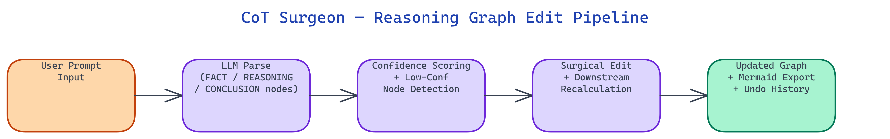

# CoT Surgeon: Surgical Editing for LLM Reasoning Chains

[](https://github.com/dakshjain-1616/cot-surgeon)



## The Problem

> LLMs produce chain-of-thought reasoning as unstructured prose. When one step is wrong, you re-run the entire prompt and hope the model self-corrects. There is no way to pinpoint the bad step, fix it, and propagate the correction without touching the rest.

NEO built CoT Surgeon to parse reasoning chains into a typed graph, expose individual nodes for editing, and recalculate only the affected downstream path.

## The ReasoningGraph Structure

**CoT Surgeon** converts LLM output into a `ReasoningGraph`, a directed acyclic graph where every node has a type and a confidence score.

Three node types cover the full reasoning structure:

- **FACT** — grounded, verifiable premises. Example: "The atmosphere contains N2, O2, and suspended particles."
- **REASONING** — inferential steps derived from facts. Example: "Rayleigh scattering causes shorter wavelengths to scatter more."
- **CONCLUSION** — the final answer derived from the reasoning chain.

Each node carries a `confidence` float between 0.0 and 1.0, estimated by the LLM during generation. Nodes below the `CONFIDENCE_THRESHOLD` (default 0.7) are flagged as low-confidence and highlighted in both the Streamlit UI and Mermaid exports.

## The Edit and Recalculate Workflow

The core operation is surgical: fix one node, regenerate only the path that depends on it.

```python
from cot_surgeon import ReasoningEngine

engine = ReasoningEngine(mode="mock")
graph = engine.generate_cot("Why is the sky blue?")

# Find low-confidence nodes
weak = graph.low_confidence_nodes(threshold=0.75)
for node in weak:
    print(f"{node.id}  conf={node.confidence:.2f}  {node.content}")

# Fix the flawed step
graph.update_node("node_3", "Rayleigh scattering causes shorter wavelengths to scatter more strongly.")

# Recalculate everything downstream — upstream nodes are untouched
graph = engine.recalculate_from_node(graph, "node_3")
```

Nodes that do not depend on `node_3` are never touched. The graph's `version` counter increments on every edit. Every mutation pushes a snapshot onto an internal history stack with a default depth of 20, so `graph.undo()` steps back through changes.

## Confidence Scoring and Graph Stats

After generation or recalculation, `graph.stats()` returns a summary:

```python
stats = graph.stats()
# {
#   "node_count": 5,
#   "avg_confidence": 0.89,
#   "low_confidence_count": 1,
#   "edit_count": 1,
#   "version": 2
# }
```

Low-confidence nodes receive a distinct color in **Mermaid** exports. Edited nodes are rendered in purple so you can see exactly which parts of a graph were modified.

## LLM Backend Priority

Three backends are supported in auto mode:

1. **OpenRouter** — used when `OPENROUTER_API_KEY` is set
2. **Local llama.cpp** — used when `LLAMA_MODEL_PATH` is set
3. **Mock** — always available, uses built-in templates, no API key needed

Pass `mode` explicitly to bypass auto-detection:

```python
engine = ReasoningEngine(mode="openrouter")  # cloud
engine = ReasoningEngine(mode="local")       # llama.cpp GGUF
engine = ReasoningEngine(mode="mock")        # no key needed
```

## How to Build This with NEO

Open NEO in VS Code or Cursor and describe what you want to build. A good starting prompt for this project:

> "Build a Python library called CoT Surgeon that parses LLM chain-of-thought output into a typed directed acyclic graph. Each node has a type (FACT, REASONING, or CONCLUSION), a confidence score between 0 and 1, and an ID. When a node is edited, recalculate only the downstream subgraph — leave upstream nodes untouched. Track a version counter on every edit, maintain an undo history stack of 20 snapshots, and flag nodes below a configurable confidence threshold. Support three LLM backends in priority order: OpenRouter, local llama.cpp GGUF, and a mock mode with built-in templates. Export graphs as Mermaid diagrams with low-confidence nodes colored distinctly and edited nodes in purple. Provide a Streamlit UI with Single Analysis and Batch Compare tabs."

<a href="https://heyneo.com/dashboard?section=new-chat&prompt=Build%20a%20Python%20library%20called%20CoT%20Surgeon%20that%20parses%20LLM%20chain-of-thought%20output%20into%20a%20typed%20directed%20acyclic%20graph.%20Each%20node%20has%20a%20type%20%28FACT%2C%20REASONING%2C%20or%20CONCLUSION%29%2C%20a%20confidence%20score%20between%200%20and%201%2C%20and%20an%20ID.%20When%20a%20node%20is%20edited%2C%20recalculate%20only%20the%20downstream%20subgraph%20%E2%80%94%20leave%20upstream%20nodes%20untouched.%20Track%20a%20version%20counter%20on%20every%20edit%2C%20maintain%20an%20undo%20history%20stack%20of%2020%20snapshots%2C%20and%20flag%20nodes%20below%20a%20configurable%20confidence%20threshold.%20Support%20three%20LLM%20backends%20in%20priority%20order%3A%20OpenRouter%2C%20local%20llama.cpp%20GGUF%2C%20and%20a%20mock%20mode%20with%20built-in%20templates.%20Export%20graphs%20as%20Mermaid%20diagrams%20with%20low-confidence%20nodes%20colored%20distinctly%20and%20edited%20nodes%20in%20purple.%20Provide%20a%20Streamlit%20UI%20with%20Single%20Analysis%20and%20Batch%20Compare%20tabs." style="display:inline-block;background:#1e40af;color:#ffffff;padding:10px 22px;border-radius:6px;text-decoration:none;font-weight:600;font-size:14px;">Build with NEO →</a>

NEO generates the project structure and core implementation from that. From there you iterate — ask it to implement the selective recalculation logic that traverses only the affected downstream subgraph, add the undo/redo history stack with configurable depth, or build out the Batch Compare tab that runs multiple prompts in parallel and displays graphs side by side. Each request builds on what's already there without re-explaining the context.

To run the finished project:

```bash
git clone https://github.com/dakshjain-1616/cot-surgeon
cd cot-surgeon
pip install -r requirements.txt
streamlit run app.py
```

The Single Analysis tab lets you generate a reasoning graph, inspect and edit individual nodes, trigger downstream recalculation, and export to Mermaid. The Batch Compare tab is useful for regression testing prompt changes across multiple reasoning chains.

NEO built a structured reasoning editor that treats LLM chain-of-thought as inspectable, editable, and version-controlled data. See what else NEO ships at [heyneo.com](https://heyneo.com/).

---

## Try NEO in Your IDE

Install the NEO extension to bring AI-powered development directly into your workflow:

- **VS Code**: [NEO in VS Code](https://marketplace.visualstudio.com/items?itemName=NeoResearchInc.heyneo)
- **Cursor**: <a href="cursor://extension/NeoResearchInc.heyneo" style="color:#0066FF;font-weight:bold;">Install NEO for Cursor →</a>

---
