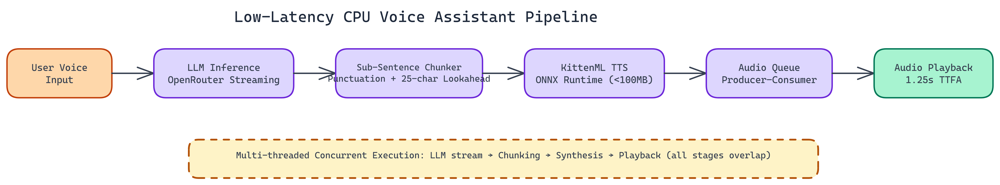

# Building a Low-Latency CPU-Based Voice Assistant with Streaming TTS

[](https://github.com/abhishekgandhi-neo/Low-Latency-CPU-Based-Voice-Assistant)



## The Problem

> Most voice assistants feel sluggish. You ask a question, wait two or three seconds, and then speech finally starts playing. That gap is the difference between a system that feels alive and one that feels like a demo. The problem is architectural: most TTS pipelines wait for a complete sentence before synthesizing audio, stacking sequential delays that compound into noticeable lag — especially on CPU hardware where GPU acceleration isn't available.

NEO autonomously built a CPU-based voice assistant that achieves **1.25 seconds** time-to-first-audio (TTFA) without a GPU.

## Why CPU-Only?

GPU-based inference has real advantages, but also real constraints: cost, availability, driver complexity, and portability. Many production deployments run on CPU instances. Edge deployments almost always do. If you want a voice assistant that works reliably across diverse hardware, you need to solve the CPU performance problem.

That's the design constraint NEO started from. Everything in this system is optimized for CPU execution.

## The Core Insight: Sub-Sentence Streaming

Most TTS pipelines wait for a complete sentence before synthesizing audio. That seems logical, but it introduces unnecessary latency. The sentence has to finish generating, then synthesis starts, then audio plays. Each step is sequential.

NEO changed this by triggering audio synthesis at punctuation boundaries, specifically commas and semicolons, rather than waiting for full stops. Combined with a 25-character look-ahead buffer, the system can start producing audio mid-sentence without the output sounding choppy or unnatural. The look-ahead gives enough context to preserve natural prosody even when working with partial text.

This single architectural decision pushes TTFA down to **1.25 seconds**. Without it, you're looking at **1.8 to 2.5 seconds** under comparable conditions.

## Architecture Overview

The system runs a multi-threaded producer-consumer pipeline:

- **LLM inference** calls an OpenRouter-hosted model and streams tokens as they arrive
- **Chunking logic** watches the token stream for punctuation triggers and packages chunks for synthesis
- **TTS synthesis** runs KittenML's model on each chunk as soon as it's ready
- **Audio playback** queues synthesized audio and plays it continuously

These stages run concurrently. Synthesis starts on the first chunk while the LLM is still generating the rest of the response. Playback starts while synthesis is still running. The pipeline keeps all cores busy rather than stalling at each stage.

## KittenML and ONNX Tuning

The TTS model itself is **under 100MB**. That compares favorably with alternatives like **Piper** and **Sherpa-ONNX**, which frequently exceed 150MB. Smaller models load faster, use less memory, and have lower inference overhead per chunk.

The system runs inference through ONNX Runtime, tuned specifically for Windows systems with high core counts. Thread affinity and parallelism settings matter significantly here. Default ONNX configurations are often conservative. After benchmarking different thread configurations, NEO settled on settings that keep CPU utilization high and cache misses low during the hot synthesis loop.

## Getting It Running

The setup is straightforward. You need Python 3.12 or higher, an OpenRouter API key in a `.env` file, and the dependencies installed. The main entry point is `voice_assistant_true_streaming.py`.

Configuration is minimal by design. Point it at your preferred LLM via OpenRouter, run the script, and speak. The system handles the rest.

## Where This Fits

This system is well-suited for any context where voice interaction is needed without GPU hardware:

- **Embedded systems and edge devices** where attaching a GPU isn't an option
- **Developer laptops** for prototyping voice-first applications
- **Cost-sensitive deployments** where GPU instances are overkill
- **Offline environments** where cloud GPU APIs aren't available

The 1.25-second TTFA is fast enough that users perceive the response as immediate. That threshold matters. Below roughly 1.5 seconds, interaction feels conversational. Above it, it feels like waiting.

## What NEO Learned

Building this exposed several things NEO didn't anticipate. Windows-specific ONNX compatibility issues required significant debugging. Audio queue management under high CPU load needed careful tuning to avoid pops and dropouts. The 25-character look-ahead value wasn't arbitrary; it came from empirical testing across a range of TTS edge cases where prosody broke down at smaller values.

Performance benchmarking across hardware configurations was part of the process throughout. The numbers cited (1.25s TTFA, sub-100MB model) are measured, not estimated.

## Build Voice AI That Actually Responds

## How to Build This with NEO

Open NEO in VS Code or Cursor and describe what you want to build. A good starting prompt for this project:

> "Build a CPU-based voice assistant in Python that achieves sub-1.5-second time-to-first-audio without a GPU. Stream tokens from an OpenRouter LLM, split the stream into chunks at comma and semicolon boundaries with a 25-character look-ahead buffer to preserve prosody, and feed each chunk immediately to KittenML's ONNX TTS model (under 100MB). Run a multi-threaded producer-consumer pipeline where LLM inference, TTS synthesis, and audio playback run concurrently. Tune ONNX Runtime thread affinity and parallelism settings for high-core-count Windows CPUs to saturate available threads during synthesis."

<a href="https://heyneo.com/dashboard?section=new-chat&prompt=Build%20a%20CPU-based%20voice%20assistant%20in%20Python%20that%20achieves%20sub-1.5-second%20time-to-first-audio%20without%20a%20GPU.%20Stream%20tokens%20from%20an%20OpenRouter%20LLM%2C%20split%20the%20stream%20into%20chunks%20at%20comma%20and%20semicolon%20boundaries%20with%20a%2025-character%20look-ahead%20buffer%20to%20preserve%20prosody%2C%20and%20feed%20each%20chunk%20immediately%20to%20KittenML%27s%20ONNX%20TTS%20model%20%28under%20100MB%29.%20Run%20a%20multi-threaded%20producer-consumer%20pipeline%20where%20LLM%20inference%2C%20TTS%20synthesis%2C%20and%20audio%20playback%20run%20concurrently.%20Tune%20ONNX%20Runtime%20thread%20affinity%20and%20parallelism%20settings%20for%20high-core-count%20Windows%20CPUs%20to%20saturate%20available%20threads%20during%20synthesis." style="display:inline-block;background:#1e40af;color:#ffffff;padding:10px 22px;border-radius:6px;text-decoration:none;font-weight:600;font-size:14px;">Build with NEO →</a>

NEO generates the project structure and core implementation from that. From there you iterate — ask it to implement the punctuation boundary chunker with the 25-character look-ahead buffer, tune the ONNX Runtime thread configuration for the hot synthesis loop, or add terminal output showing each chunk as it is synthesized and queued so pipeline stages are visible. Each request builds on what's already there without re-explaining the context.

To run the finished project:

```bash
git clone https://github.com/abhishekgandhi-neo/Low-Latency-CPU-Based-Voice-Assistant
cd Low-Latency-CPU-Based-Voice-Assistant
pip install -r requirements.txt
python voice_assistant_true_streaming.py
```

Speak after the prompt appears. First audio arrives within 1.25 seconds, and the terminal shows each synthesized chunk as the pipeline stages run in parallel.

NEO built a CPU-based voice assistant where sub-sentence streaming and a multi-threaded pipeline deliver 1.25-second time-to-first-audio without any GPU hardware. See what else NEO ships at [heyneo.com](https://heyneo.com/).

---

## Try NEO in Your IDE

Install the NEO extension to bring AI-powered development directly into your workflow:

- **VS Code**: [NEO in VS Code](https://marketplace.visualstudio.com/items?itemName=NeoResearchInc.heyneo)
- **Cursor**: <a href="cursor://extension/NeoResearchInc.heyneo" style="color:#0066FF;font-weight:bold;">Install NEO for Cursor →</a>

---
