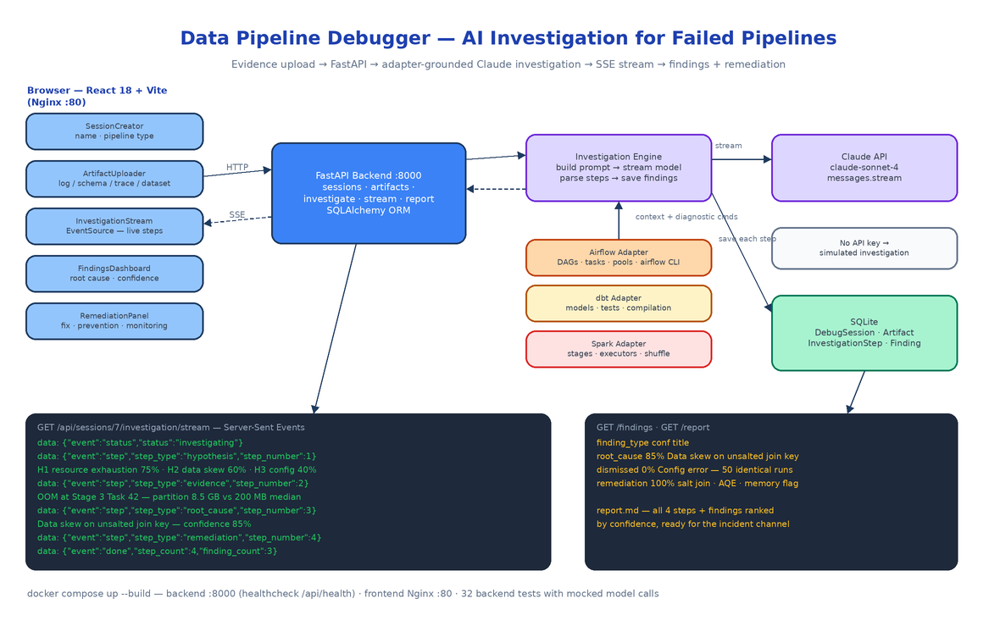

# Data Pipeline Debugger: An AI Investigation Engine for Broken Airflow, dbt, and Spark Runs

[](https://github.com/dakshjain-1616/Data-Pipeline-Debugger)



## The Problem

> The revenue aggregation job died at 2:47am. The on-call data engineer opens the Spark UI, sees Stage 3 failed, opens the executor logs, scrolls past four thousand lines of GC noise, finds an `OutOfMemoryError`, bumps executor memory to 8 GB, reruns, and goes back to bed. It fails again at 4:15. The real problem was never memory — it was one partition carrying 8.5 GB through an unsalted join while the median carried 200 MB. Nobody looked at the task-level distribution, because at 3am nobody does.

Pipeline debugging is an evidence problem disguised as a log-reading problem. The signal is spread across executor logs, DAG run histories, schema files, and config diffs, and the human process — guess, grep, rerun — skips the step where you actually weigh hypotheses against each other. Data Pipeline Debugger turns that process into a structured investigation: you upload whatever evidence you have, and a Claude-powered engine works through hypothesis formation, evidence analysis, root-cause determination, and remediation, streaming each step to your browser as it happens.

## A Debug Session Is the Unit of Work

The backend is FastAPI on Python 3.11 with SQLAlchemy over SQLite, and the whole data model is four tables: `DebugSession`, `Artifact`, `InvestigationStep`, `Finding`. You create a session with a name and a `pipeline_type` (airflow, dbt, or spark), then attach artifacts — log files, JSON or YAML schemas, execution traces, CSV datasets — either as file uploads or pasted text. Uploads are capped at 10 MB, restricted to four `file_type` values (`log`, `schema`, `trace`, `dataset`), and a whitelist of extensions (`.log`, `.txt`, `.json`, `.yaml`, `.yml`, `.csv`, `.trace`).

The API surface is small and obvious:

```
POST   /api/sessions                                  create a debug session
GET    /api/sessions                                  list sessions with artifact/finding counts
GET    /api/sessions/{id}                             session detail
POST   /api/sessions/{id}/artifacts                   upload evidence (file or text)
DELETE /api/sessions/{id}/artifacts/{artifact_id}     remove evidence
POST   /api/sessions/{id}/investigate                 kick off the AI investigation (202)
GET    /api/sessions/{id}/investigation/stream        SSE — live steps
GET    /api/sessions/{id}/investigation/steps         saved steps
GET    /api/sessions/{id}/findings                    root cause, dismissed hypotheses, remediation
GET    /api/sessions/{id}/report                      Markdown investigation report
GET    /api/health                                    health check (gates the frontend container)
```

`POST /investigate` returns `202 Accepted` immediately and runs the investigation in a background `asyncio` task with its own DB session. A second investigate call on a session that is already `investigating` gets a `409`.

## The Investigation Engine

`services/investigation_engine.py` is the core. It gathers every artifact for the session, routes them through the adapter matching the session's pipeline type, and builds one structured prompt from `INVESTIGATION_PROMPT_TEMPLATE`. The template is the scientific method spelled out as instructions:

```text
## Step 1: Hypothesis Formation
Generate 3-5 hypotheses. For each: title, description,
likelihood (0-100), evidence for, evidence against.

## Step 2: Evidence Analysis
For each hypothesis: confirmed | dismissed | inconclusive,
key evidence (specific log lines), step-by-step reasoning.

## Step 3: Root Cause Determination
Root cause, confidence (0-100), supporting evidence,
dismissed hypotheses and why they were ruled out.

## Step 4: Remediation Recommendations
Immediate fix, exact code/config change, prevention
strategy, monitoring suggestion.
```

The forced structure matters. Without it, a model reads an OOM stack trace and tells you to add memory. With it, the model has to enumerate alternatives, state likelihood percentages, and dismiss hypotheses with reasons before committing — which is how data skew gets caught hiding behind a memory error.

The engine calls the model with streaming enabled (`client.messages.stream`, defaulting to `claude-sonnet-4-20250514`, with an OpenRouter path selected automatically when `OPENROUTER_API_KEY` is set). The accumulated response is parsed by `_parse_steps_from_text`, which maps section headers to step types (`hypothesis`, `evidence`, `root_cause`, `remediation`), and `_parse_findings_from_steps` then extracts structured findings — pulling the root-cause title and confidence percentage out with regexes and tagging remediation blocks. Steps and findings are written to SQLite one at a time, and a `ProgressCallback` emits an event for every write.

## Pipeline Adapters Carry the Domain Knowledge

A generic "here are some logs" prompt produces generic advice. The fix is the adapter pattern in `pipeline_adapters/`: an abstract `BasePipelineAdapter` with three methods — `get_investigation_prompt_context`, `suggest_diagnostic_commands`, `parse_pipeline_logs` — and one concrete adapter per platform.

Each adapter wraps the artifacts in XML-tagged context plus a platform-specific investigation briefing. The Airflow adapter tells the model to consider DAG parse timing, task instance dependencies, pool/slot contention, executor backpressure, and metadata DB health. The dbt adapter knows model compilation output and failing tests; the Spark adapter knows stages, executors, and shuffle behavior. Each adapter also contributes a list of real diagnostic commands that get embedded in the prompt, so remediation references things you can actually run:

```python
def suggest_diagnostic_commands(self) -> List[Dict[str, str]]:
    return [
        {"command": "airflow dags report",
         "description": "Show DAG parsing and scheduling health report"},
        {"command": "airflow tasks test <dag_id> <task_id> <execution_date>",
         "description": "Test a single task instance"},
        {"command": "airflow pools list",
         "description": "List resource pools and slot usage"},
        ...
    ]
```

On the parsing side, `services/artifact_parser.py` has format-aware log parsers: the Airflow parser extracts timestamps, DAG IDs, task IDs, and error/warning lines; the dbt and Spark parsers do the equivalent for their formats. Structured extraction means the prompt leads with "3 errors, 2 warnings, 1 DAG, 14 tasks" rather than making the model rediscover that from raw text.

## SSE Streaming That Survives a Refresh

The investigation runs server-side for tens of seconds, so the frontend watches it live over Server-Sent Events. The stream endpoint has two modes. While an investigation is running, it registers a handler on the session's `ProgressCallback`, pushes every event (`status`, `step`, `done`, `error`) through an `asyncio.Queue`, and emits a `: keepalive` comment every 60 seconds of silence so proxies don't kill the connection.

The useful part is what happens when no investigation is live: the endpoint falls back to the database, replays every saved `InvestigationStep` in order as SSE events, and closes with a `done`. Because the engine writes each step to SQLite *before* emitting it, the stream and the database can never disagree — refresh the browser mid-investigation and you reconnect to exactly the steps that actually happened, not an in-memory approximation.

The React 18 + Tailwind frontend consumes this with a plain `EventSource` in `api/client.ts`. Five components cover the workflow: `SessionCreator` (name, pipeline type, description), `ArtifactUploader` (file upload with type selector), `InvestigationStream` (live step display), `FindingsDashboard` (root cause with confidence score, supporting evidence, dismissed hypotheses), and `RemediationPanel` (immediate fix, code snippet, prevention strategy, monitoring suggestion). When the session completes, `GET /api/sessions/{id}/report` renders the whole investigation — every step plus findings ranked by confidence — as a Markdown report you can paste into the incident channel.

## No API Key, No Problem

If neither `ANTHROPIC_API_KEY` nor `OPENROUTER_API_KEY` is set, the engine doesn't error out — it runs a deterministic simulated investigation of a realistic Spark failure: five hypotheses with likelihoods, resource exhaustion confirmed at Stage 3 Task 42, configuration error dismissed after 50 identical prior runs, root cause "data skew on an unsalted join key" at 85% confidence, and a three-layer remediation ending in an AQE prevention strategy. The simulation flows through the exact same parser, database writes, and SSE pipeline as a real model call, which is also why the backend's 32 tests (adapters, artifact parsing, prompt building, SSE callbacks, the no-key fallback) run in under a second with zero network calls.

## Running It

Local dev is two terminals (`uvicorn main:app --reload` on 8000, `npm run dev` on 5173). Production is one command:

```bash
cp .env.example .env   # set ANTHROPIC_API_KEY
docker compose up --build
```

Compose builds the backend container on port 8000 with a `curl -f http://localhost:8000/api/health` healthcheck, persists SQLite in a named `backend_data` volume, and serves the built frontend behind Nginx on port 80 with `VITE_API_BASE_URL=/api` so the browser never needs to know where the backend lives.

## How to Build This with NEO

Open NEO in VS Code or Cursor and describe what you want to build. A good starting prompt for this project:

> "Build a docker-compose web app called Data Pipeline Debugger: an AI investigation platform for failed Airflow, dbt, and Spark runs. Backend: FastAPI + SQLAlchemy + SQLite with four models (DebugSession, Artifact, InvestigationStep, Finding) and REST endpoints for sessions, artifact upload (10 MB cap, log/schema/trace/dataset types), starting an investigation as a background asyncio task, an SSE stream of live steps, findings, and a Markdown report export. Build an investigation engine that routes artifacts through per-platform adapters (Airflow, dbt, Spark — each providing prompt context, log parsing, and diagnostic CLI commands), constructs a structured prompt forcing four steps (hypothesis formation with likelihoods, evidence analysis, root cause with confidence, remediation), streams Claude's response, parses it into steps and findings, and saves each to SQLite before emitting it over SSE. Include a deterministic simulated investigation when no API key is set. Frontend: React 18 + Tailwind + Vite with SessionCreator, ArtifactUploader, InvestigationStream (EventSource), FindingsDashboard, and RemediationPanel components. Ship docker-compose with a health-checked backend and an Nginx-served frontend, plus pytest coverage for adapters, parsing, and SSE callbacks with mocked model calls."

<a href="https://heyneo.com/dashboard?section=new-chat&prompt=Build%20a%20docker-compose%20web%20app%20called%20Data%20Pipeline%20Debugger%3A%20an%20AI%20investigation%20platform%20for%20failed%20Airflow%2C%20dbt%2C%20and%20Spark%20runs.%20FastAPI%20%2B%20SQLAlchemy%20%2B%20SQLite%20backend%20with%20sessions%2C%20artifact%20upload%2C%20background%20investigations%2C%20and%20SSE%20streaming.%20Per-platform%20pipeline%20adapters%20feed%20a%20structured%20Claude%20prompt%3A%20hypothesis%20formation%2C%20evidence%20analysis%2C%20root%20cause%20with%20confidence%2C%20remediation.%20React%2018%20%2B%20Tailwind%20frontend%20with%20live%20investigation%20stream%2C%20findings%20dashboard%2C%20and%20remediation%20panel.%20Markdown%20report%20export%2C%20simulated%20fallback%20without%20an%20API%20key%2C%20pytest%20with%20mocked%20model%20calls." style="display:inline-block;background:#1e40af;color:#ffffff;padding:10px 22px;border-radius:6px;text-decoration:none;font-weight:600;font-size:14px;">Build with NEO →</a>

NEO scaffolds the FastAPI app, the adapter layer, the SSE plumbing, the React components, and the compose file. From there you add adapters for your own platforms — a Dagster adapter, a Flink adapter, an internal ETL framework — by implementing three methods on the base class, and the investigation engine picks them up without touching the core loop.

NEO built a debugger that treats a 3am pipeline failure like a case file instead of a grep session. See what else NEO ships at [heyneo.com](https://heyneo.com/).

---

## Try NEO in Your IDE

Install the NEO extension to bring AI-powered development directly into your workflow:

- **VS Code**: [NEO in VS Code](https://marketplace.visualstudio.com/items?itemName=NeoResearchInc.heyneo)
- **Cursor**: <a href="cursor://extension/NeoResearchInc.heyneo" style="color:#0066FF;font-weight:bold;">Install NEO for Cursor →</a>

---
