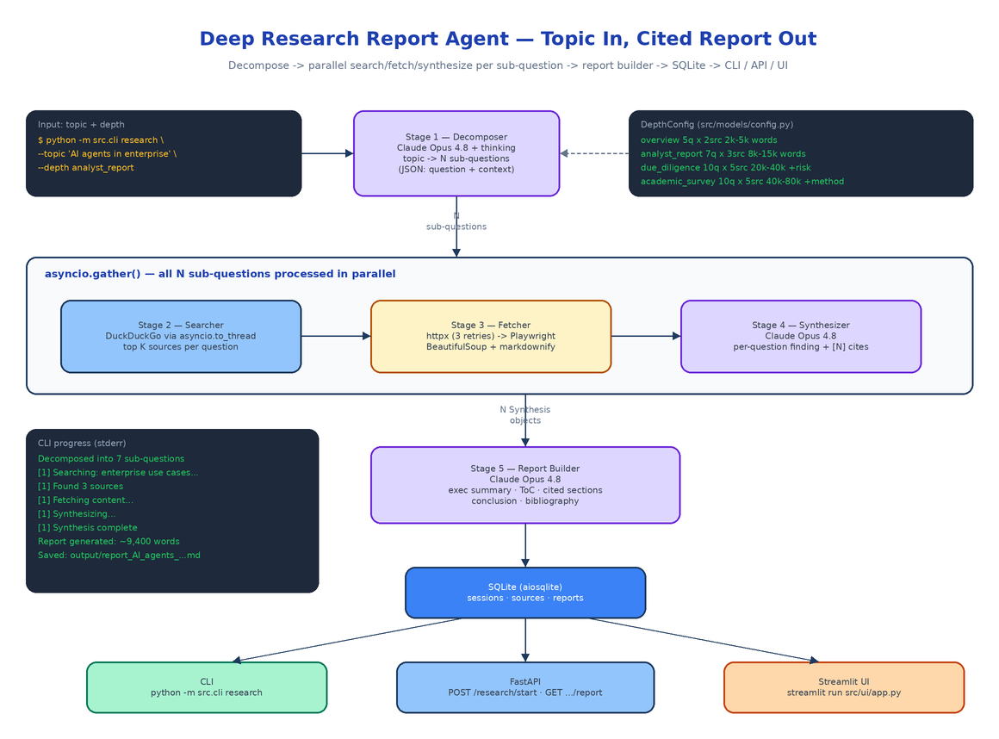

# Deep Research Report Agent: From One Topic to a Book-Length, Fully-Cited Report

[](https://github.com/dakshjain-1616/Deep-Research-Report-Agent)



## The Problem

> You need a due-diligence memo on a market you barely know. The honest version of that work is forty browser tabs, a dozen contradictory sources, and a weekend of copying quotes into a doc while trying to remember which tab each claim came from. Ask a chatbot instead and you get three confident paragraphs with zero citations and no way to check any of it.

The gap between "ask an LLM" and "produce a real research report" is structural. A single prompt cannot cover a broad topic, a single context window cannot hold dozens of full web pages, and a single generation pass cannot keep citations honest across ten thousand words. Deep Research Report Agent closes that gap with a five-stage pipeline: decompose the topic into sub-questions, search and fetch real sources for each one in parallel, synthesize per-question findings with numbered citations, then assemble everything into a structured report with an executive summary, table of contents, and bibliography. Give it a topic and a depth level; get back Markdown you can actually hand to someone.

## Five Stages, One Orchestrator

The whole pipeline lives in `src/agent/`, one module per stage, coordinated by `orchestrator.py`'s `run_research()`.

**Stage 1 — Decompose** (`decomposer.py`). Claude Opus 4.8, called through OpenRouter with extended thinking enabled (`"thinking": {"type": "enabled", "budget_tokens": 8000}`), receives the topic and returns a JSON array of sub-questions, each with a `question` and a `context` note explaining which aspect it covers. The system prompt forces non-overlapping, independently researchable questions — this stage gets the thinking budget because a bad decomposition produces a disconnected report no later stage can fix.

**Stage 2 — Search** (`searcher.py`). Each sub-question becomes a DuckDuckGo query via the `duckduckgo_search` library. The library is synchronous, so calls are wrapped in `asyncio.to_thread` to keep the event loop unblocked. It over-fetches at `max_sources * 2` results and keeps the top N as `Source` objects with URL, title, and snippet.

**Stage 3 — Fetch** (`fetcher.py`). Every source URL is fetched with `httpx.AsyncClient` — three retries with linear backoff, a browser User-Agent, permanent failures (403/404/410) skipped immediately, PDFs skipped. If httpx comes back empty, a headless Playwright Chromium renders the page as a fallback for JS-heavy sites. The HTML then goes through a BeautifulSoup cleaning pass that strips nav, footers, sidebars, cookie banners, and anything matching a noise-pattern regex, finds the `<main>` or `<article>` content area, and converts it to Markdown with `markdownify`, truncated at 50KB per source.

**Stage 4 — Synthesize** (`synthesizer.py`). For each sub-question, Claude Opus 4.8 receives the question, its context note, and every fetched source (content or snippet, with fetch status marked). It writes a standalone finding with inline `[1]`-style citations keyed to source order, presenting both sides when sources disagree and explicitly flagging when sources failed to fetch.

**Stage 5 — Build Report** (`report_builder.py`). A final Claude call gets all syntheses plus a pre-built numbered bibliography and assembles the document: title page, 200–400 word executive summary, table of contents, one body section per sub-question with consistent citation numbering, conclusion, and a bibliography in `[1] Title, URL, Accessed: YYYY-MM-DD` format. The system prompt is blunt about quality: every paragraph cited, no placeholder text, no "further research needed" cop-outs.

## Parallelism and Graceful Degradation

Stages 2–4 run per sub-question, and the orchestrator launches all of them concurrently:

```python
tasks = [process_sub_question(sq, i) for i, sq in enumerate(sub_questions)]
await asyncio.gather(*tasks, return_exceptions=True)
```

Within each sub-question, source fetches are themselves gathered in parallel. `return_exceptions=True` is doing real work here: a DuckDuckGo query that returns nothing, a URL that times out, or a synthesis that fails marks that one sub-question `failed` and the pipeline keeps going. Only if *every* synthesis fails does the session drop to `partially_completed` — and even then the report builder runs with whatever survived. The 56-test suite (`pytest tests/ -v`) covers each stage in isolation plus exactly these degradation paths in the orchestrator.

Every transition is persisted to SQLite via `aiosqlite` and surfaced through a progress callback, so the session walks through `decomposing → searching → fetching → synthesizing → building → completed` with a `progress_pct` you can poll.

## Depth Levels Change the Shape, Not Just the Length

Depth is a dataclass config (`src/models/config.py`), not a vibe. Each level fixes the sub-question count, sources per question, and target word range:

| Depth | Sub-questions | Sources/question | Target words | Special section |
|-------|--------------|------------------|--------------|-----------------|
| `overview` | 5 | 2 | 2,000–5,000 | — |
| `analyst_report` | 7 | 3 | 8,000–15,000 | — |
| `due_diligence` | 10 | 5 | 20,000–40,000 | Risk Assessment |
| `academic_survey` | 10 | 5 | 40,000–80,000 | Methodology Critique |

The `special_sections` field is the interesting part: `due_diligence` injects a mandatory Risk Assessment section into the report builder's prompt, and `academic_survey` adds a Methodology Critique. Deeper levels do not just write more words — they answer more questions from more sources and add the analytical sections that the report type demands.

## Three Interfaces, One Pipeline

The CLI is the fastest path:

```bash
export OPENROUTER_API_KEY=sk-or-...

python -m src.cli list-depths
python -m src.cli research --topic "AI agents in enterprise software" \
    --depth analyst_report --output report.md
```

Progress streams to stderr while the report itself goes to stdout (and to `output/report_<topic>_<timestamp>.md` if you skip `--output`):

```
  Decomposed into 7 sub-questions:
    1. What are the primary enterprise use cases for AI agents today?
    ...
  [1] Searching: What are the primary enterprise use cases...
  [1] Found 3 sources
  [1] Fetching content...
  [1] Synthesizing...
  [1] Synthesis complete

  Report generated: ~9,400 words, status=completed
  Report saved to: output/report_AI_agents_in_enterprise_software_20260612.md
```

The FastAPI server runs the same pipeline as a background `asyncio.Task`, returning a session ID immediately:

| Method | Path | Description |
|--------|------|-------------|
| `POST` | `/research/start` | Start a session; returns `session_id` immediately |
| `GET` | `/research/{session_id}/status` | Status, `progress_pct`, per-sub-question state |
| `GET` | `/research/{session_id}/report` | Completed report as Markdown with word count |
| `GET` | `/research/sessions` | All past sessions |
| `GET` | `/depths` | Available depth configs |

And `streamlit run src/ui/app.py` gives you a browser UI with a depth selector, live progress, and the rendered report.

## Configuration

One environment variable is required; two more are optional overrides, all loaded from `.env` by `src/config.py`:

```env
OPENROUTER_API_KEY=sk-or-...                  # required — all LLM calls go through OpenRouter
ANTHROPIC_MODEL=anthropic/claude-opus-4.8     # optional model override
DATABASE_PATH=data/research.db                # optional SQLite location
```

HTTP timeout (30s), retry count (3), and the Playwright timeout (60s) are constants in the same module, so tuning fetch behavior is a one-line change.

## How to Build This with NEO

Open NEO in VS Code or Cursor and describe what you want to build. A good starting prompt for this project:

> "Build a Python deep research agent. Give it a topic and a depth level; it returns a book-length, fully-cited Markdown report. Five stages: (1) a decomposer that calls Claude Opus 4.8 via OpenRouter with extended thinking to break the topic into N non-overlapping sub-questions as JSON; (2) a DuckDuckGo searcher wrapped in asyncio.to_thread; (3) a fetcher that tries httpx with retries first and falls back to headless Playwright for JS-rendered pages, then cleans HTML with BeautifulSoup and converts to Markdown with markdownify; (4) a per-question synthesizer that writes a cited finding with [1]-style references; (5) a report builder that assembles executive summary, table of contents, body sections, conclusion, and a numbered bibliography. Run all sub-questions in parallel with asyncio.gather and degrade gracefully when a search or synthesis fails. Define four depth levels (overview, analyst_report, due_diligence, academic_survey) as dataclass configs controlling sub-question count, sources per question, and target word range, with special sections like a risk assessment for due diligence. Persist sessions, sources, and reports in SQLite via aiosqlite. Expose three interfaces: an argparse CLI (research, list-depths), a FastAPI server with background tasks and status polling, and a Streamlit UI with live progress. Cover every stage plus the degradation paths with pytest."

<a href="https://heyneo.com/dashboard?section=new-chat&prompt=Build%20a%20Python%20deep%20research%20agent%20that%20turns%20a%20topic%20into%20a%20book-length%2C%20fully-cited%20Markdown%20report.%20Five-stage%20async%20pipeline%3A%20Claude%20decomposes%20the%20topic%20into%20sub-questions%2C%20DuckDuckGo%20search%2C%20httpx%20fetch%20with%20Playwright%20fallback%20and%20markdownify%2C%20per-question%20synthesis%20with%20numbered%20citations%2C%20and%20a%20report%20builder%20with%20executive%20summary%2C%20ToC%2C%20and%20bibliography.%20Four%20depth%20levels%2C%20asyncio.gather%20parallelism%20with%20graceful%20degradation%2C%20SQLite%20session%20store%2C%20argparse%20CLI%2C%20FastAPI%20background%20tasks%2C%20and%20Streamlit%20UI." style="display:inline-block;background:#1e40af;color:#ffffff;padding:10px 22px;border-radius:6px;text-decoration:none;font-weight:600;font-size:14px;">Build with NEO →</a>

NEO scaffolds the five-stage pipeline, the depth configs, the SQLite store, all three interfaces, and the test suite. From there you swap in your preferred search backend, add a depth level tuned to your team's deliverables, or point `ANTHROPIC_MODEL` at whatever model OpenRouter is serving this month.

NEO built a research pipeline that turns one topic string into a cited, structured report you can actually check. See what else NEO ships at [heyneo.com](https://heyneo.com/).

---

## Try NEO in Your IDE

Install the NEO extension to bring AI-powered development directly into your workflow:

- **VS Code**: [NEO in VS Code](https://marketplace.visualstudio.com/items?itemName=NeoResearchInc.heyneo)
- **Cursor**: <a href="cursor://extension/NeoResearchInc.heyneo" style="color:#0066FF;font-weight:bold;">Install NEO for Cursor →</a>

---
