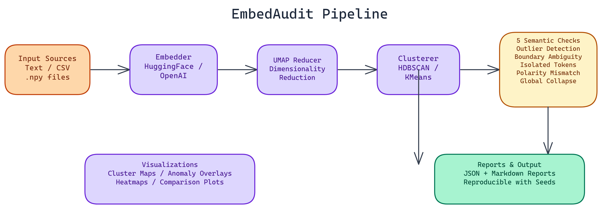

# EmbedAudit: A CLI Tool for Auditing Semantic Embedding Spaces

<a href="https://github.com/dakshjain-1616/Embedding-Evaluator" target="_blank" style="display:flex;align-items:center;gap:14px;padding:16px 20px;border:1px solid #30363d;border-radius:10px;background:#0d1117;color:#e6edf3;text-decoration:none;font-family:-apple-system,BlinkMacSystemFont,'Segoe UI',sans-serif;margin:20px 0;width:fit-content;max-width:480px;transition:border-color 0.2s;">
  <svg width="22" height="22" viewBox="0 0 16 16" fill="#e6edf3" xmlns="http://www.w3.org/2000/svg"><path d="M8 0C3.58 0 0 3.58 0 8c0 3.54 2.29 6.53 5.47 7.59.4.07.55-.17.55-.38 0-.19-.01-.82-.01-1.49-2.01.37-2.53-.49-2.69-.94-.09-.23-.48-.94-.82-1.13-.28-.15-.68-.52-.01-.53.63-.01 1.08.58 1.23.82.72 1.21 1.87.87 2.33.66.07-.52.28-.87.51-1.07-1.78-.2-3.64-.89-3.64-3.95 0-.87.31-1.59.82-2.15-.08-.2-.36-1.02.08-2.12 0 0 .67-.21 2.2.82.64-.18 1.32-.27 2-.27.68 0 1.36.09 2 .27 1.53-1.04 2.2-.82 2.2-.82.44 1.1.16 1.92.08 2.12.51.56.82 1.27.82 2.15 0 3.07-1.87 3.75-3.65 3.95.29.25.54.73.54 1.48 0 1.07-.01 1.93-.01 2.2 0 .21.15.46.55.38A8.013 8.013 0 0016 8c0-4.42-3.58-8-8-8z"/></svg>
  

    
dakshjain-1616/Embedding-Evaluator

    
View on GitHub →

  

</a>

## The Problem

> Embeddings fail quietly. A model's vector representations can look reasonable in aggregate while hiding structural problems that hurt retrieval quality, clustering accuracy, or downstream classification performance. When retrieval results seem semantically wrong or a fine-tuned model underperforms relative to baseline, the problem is frequently in the vector space — but most teams have no systematic way to inspect it.

EmbedAudit is a CLI tool that automates that inspection. Feed it text, vocabulary, CSV data, or pre-computed `.npy` files, and it runs a systematic audit: dimensionality reduction, clustering, anomaly detection, and a structured report with recommendations.

## The Five Semantic Checks

The core of EmbedAudit is a set of five semantic checks that run on every audit. These aren't generic statistical tests. They target the specific failure modes that matter for NLP embedding quality.

**Outlier Detection** identifies tokens or phrases whose vector position is far from any meaningful cluster. Outliers sometimes represent legitimate edge cases, but they often indicate tokenization artifacts, training data gaps, or vocabulary items the model hasn't seen in useful context.

**Boundary Ambiguity** finds regions where clusters overlap in ways that suggest semantic confusion. If "bank" (financial) and "bank" (riverbank) land in the same neighborhood, your embedding space has a polysemy problem that will surface as retrieval noise.

**Isolated Token Detection** flags tokens that are semantically isolated: present in the vocabulary but not meaningfully connected to surrounding concept clusters. These often cause unexpected misses in retrieval systems.

**Polarity Mismatch Detection** checks whether tokens with opposite semantic polarity are landing too close together. Antonyms should be distant in a well-calibrated embedding space. When they're not, sentiment and contrast tasks become unreliable.

**Global Collapse Detection** identifies whether the overall embedding space has collapsed into a tight cluster, which happens when models overfit or when the training distribution is too narrow. A collapsed embedding space looks fine by individual pair similarity metrics but fails badly on any task requiring semantic discrimination.

## The Pipeline

The processing flow is: **Input → Embedder → Reducer → Clusterer → Auditor → Reporter/Visualizer → Output**.

Each stage is swappable. The embedder supports HuggingFace local models by default, with OpenAI and OpenRouter compatibility for remote inference. The reducer uses UMAP, which preserves local structure better than PCA for high-dimensional embedding spaces. The clusterer supports HDBSCAN, KMeans, or both with automatic parameter selection based on dataset size.

HDBSCAN is the more informative choice for most embedding audits because it doesn't require specifying the number of clusters in advance. It finds density-based clusters of varying sizes and explicitly marks low-density points as noise, which is exactly what you want when looking for structural anomalies.

## Visualizations

EmbedAudit generates several visualization types. Cluster maps show the full embedding space with UMAP projection and cluster coloring. Anomaly overlays mark the flagged tokens from each of the five checks directly on the cluster map. Heatmaps show pairwise similarity distributions across clusters. Comparison plots let you view two embedding configurations side by side, which is useful when evaluating fine-tuning impact or comparing model variants.

All visualizations are designed to be useful without requiring deep familiarity with the underlying math. A product manager reviewing retrieval quality can look at an anomaly overlay and understand why certain queries are returning unexpected results.

## Reports and Reproducibility

Reports come in JSON and Markdown formats. The JSON report is structured for downstream processing. The Markdown report is designed for human readers, with an executive summary, per-check findings, and a prioritized list of recommendations.

Reproducibility is handled through configurable seeds and metadata tracking. Every audit run captures the embedding model version, clustering parameters, UMAP configuration, and the random seed used. If you run the same audit six months later after a model update and the results differ, you have a precise record of what changed.

## Configuration Options

EmbedAudit accepts configuration via CLI flags, `.env` files, or a `.embedaudit.yaml` file. CLI flags take precedence, which makes it easy to override defaults for specific runs without changing the base configuration. This matters for teams that run regular audits as part of a deployment pipeline and need the flexibility to test variations quickly.

For large corpora, optimization options reduce memory usage by processing embeddings in batches and sampling for the visualization step. For small vocabulary analysis, the default settings handle everything without tuning.

## When to Run an Embedding Audit

The short answer: before deploying any system that depends on embedding quality, and again after any significant model update or fine-tuning run.

The longer answer: if you're seeing retrieval results that seem semantically wrong, if clustering on your data produces unstable or uninterpretable groups, or if a fine-tuned model is underperforming relative to a baseline, an embedding audit is often faster than debugging the downstream system. The problem is frequently in the vector space, not in the retrieval logic.

EmbedAudit makes that inspection fast and systematic. NEO built it because the same diagnostic steps were needed every time embedding quality issues arose. Automating those steps into a reproducible tool was the obvious move.

## Watch It in Action

We put together a full CLI walkthrough showing EmbedAudit running on a real vocabulary set, from the initial audit command through to the UMAP cluster map and the final report output.

<a href="https://youtu.be/2YiW3SjyE3c" target="_blank" style="display:block;max-width:560px;margin:20px 0;border-radius:12px;overflow:hidden;border:1px solid #30363d;position:relative;cursor:pointer;text-decoration:none;">
  
  

    <svg width="28" height="28" viewBox="0 0 24 24" fill="white"><path d="M8 5v14l11-7z"/></svg>
  

  
▶ Watch on YouTube

</a>

---

NEO built a semantic embedding audit tool where UMAP, HDBSCAN, and five targeted checks surface outliers, polarity mismatches, and global collapse before they silently degrade downstream retrieval quality. See what else NEO ships at [heyneo.so](https://heyneo.so/).

---

## Try NEO in Your IDE

Install the NEO extension to bring AI-powered development directly into your workflow:

- **VS Code**: [NEO in VS Code](https://marketplace.visualstudio.com/items?itemName=NeoResearchInc.heyneo)
- **Cursor**: [**Install NEO for Cursor →**](cursor:extension/NeoResearchInc.heyneo)

---
