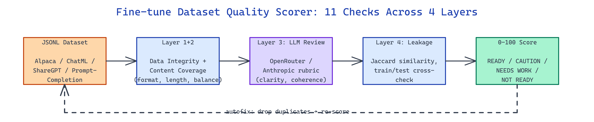

# Fine-tune Dataset Quality Scorer: 0-100 Score Before You Spend GPU Hours

[](https://github.com/dakshjain-1616/Fine-tune-Dataset-Quality-Scorer)



## The Problem

> Teams hit "start training" on JSONL datasets without knowing whether the file is full of duplicates, train/test leakage, malformed rows, or instruction-response mismatches — and the first signal something is wrong is a suspicious eval result three days later.

NEO built Fine-tune Dataset Quality Scorer to collapse that risk into a single readiness score you run before touching a GPU.

## Eleven Checks Across Four Analysis Layers

**Fine-tune Dataset Quality Scorer** runs 11 automated checks organized into four stacked layers: **Data Integrity** (format, missing values, schema drift), **Content Coverage** (length distribution, language consistency, label balance), **LLM-Based Review** (instruction clarity, response quality, coherence), and **Train/Test Leakage** (cross-file contamination). Each check returns a sub-score and row-level findings.

```bash
dqs score dataset.jsonl --output report.html
dqs fetch yahma/alpaca-cleaned       # pull and analyze from Hugging Face
dqs llm-review dataset.jsonl
dqs crosscheck train.jsonl test.jsonl
```

Format auto-detection handles Alpaca, ChatML, ShareGPT, Prompt-Completion, and generic schemas without a config file — the scorer probes the first few rows and picks a parser.

## Score Bands and Actionable Remediation

The composite score maps to four bands with an explicit verdict:

| Score | Band | Verdict |
|---|---|---|
| 92-100 | READY | Safe to train |
| 80-91 | CAUTION | Fix flagged rows then re-score |
| 60-79 | NEEDS WORK | Structural problems need patching |
| 0-59 | NOT READY | Rebuild before spending compute |

Every drop from 100 is traceable to specific row IDs and a recommended fix. Near-duplicates use Jaccard similarity on shingled tokens; the autofix mode can drop duplicates and re-score in a single command, so fixes are reproducible and show up in the next report as an upward score delta.

## LLM Review and Domain Intelligence

The LLM review layer sends sampled rows to OpenRouter or Anthropic with a rubric prompt that scores clarity, instruction-response coherence, and domain fit on a 10-point scale. The reviewer also classifies domain type — coding, QA, translation, agentic — and highlights coverage gaps, like "85% of rows are beginner-level; consider adding intermediate and expert examples." Rich terminal output groups findings by severity; JSON output feeds dashboards; HTML output is meant for sharing with the rest of the team.

```bash
dqs score dataset.jsonl \
  --llm-review \
  --llm-provider openrouter \
  --llm-model meta-llama/llama-4-maverick \
  --output-format html \
  --output report.html
```

Typer provides the CLI scaffolding and 63 unit tests cover every check, which keeps the scoring deterministic across runs and reproducible in CI.

## How to Build This with NEO

Open NEO in VS Code or Cursor and describe what you want to build. A good starting prompt for this project:

> "Build a CLI quality scorer for JSONL fine-tuning datasets. Run 11 checks across four layers: data integrity, content coverage, LLM-based review via OpenRouter or Anthropic, and train/test leakage detection. Auto-detect Alpaca, ChatML, ShareGPT, and prompt-completion schemas. Assign a 0-100 composite score mapped to four bands with row-level remediation. Render with Rich terminal output and export JSON and HTML reports. Include an autofix mode that removes duplicates and re-scores."

<a href="https://heyneo.com/dashboard?section=new-chat&prompt=Build%20a%20CLI%20quality%20scorer%20for%20JSONL%20fine-tuning%20datasets.%20Run%2011%20checks%20across%20four%20layers%3A%20data%20integrity%2C%20content%20coverage%2C%20LLM-based%20review%20via%20OpenRouter%20or%20Anthropic%2C%20and%20train%2Ftest%20leakage%20detection.%20Auto-detect%20Alpaca%2C%20ChatML%2C%20ShareGPT%2C%20and%20prompt-completion%20schemas.%20Assign%20a%200-100%20composite%20score%20mapped%20to%20four%20bands%20with%20row-level%20remediation.%20Render%20with%20Rich%20terminal%20output%20and%20export%20JSON%20and%20HTML%20reports.%20Include%20an%20autofix%20mode%20that%20removes%20duplicates%20and%20re-scores." style="display:inline-block;background:#1e40af;color:#ffffff;padding:10px 22px;border-radius:6px;text-decoration:none;font-weight:600;font-size:14px;">Build with NEO →</a>

NEO generates the project structure and core implementation. From there you iterate — add custom benchmarks, wire the score into a CI gate that blocks training below 80, or build a patch-then-rescore loop that iterates until a dataset reaches READY. Each request builds on what's already there.

To run the finished project:

```bash
git clone https://github.com/dakshjain-1616/Fine-tune-Dataset-Quality-Scorer
cd Fine-tune-Dataset-Quality-Scorer
pip install -r requirements.txt
dqs score examples/dataset.jsonl --output report.html
```

Open `report.html` for the score breakdown and row-level findings; run `dqs autofix` to apply remediation suggestions.

NEO built a pre-flight quality gate that turns "is this dataset training-ready?" into a single number plus a punch list. See what else NEO ships at [heyneo.com](https://heyneo.com/).

---

## Try NEO in Your IDE

Install the NEO extension to bring AI-powered development directly into your workflow:

- **VS Code**: [NEO in VS Code](https://marketplace.visualstudio.com/items?itemName=NeoResearchInc.heyneo)
- **Cursor**: <a href="cursor://extension/NeoResearchInc.heyneo" style="color:#0066FF;font-weight:bold;">Install NEO for Cursor →</a>

---
