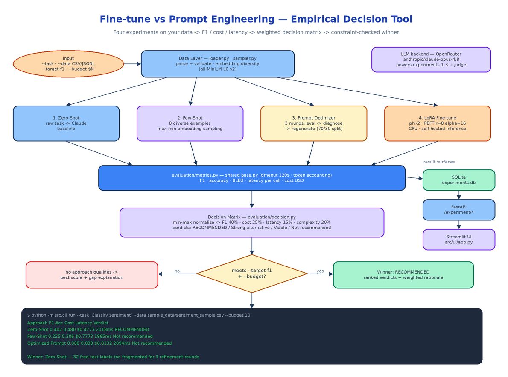

# Fine-tune or Prompt? Stop Guessing — Run All Four Approaches and Let the Numbers Decide

[](https://github.com/dakshjain-1616/Fine-tune-vs-Prompt-Engineering-Decision-Tool)



## The Problem

> The team has a classification task and a few hundred labeled rows. Someone says "fine-tuning is for custom behavior, this needs a fine-tune." Someone else says "few-shot will get you 90% of the way for a tenth of the cost." Both are quoting blog posts about other people's tasks. Nobody has run either approach on this data, and the decision that determines the next two sprints gets made by whoever argues longest.

The fine-tune vs prompt decision is almost always made on intuition or convention rather than evidence from the actual task. The annoying truth is that the answer is task-dependent in ways that are hard to predict: label granularity, dataset size, how well the task is already represented in the base model. This tool replaces the argument with an experiment. Give it a task description, a labeled CSV or JSONL, and a budget, and it runs four approaches side by side, measures each on F1, cost, and latency, and returns a ranked recommendation with a rationale you can paste into the design doc.

## Four Experiments, One Command

```bash
python -m src.cli run \
  --task "Classify sentiment" \
  --data sample_data/sentiment_sample.csv \
  --target-f1 0.85 --budget 10
```

The CLI loads and validates the dataset, then runs each experiment as a subclass of `BaseExperiment` (`src/experiments/base.py`), which provides shared timeout handling (`EXPERIMENT_TIMEOUT_SECONDS`, default 120), error capture, and token accounting so the comparison stays fair.

**Zero-Shot** (`zero_shot.py`) sends the raw task description to Claude via OpenRouter with no examples. Cheapest, fastest, and it sets the baseline every other approach has to beat.

**Few-Shot** (`few_shot.py`) injects 8 examples (`FEW_SHOT_EXAMPLE_COUNT`) into the prompt — but not random ones. `src/data/sampler.py` stratifies across labels, embeds every row with `all-MiniLM-L6-v2`, then runs a greedy max–min selection: pick one example, then repeatedly pick the row with the largest minimum distance to everything already chosen. The examples cover the label space instead of clustering around the common cases.

**Prompt Optimizer** (`prompt_optimizer.py`) splits the data 70/30, evaluates an initial classification prompt on the train split, asks Claude to diagnose the failure patterns, and generates an improved prompt — for up to 3 rounds (`PROMPT_OPTIMIZATION_ROUNDS`). The best-performing prompt across rounds is the one that gets the final evaluation on the held-out 30%.

**LoRA Fine-tune** (`lora_finetune.py`) trains a LoRA adapter on `microsoft/phi-2` using PEFT with CPU-friendly defaults: `r=8`, `alpha=16`, dropout 0.1, 3 epochs, capped at 200 training samples (`LORA_MAX_SAMPLES`). Training is slow without a GPU, but the resulting adapter is self-hosted and inference costs nothing. Pass `--skip-lora` if you don't want to wait — every experiment has a matching `--skip-*` flag.

## The Decision Matrix

After all experiments finish, `src/evaluation/decision.py` builds the matrix. Each approach's metrics get min–max normalized across the field, then combined into a weighted score:

- **Performance (40%)** — your `--metric`: `f1_score`, `accuracy`, or `bleu`
- **Cost (25%)** — actual token spend, normalized so cheaper is better
- **Latency (15%)** — ms per call
- **Implementation complexity (20%)** — low/medium/high, because a fine-tune you have to deploy and maintain is not free even when inference is

The weights are env-overridable (`WEIGHT_PERFORMANCE`, `WEIGHT_COST`, `WEIGHT_LATENCY`, `WEIGHT_COMPLEXITY`) if your priorities differ. Every row gets a verdict relative to the top score: **RECOMMENDED**, **Strong alternative** (within 90%), **Viable option** (within 70%), or **Not recommended**. The winner is the highest score that also satisfies your `--target-f1` and `--budget` constraints — and if nothing hits the F1 target, the tool recommends the best available approach and explains the gap rather than pretending the problem is solved.

## A Real Run Where Intuition Was Wrong

A live run on sentiment classification — 102 rows, 32 distinct labels, Claude Opus 4.8 via OpenRouter:

| Approach | F1 | Accuracy | Cost | Latency | Verdict |
|----------|-----|----------|------|---------|---------|
| **Zero-Shot** | **0.442** | **0.480** | $0.4773 | 2018ms/call | **WINNER** |
| Few-Shot | 0.225 | 0.206 | $0.7773 | 1965ms/call | Not recommended |
| Optimized Prompt | 0.000 | 0.000 | $0.8132 | 2094ms/call | Not recommended |

This is exactly the result nobody would have predicted from first principles. Few-shot *halved* performance: the diversity sampler kept surfacing examples with unusual free-text label strings, which confused the model's output format. The prompt optimizer never converged — 3 refinement rounds can't fix coverage across 32 fragmented labels. A clean zero-shot instruction beat both, at the lowest cost. That's the entire argument for measuring instead of debating: the conventional wisdom ("examples always help") was not just suboptimal here, it was actively harmful.

## Three Ways In: CLI, REST, Streamlit

Every run persists to SQLite (`experiments.db`), so results accumulate and stay queryable:

```bash
python -m src.cli list-experiments        # recent runs
python -m src.cli status <experiment_id>  # per-approach status for one run
python -m src.cli run ... --output results.json
```

The FastAPI server exposes the same engine for CI and tooling pipelines:

| Method | Path | Description |
|--------|------|-------------|
| `POST` | `/experiment/start` | Launch all experiments asynchronously, returns an experiment ID |
| `GET` | `/experiment/{id}/status` | Poll progress with per-experiment status and partial results |
| `GET` | `/experiment/{id}/results` | Full decision matrix, winner, and per-approach metrics |

And `streamlit run src/ui/app.py` gives you an interactive view for comparing runs across datasets and tasks.

## Configuration

One required key, everything else has sensible defaults in `src/config.py`:

```env
OPENROUTER_API_KEY=sk-or-...                      # required — powers all Claude calls
OPENROUTER_MODEL_ID=anthropic/claude-opus-4.8     # experiment + judge model
FEW_SHOT_EXAMPLE_COUNT=8
PROMPT_OPTIMIZATION_ROUNDS=3
EXPERIMENT_TIMEOUT_SECONDS=120
LORA_R=8
LORA_MAX_SAMPLES=200
WEIGHT_PERFORMANCE=0.40
WEIGHT_COST=0.25
```

## How to Build This with NEO

Open NEO in VS Code or Cursor and describe what you want to build. A good starting prompt for this project:

> "Build a Python tool that settles the fine-tune vs prompt engineering question empirically. Given a task description, a labeled CSV/JSONL dataset, a target F1, and a budget, run four experiments: zero-shot via Claude on OpenRouter; few-shot with 8 examples selected by stratified greedy max–min embedding diversity using sentence-transformers all-MiniLM-L6-v2; a prompt optimizer that does 3 rounds of evaluate-on-holdout, Claude-diagnoses-failures, regenerate-prompt on a 70/30 split; and a LoRA fine-tune of microsoft/phi-2 with PEFT (r=8, alpha=16, CPU-friendly, max 200 samples). Give every experiment a shared base class with timeout and token accounting. Measure F1, accuracy, BLEU, latency per call, and cost, then build a decision matrix that min-max normalizes and weights performance 40%, cost 25%, latency 15%, complexity 20%, assigns verdicts (RECOMMENDED / Strong alternative / Viable / Not recommended), and explains the gap if no approach hits the F1 target. Surfaces: Typer CLI with run/list/status and --skip-* flags, FastAPI endpoints for start/status/results, Streamlit comparison UI, SQLite persistence. Config via environment variables with overridable weights."

<a href="https://heyneo.com/dashboard?section=new-chat&prompt=Build%20a%20Python%20tool%20that%20settles%20fine-tune%20vs%20prompt%20engineering%20empirically%3A%20run%20zero-shot%2C%20few-shot%20with%20embedding-diversity%20sampling%2C%203-round%20prompt%20optimization%2C%20and%20LoRA%20fine-tuning%20%28phi-2%2C%20PEFT%29%20on%20a%20labeled%20CSV%2C%20measure%20F1%2C%20cost%2C%20and%20latency%2C%20then%20pick%20a%20winner%20with%20a%20weighted%20decision%20matrix%20under%20a%20budget%20and%20target%20F1.%20Typer%20CLI%2C%20FastAPI%2C%20Streamlit%20UI%2C%20SQLite." style="display:inline-block;background:#1e40af;color:#ffffff;padding:10px 22px;border-radius:6px;text-decoration:none;font-weight:600;font-size:14px;">Build with NEO →</a>

NEO scaffolds the experiment base class, all four approaches, the diversity sampler, the decision matrix, and the three surfaces. From there you point it at your own dataset, tune the weights to your team's actual priorities (maybe latency matters more than 15% for your use case), and wire `POST /experiment/start` into the pipeline that evaluates every new task before anyone commits to a fine-tune.

The fine-tune vs prompt debate has an empirical answer for your specific task — this tool just goes and gets it. See what else NEO ships at [heyneo.com](https://heyneo.com/).

---

## Try NEO in Your IDE

Install the NEO extension to bring AI-powered development directly into your workflow:

- **VS Code**: [NEO in VS Code](https://marketplace.visualstudio.com/items?itemName=NeoResearchInc.heyneo)
- **Cursor**: <a href="cursor://extension/NeoResearchInc.heyneo" style="color:#0066FF;font-weight:bold;">Install NEO for Cursor →</a>

---
