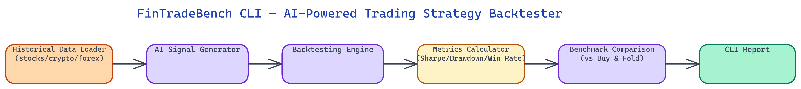

# FinTradeBench CLI: Rigorous Backtesting for AI Trading Strategies

[](https://github.com/dakshjain-1616/FinTradeBench-CLI)



## The Problem

> AI-generated trading signals are easy to produce and hard to evaluate honestly. A model that describes its strategy in compelling terms may be curve-fitting on recent data, generating signals indistinguishable from a random walk, or outperforming on raw return while hiding catastrophic drawdown risk. Without rigorous backtesting infrastructure, teams either skip evaluation or build bespoke scripts that are slow, inconsistent, and hard to share.

NEO built FinTradeBench CLI to provide a disciplined, reproducible backtesting pipeline for AI trading strategies — covering four asset classes, computing the full suite of professional risk metrics, and making it easy to compare AI-generated signals against classical technical indicators on the same historical dataset.

## Loading and Normalizing Historical Data

FinTradeBench CLI ingests historical OHLCV (open, high, low, close, volume) data from multiple sources. For equities, it fetches from Yahoo Finance or accepts CSV files in a standard column format. For crypto, it integrates with Binance and Coinbase historical APIs. Forex and commodity data can be loaded via OANDA or flat files.

All data passes through a normalization pipeline before any analysis runs. The pipeline checks for gaps in the time series, handles corporate actions for equities (dividend adjustments, stock splits), aligns timestamps across assets in a portfolio, and converts everything to a unified bar format. Data quality issues — missing bars, stale prices, zero-volume bars — are logged and either filled or flagged depending on the configured handling policy. Getting this right matters: a single corrupt bar can corrupt an entire backtest with a spurious spike or drawdown.

The data pipeline also handles forward-looking bias. Price data is partitioned into a training window (used to calibrate any adaptive strategy parameters) and a test window (used for evaluation). The partition is enforced strictly — no data from the test window is visible during training.

## Running the Backtest

The core backtest engine simulates trading over the historical test period bar by bar. For each bar, it calls the registered signal generator — which may be an AI model, a rule-based system, or a combination — and receives a signal: long, short, flat, or a continuous position size. The engine then simulates trade execution at the next bar's open price, which is the standard conservative assumption for backtesting (assuming you cannot trade at the exact bar close where the signal was generated).

Transaction costs are modeled explicitly. You configure commission per trade, bid-ask spread, and slippage (the price impact of your trade size relative to bar volume). For strategies that trade frequently, transaction costs dominate performance and cannot be ignored. The engine tracks cash, position, and mark-to-market portfolio value at each bar, producing a full equity curve.

Portfolio-level backtesting is supported for multi-asset strategies. Position sizing follows either fixed fractional sizing (a fixed percentage of portfolio per trade) or volatility-targeting (scaling position size so each position contributes equal expected volatility to the portfolio). The volatility targeting mode uses a rolling window to estimate per-asset volatility and rebalances dynamically.

## Risk Metrics and Performance Analysis

The output of a FinTradeBench run is a comprehensive metrics report. The headline metrics are:

**Sharpe Ratio**: annualized excess return divided by annualized volatility of returns. This is the most widely used risk-adjusted return metric. The CLI computes it using daily returns, annualized to a standard 252 trading days.

**Maximum Drawdown**: the largest peak-to-trough decline in portfolio value over the test period. This is the single most important risk metric for strategies under real capital constraints — it tells you the worst loss you would have experienced if you had entered at the peak.

**Win Rate**: the fraction of closed trades that were profitable. Useful context for understanding strategy character — a high-frequency strategy with a 55% win rate and small average gain looks very different from a trend-following strategy with a 35% win rate and large average gain.

**Alpha vs. Benchmark**: excess return over a passive buy-and-hold benchmark (typically the index or a representative ETF for the asset class). A strategy with positive alpha generates return beyond what you would have gotten by simply holding the market.

The report also includes annualized return, annualized volatility, Calmar ratio (annualized return divided by maximum drawdown), Sortino ratio (downside deviation version of Sharpe), average trade duration, and a breakdown of performance by month and by year.

## Comparing AI Signals to Classical Indicators

A key feature of FinTradeBench CLI is the comparison mode. Instead of just evaluating a single strategy, you can define a benchmark strategy using classical technical indicators and run both strategies on the same historical data in a single command.

Built-in technical indicator signals include moving average crossover (configurable fast and slow periods), RSI mean-reversion (buy oversold, sell overbought), Bollinger Band breakout, MACD, and momentum. These are the standard baselines that quantitative researchers use to calibrate whether a new signal is genuinely adding information.

The comparison report renders side by side: AI strategy vs. indicator baseline, across every metric. It includes a correlation analysis of the two signal series to quantify how independent the strategies are. If your AI model's signals are 95% correlated with a simple moving average crossover, it is probably learning to approximate the moving average — not discovering something novel. If they are largely uncorrelated but both profitable, that is genuinely interesting.

## CLI Interface and Reproducibility

Every FinTradeBench run is specified by a YAML config file and executed with a single command: `fintrade-bench run config.yaml`. The config specifies data source, asset, date range, strategy module path, benchmark indicator, cost model, and output format. Results are written to a directory with the equity curve as a CSV, the full metrics report as JSON, and a rendered HTML report with charts.

The combination of config-as-code and deterministic execution means every result is reproducible. Share the config file and the data source specification, and anyone can reproduce the exact same backtest numbers. This matters for reporting results honestly and for debugging when metrics change unexpectedly after a strategy update.

## How to Build This with NEO

Open NEO in VS Code or Cursor and describe what you want to build. A good starting prompt for this project:

> "Build a Python CLI tool called FinTradeBench that backtests AI trading strategies against historical OHLCV data from Yahoo Finance, Binance, and CSV files across stocks, crypto, forex, and commodities. The backtest engine should simulate bar-by-bar execution at next-bar open price, model transaction costs including commission, bid-ask spread, and slippage, and support fixed fractional and volatility-targeting position sizing. Compute Sharpe ratio, maximum drawdown, win rate, alpha vs. benchmark, Calmar ratio, and Sortino ratio. Include a comparison mode that runs the strategy against classical technical indicator baselines (moving average crossover, RSI, Bollinger Bands, MACD, momentum) on the same dataset. All runs specified by a YAML config file, results exported as CSV equity curve, JSON metrics, and HTML report."

<a href="https://heyneo.com/dashboard?section=new-chat&prompt=Build%20a%20Python%20CLI%20tool%20called%20FinTradeBench%20that%20backtests%20AI%20trading%20strategies%20against%20historical%20OHLCV%20data%20from%20Yahoo%20Finance%2C%20Binance%2C%20and%20CSV%20files%20across%20stocks%2C%20crypto%2C%20forex%2C%20and%20commodities.%20The%20backtest%20engine%20should%20simulate%20bar-by-bar%20execution%20at%20next-bar%20open%20price%2C%20model%20transaction%20costs%20including%20commission%2C%20bid-ask%20spread%2C%20and%20slippage%2C%20and%20support%20fixed%20fractional%20and%20volatility-targeting%20position%20sizing.%20Compute%20Sharpe%20ratio%2C%20maximum%20drawdown%2C%20win%20rate%2C%20alpha%20vs.%20benchmark%2C%20Calmar%20ratio%2C%20and%20Sortino%20ratio.%20Include%20a%20comparison%20mode%20that%20runs%20the%20strategy%20against%20classical%20technical%20indicator%20baselines%20%28moving%20average%20crossover%2C%20RSI%2C%20Bollinger%20Bands%2C%20MACD%2C%20momentum%29%20on%20the%20same%20dataset.%20All%20runs%20specified%20by%20a%20YAML%20config%20file%2C%20results%20exported%20as%20CSV%20equity%20curve%2C%20JSON%20metrics%2C%20and%20HTML%20report." style="display:inline-block;background:#1e40af;color:#ffffff;padding:10px 22px;border-radius:6px;text-decoration:none;font-weight:600;font-size:14px;">Build with NEO →</a>

NEO generates the project structure and core implementation from that. From there you iterate — ask it to add signal correlation analysis between the AI strategy and the indicator baseline, add the portfolio-level multi-asset backtesting mode with dynamic rebalancing, or add a persistent leaderboard that accumulates results across runs for tracking strategy performance over time. Each request builds on what's already there.

To run the finished project:

```bash
git clone https://github.com/dakshjain-1616/FinTradeBench-CLI
cd FinTradeBench-CLI
pip install -r requirements.txt
python benchmark.py --model openai/gpt-4o --dry-run
```

The dry run walks through the full evaluation pipeline without spending API credits, then `--compare` runs two models side by side on the same historical dataset.

NEO built FinTradeBench CLI so that evaluating AI trading strategies is as disciplined as evaluating any other machine learning system — data partitioning, cost modeling, risk metrics, and baseline comparison all enforced by the tool. See what else NEO ships at [heyneo.com](https://heyneo.com/).

---

## Try NEO in Your IDE

Install the NEO extension to bring AI-powered development directly into your workflow:

- **VS Code**: [NEO in VS Code](https://marketplace.visualstudio.com/items?itemName=NeoResearchInc.heyneo)
- **Cursor**: <a href="cursor://extension/NeoResearchInc.heyneo" style="color:#0066FF;font-weight:bold;">Install NEO for Cursor →</a>

---
