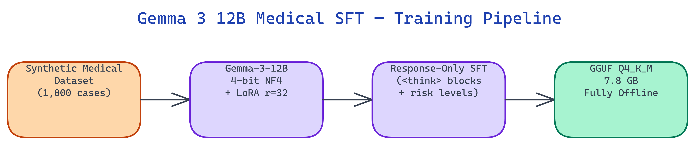

# Gemma 3 12B Medical SFT: Offline Clinical Reasoning via LoRA Fine-Tuning

[](https://github.com/dakshjain-1616/gemma3-medical-sft)
[](https://huggingface.co/daksh-neo/gemma-3-12b-medical-sft)



> **Important:** This model is for research and educational purposes only. It is not a substitute for professional medical advice, diagnosis, or treatment.

## The Problem

> Clinicians in resource-limited settings need decision-support tools that work without internet connectivity and cannot transmit patient data to cloud APIs. General-purpose LLMs are not trained on clinical reasoning formats and cannot be used where HIPAA or GDPR apply to patient data.

NEO built this fine-tuning pipeline to adapt [Gemma 3 12B](https://huggingface.co/google/gemma-3-12b-it) for structured medical reasoning, then export the result as a 7.8 GB GGUF that runs fully offline on a standard 16 GB laptop.

## Three Medical Domains

**Gemma-3-12B Medical SFT** handles three clinical reasoning tasks:

1. **Symptom triage** — given a set of presenting symptoms, the model produces a differential diagnosis with risk stratification (LOW / MEDIUM / HIGH).
2. **Drug interaction checking** — given a medication list, the model identifies known interactions and severity levels.
3. **Lab result interpretation** — given lab values with reference ranges, the model flags abnormalities and suggests clinical context.

All three use the same `<think>` block structure, which shows a five-step differential reasoning chain before the final answer. This makes the output auditable: you can inspect the reasoning steps before accepting the conclusion.

## The Training Pipeline

The pipeline follows four stages:

1. **Synthetic data generation** — 1,000 medical cases generated with seeded randomization for reproducibility. Each case is tagged with domain, severity, and reasoning step count.
2. **4-bit model loading** — Gemma-3-12B loads in 4-bit NF4 to fit GPU VRAM during training.
3. **Response-Only LoRA training** — user turns and reasoning prefixes are masked. Loss flows only through the model's response tokens.
4. **LoRA merge and GGUF export** — the 200 MB adapter merges into the base weights, then llama.cpp quantizes to Q4_K_M.

The **Response-Only Training** approach is critical. Without masking user tokens, the model wastes training capacity memorizing prompts instead of learning how to reason through clinical presentations.

## LoRA Configuration

| Parameter | Value |
|:----------|------:|
| Rank (r) | 32 |
| Alpha | 64 |
| Max sequence length | 4096 |
| Training epochs | 3 |
| Learning rate | 2e-4 |
| Quantization (training) | 4-bit NF4 |
| Adapter size | ~200 MB |

The training format uses Gemma-3 chat syntax:

```
<start_of_turn>user
Patient presents with chest pain, shortness of breath, diaphoresis.<end_of_turn>
<start_of_turn>model
<think>
Step 1: Identify cardinal symptoms...
Step 2: Consider differential diagnoses...
Step 3: Evaluate risk factors...
Step 4: Apply clinical decision rules...
Step 5: Determine risk stratification...
</think>
Primary consideration: ACS. Risk level: HIGH.
Immediate ECG and troponin indicated.<end_of_turn>
```

## GGUF Quantization Options

| Quantization | Size | RAM Needed |
|:-------------|-----:|-----------:|
| Q4_K_M | 7.8 GB | 16 GB |
| Q5_K_M | 9.1 GB | 16 GB |
| Q8_0 | ~15 GB | 32 GB |

Q4_K_M fits on any MacBook M2 or standard laptop with 16 GB RAM. No GPU is required for inference.

## How to Build This with NEO

Open NEO in VS Code or Cursor and describe what you want to build. A good starting prompt for this project:

> "Build a supervised fine-tuning pipeline for [Gemma-3-12B](https://huggingface.co/google/gemma-3-12b-it) targeting three medical reasoning tasks: symptom triage with LOW/MEDIUM/HIGH risk stratification, drug interaction checking with severity levels, and lab result interpretation. Load the base model in 4-bit NF4 with bitsandbytes. Use LoRA (rank 32, alpha 64) targeting attention layers only. Generate 1,000 synthetic medical cases with seeded randomization. Use response-only training by masking user prompt tokens with labels=-100 so gradients only flow through assistant response tokens. Format outputs with a five-step <think> reasoning block before the final answer. After training, merge the LoRA adapter and export to GGUF Q4_K_M (target 7.8 GB, runnable on 16 GB RAM with no GPU). All training parameters configurable via environment variables."

<a href="https://heyneo.com/dashboard?section=new-chat&prompt=Build%20a%20supervised%20fine-tuning%20pipeline%20for%20Gemma-3-12B%20targeting%20three%20medical%20reasoning%20tasks%3A%20symptom%20triage%20with%20LOW%2FMEDIUM%2FHIGH%20risk%20stratification%2C%20drug%20interaction%20checking%20with%20severity%20levels%2C%20and%20lab%20result%20interpretation.%20Load%20the%20base%20model%20in%204-bit%20NF4%20with%20bitsandbytes.%20Use%20LoRA%20%28rank%2032%2C%20alpha%2064%29%20targeting%20attention%20layers%20only.%20Generate%201%2C000%20synthetic%20medical%20cases%20with%20seeded%20randomization.%20Use%20response-only%20training%20by%20masking%20user%20prompt%20tokens%20with%20labels%3D-100%20so%20gradients%20only%20flow%20through%20assistant%20response%20tokens.%20Format%20outputs%20with%20a%20five-step%20%3Cthink%3E%20reasoning%20block%20before%20the%20final%20answer.%20After%20training%2C%20merge%20the%20LoRA%20adapter%20and%20export%20to%20GGUF%20Q4_K_M%20%28target%207.8%20GB%2C%20runnable%20on%2016%20GB%20RAM%20with%20no%20GPU%29.%20All%20training%20parameters%20configurable%20via%20environment%20variables." style="display:inline-block;background:#1e40af;color:#ffffff;padding:10px 22px;border-radius:6px;text-decoration:none;font-weight:600;font-size:14px;">Build with NEO →</a>

NEO generates the project structure and core implementation from that. From there you iterate — ask it to add the synthetic dataset generation script with domain/severity tagging and reproducible seeding, add support for Q5_K_M and Q8_0 quantization tiers in the export step, or add a `DRY_RUN=1` mode that runs two mock training steps without downloading the model. Each request builds on what's already there.

To use the released model directly, download from HuggingFace and run with llama.cpp:

```bash
pip install huggingface_hub
huggingface-cli download daksh-neo/gemma-3-12b-medical-sft --local-dir ./model
./llama-cli -m model/gemma-3-12b-medical-sft-Q4_K_M.gguf \
  -p "Patient presents with chest pain, shortness of breath, diaphoresis." -n 512
```

The model produces a five-step `<think>` differential reasoning chain before the final risk-stratified answer, running fully offline on any 16 GB laptop.

NEO built a medical reasoning model that runs entirely on-device, keeps patient data local, and shows its differential diagnosis reasoning in auditable `<think>` blocks. See what else NEO ships at [heyneo.com](https://heyneo.com/).

---

## Try NEO in Your IDE

Install the NEO extension to bring AI-powered development directly into your workflow:

- **VS Code**: [NEO in VS Code](https://marketplace.visualstudio.com/items?itemName=NeoResearchInc.heyneo)
- **Cursor**: <a href="cursor://extension/NeoResearchInc.heyneo" style="color:#0066FF;font-weight:bold;">Install NEO for Cursor →</a>

---
