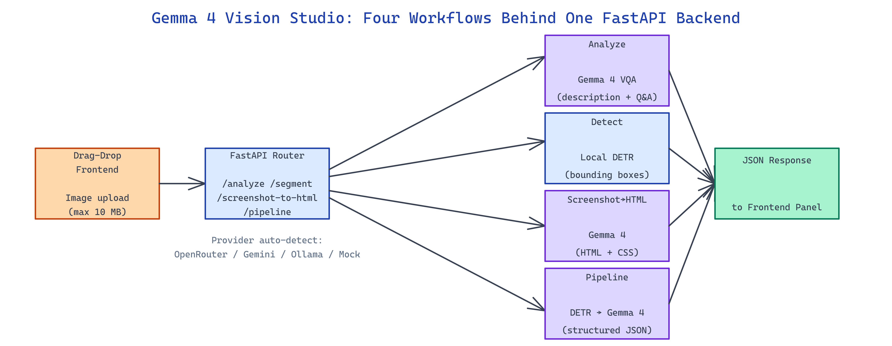

# Gemma 4 Vision Studio: Four Vision Workflows Behind One FastAPI Backend

[](https://github.com/dakshjain-1616/gemma-4-vision-studio)



## The Problem

> Teams building vision-powered UIs end up glueing together three separate services for VQA, object detection, and screenshot-to-code, each with its own auth, deploy surface, and failure mode.

NEO built Gemma 4 Vision Studio to collapse those four workflows into a single FastAPI backend with a shared frontend and shared auth.

## Four Modes in One App

**Gemma 4 Vision Studio** exposes four modes, each as its own endpoint with a matching frontend panel:

| Mode | Endpoint | Backing Model | Output |
|---|---|---|---|
| Analyze | `POST /analyze` | Gemma 4 | Free-form description + Q&A |
| Detect | `POST /segment` | Facebook DETR | Bounding boxes + labels |
| Screenshot→HTML | `POST /screenshot-to-html` | Gemma 4 | HTML + CSS string |
| Pipeline | `POST /pipeline` | Gemma 4 + DETR | Structured JSON |

Pipeline mode is the interesting one — it chains the visual language model and the detection model so the JSON output contains both natural-language descriptions and structured bounding boxes the description refers to. That combination is what downstream automation usually needs but rarely gets from a single call.

## Provider-Agnostic Gemma Backend

The Gemma client auto-detects the available provider from environment variables: `OPENROUTER_API_KEY` routes to `google/gemma-4-31b-it` via OpenRouter, `GEMINI_API_KEY` goes through Google AI Studio, and direct Ollama configuration works for fully-local deployments. When no key is set, a mock mode returns deterministic stub responses so the frontend is usable during development without burning credits.

```python
# gemma_client.py — simplified
class GemmaClient:
    def __init__(self):
        if os.getenv("OPENROUTER_API_KEY"):
            self.backend = OpenRouterBackend()
        elif os.getenv("GEMINI_API_KEY"):
            self.backend = GoogleAIBackend()
        elif ollama_available():
            self.backend = OllamaBackend()
        else:
            self.backend = MockBackend()

    async def analyze(self, image_bytes, prompt):
        return await self.backend.vqa(image_bytes, prompt)
```

DETR runs locally via `transformers` so detection never leaves the machine — handy when screenshots contain sensitive UI.

## Screenshot-to-HTML and Structured Pipeline

Screenshot mode prompts Gemma 4 with the image plus a structured instruction to output HTML and CSS that reproduces the visual layout. The response is wrapped in `<html>` scaffolding and returned ready to drop into an iframe. Pipeline mode runs the image through DETR first to get bounding boxes, then feeds the image plus the detection list to Gemma 4 with a JSON-output instruction so the description references specific detected elements. The result is a structured document with descriptions, categories, detected elements, and any extracted text.

```bash
pip install -r requirements.txt
cp .env.example .env       # set OPENROUTER_API_KEY or GEMINI_API_KEY
uvicorn app:app --host 0.0.0.0 --port 8000 --reload
```

Max upload size defaults to 10 MB and is configurable via environment variables for larger desktop screenshots.

## How to Build This with NEO

Open NEO in VS Code or Cursor and describe what you want to build. A good starting prompt for this project:

> "Build a FastAPI vision studio with four modes on four endpoints: Analyze (Gemma 4 VQA), Detect (local DETR object detection), Screenshot-to-HTML (Gemma 4 with structured prompt), and Pipeline (DETR then Gemma 4 producing JSON with descriptions referencing detected boxes). Auto-detect provider from OPENROUTER_API_KEY, GEMINI_API_KEY, or local Ollama, with mock-mode fallback. Ship a drag-drop HTML/CSS frontend for all four modes."

<a href="https://heyneo.com/dashboard?section=new-chat&prompt=Build%20a%20FastAPI%20vision%20studio%20with%20four%20modes%20on%20four%20endpoints%3A%20Analyze%20%28Gemma%204%20VQA%29%2C%20Detect%20%28local%20DETR%20object%20detection%29%2C%20Screenshot-to-HTML%20%28Gemma%204%20with%20structured%20prompt%29%2C%20and%20Pipeline%20%28DETR%20then%20Gemma%204%20producing%20JSON%20with%20descriptions%20referencing%20detected%20boxes%29.%20Auto-detect%20provider%20from%20OPENROUTER_API_KEY%2C%20GEMINI_API_KEY%2C%20or%20local%20Ollama%2C%20with%20mock-mode%20fallback.%20Ship%20a%20drag-drop%20HTML%2FCSS%20frontend%20for%20all%20four%20modes." style="display:inline-block;background:#1e40af;color:#ffffff;padding:10px 22px;border-radius:6px;text-decoration:none;font-weight:600;font-size:14px;">Build with NEO →</a>

NEO generates the project structure and core implementation. From there you iterate — add OCR extraction via Tesseract, swap DETR for YOLOv9 for denser scenes, or wrap the Pipeline mode as an MCP server for agents that need structured visual understanding. Each request builds on what's already there.

To run the finished project:

```bash
git clone https://github.com/dakshjain-1616/gemma-4-vision-studio
cd gemma-4-vision-studio
pip install -r requirements.txt
uvicorn app:app --host 0.0.0.0 --port 8000 --reload
```

Open `http://localhost:8000` and drag an image into any of the four mode panels.

NEO built a unified vision studio that makes four previously-separate workflows a single FastAPI deploy with shared auth and a shared frontend. See what else NEO ships at [heyneo.com](https://heyneo.com/).

---

## Try NEO in Your IDE

Install the NEO extension to bring AI-powered development directly into your workflow:

- **VS Code**: [NEO in VS Code](https://marketplace.visualstudio.com/items?itemName=NeoResearchInc.heyneo)
- **Cursor**: <a href="cursor://extension/NeoResearchInc.heyneo" style="color:#0066FF;font-weight:bold;">Install NEO for Cursor →</a>

---
