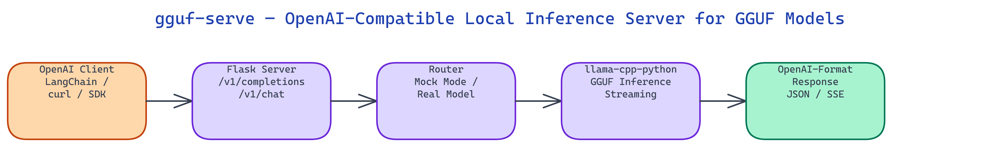

# gguf-serve — OpenAI-Compatible Local Inference Server for GGUF Models

[](https://github.com/dakshjain-1616/gguf-serve)



## The Problem

> Running a GGUF model locally usually means writing custom inference code or wrestling with llama.cpp's CLI flags every time you want to test something. Existing OpenAI-compatible servers often require Docker, complex configuration files, or GPU support. The gap between "I have a .gguf file" and "I have a working API endpoint" is wider than it should be.

NEO built gguf-serve to close that gap with a single Python file. Point it at any `.gguf` file, run the server, and immediately get OpenAI-compatible endpoints that work with any client library or tool that speaks the OpenAI API format.

## OpenAI-Compatible Endpoints

**gguf-serve** exposes two endpoints that match the OpenAI API specification:

- `POST /v1/completions` for text completion
- `POST /v1/chat/completions` for chat-style conversations

The request and response formats are wire-compatible with OpenAI's API. This means you can swap out `api.openai.com` for `localhost:PORT` in any existing codebase and the client library won't notice the difference. Tools like LangChain, LiteLLM, and raw `openai` Python SDK all work without modification.

```python
from openai import OpenAI

client = OpenAI(base_url="http://localhost:8080/v1", api_key="unused")
response = client.chat.completions.create(
    model="local",
    messages=[{"role": "user", "content": "Explain quantization in one paragraph."}]
)
print(response.choices[0].message.content)
```

## Mock Mode for Integration Testing

One of the most practical features is **mock mode**. Starting the server with `--mock` loads a lightweight stub instead of an actual model. The stub returns realistic-looking responses with correct JSON structure, proper token counts, and valid finish reasons.

This is useful for integration testing: you can verify that your application correctly parses responses, handles streaming, and manages errors without downloading a multi-gigabyte model or needing a GPU. CI pipelines can run against mock mode to test the full request path.

```bash
python server.py --mock --port 8080
```

Mock mode produces responses immediately, with no latency from actual inference, which also makes it useful for load-testing request handling logic.

## Pure Python, No Docker

The server is implemented in Flask, which means it runs in any Python 3.8+ environment without Docker, without CUDA drivers, and without native dependencies beyond llama-cpp-python. The Flask layer is thin: it validates the incoming JSON, calls the model inference function, and formats the output to match OpenAI's response structure.

Because the code is plain Python, debugging is straightforward. You can add breakpoints, print intermediate values, and trace exactly what happens between the HTTP request and the model call. Contrast this with compiled servers where the inference path is opaque.

Port customization prevents conflicts when you are running multiple services locally:

```bash
python server.py --model ./llama-3-8b-q4.gguf --port 9090
```

## Streaming Support

For long completions, **token streaming** sends each generated token as a server-sent event as soon as it is available, rather than waiting for the entire response. This is the same mechanism OpenAI's streaming API uses, and clients that support it get much lower time-to-first-token.

Streaming is optional and controlled by the `stream` field in the request body. Non-streaming clients get the complete response in one JSON object, identical to the OpenAI non-streaming format.

## How to Build This with NEO

Open NEO in VS Code or Cursor and describe what you want to build. A good starting prompt for this project:

> "Build a Flask-based OpenAI-compatible inference server for GGUF models using llama-cpp-python. Expose POST /v1/completions and POST /v1/chat/completions endpoints that are wire-compatible with the OpenAI API spec — same request and response JSON structure. Accept --model flag to point at any .gguf file and --port flag for port selection. Add a --mock flag that starts a lightweight stub returning realistic responses with correct JSON structure, token counts, and finish reasons without loading any model. Support token streaming via server-sent events when the request body includes 'stream': true. Keep it a single Python file with no Docker dependency."

<a href="https://heyneo.com/dashboard?section=new-chat&prompt=Build%20a%20Flask-based%20OpenAI-compatible%20inference%20server%20for%20GGUF%20models%20using%20llama-cpp-python.%20Expose%20POST%20%2Fv1%2Fcompletions%20and%20POST%20%2Fv1%2Fchat%2Fcompletions%20endpoints%20that%20are%20wire-compatible%20with%20the%20OpenAI%20API%20spec%20%E2%80%94%20same%20request%20and%20response%20JSON%20structure.%20Accept%20--model%20flag%20to%20point%20at%20any%20.gguf%20file%20and%20--port%20flag%20for%20port%20selection.%20Add%20a%20--mock%20flag%20that%20starts%20a%20lightweight%20stub%20returning%20realistic%20responses%20with%20correct%20JSON%20structure%2C%20token%20counts%2C%20and%20finish%20reasons%20without%20loading%20any%20model.%20Support%20token%20streaming%20via%20server-sent%20events%20when%20the%20request%20body%20includes%20%27stream%27%3A%20true.%20Keep%20it%20a%20single%20Python%20file%20with%20no%20Docker%20dependency." style="display:inline-block;background:#1e40af;color:#ffffff;padding:10px 22px;border-radius:6px;text-decoration:none;font-weight:600;font-size:14px;">Build with NEO →</a>

NEO generates the project structure and core implementation from that. From there you iterate — ask it to add the 42-test pytest suite covering endpoint validation, response format compliance, mock mode behavior, and streaming correctness, add port conflict detection with a helpful error message, or add request logging middleware that records model, token counts, and latency per call. Each request builds on what's already there.

To run the finished project:

```bash
git clone https://github.com/dakshjain-1616/gguf-serve
cd gguf-serve
pip install -r requirements.txt
python server.py --mock --port 8080
```

Point any OpenAI-compatible client at `http://localhost:8080/v1` — swap `api.openai.com` for `localhost:8080` and the client library works without modification.

NEO built gguf-serve as a minimal, debuggable OpenAI-compatible server that exposes any GGUF model as a local API endpoint with zero configuration overhead. See what else NEO ships at [heyneo.com](https://heyneo.com/).

---

## Try NEO in Your IDE

Install the NEO extension to bring AI-powered development directly into your workflow:

- **VS Code**: [NEO in VS Code](https://marketplace.visualstudio.com/items?itemName=NeoResearchInc.heyneo)
- **Cursor**: <a href="cursor://extension/NeoResearchInc.heyneo" style="color:#0066FF;font-weight:bold;">Install NEO for Cursor →</a>

---
