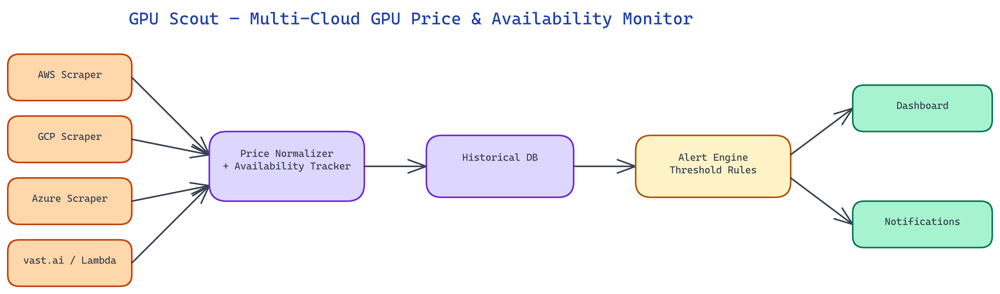

# GPU Scout: Real-Time Cloud GPU Monitoring with Spot Price Alerts and Cost Dashboards

[](https://github.com/NeoResearchAI/gpu-scout)



<video controls style="width:100%;max-width:800px;margin:1.5rem 0;">
  <source src="https://heyneo-content.s3.us-east-2.amazonaws.com/documents/public/gpu-scout.mp4" type="video/mp4">
</video>

## The Problem

> Training and fine-tuning large models requires significant GPU compute, but GPU availability and pricing across cloud providers fluctuates constantly. Spot instance prices can drop by 60-80% at certain times, and specific GPU types become available on different providers at different windows. Without monitoring, teams either overpay by using on-demand instances or waste hours manually checking multiple provider dashboards hoping to catch a good window.

NEO built GPU Scout to watch every major GPU market simultaneously, alert when prices drop or capacity opens up, and give teams the historical pricing data they need to plan training runs strategically rather than reactively.

## The Multi-Provider Monitoring Challenge

Cloud GPU markets are fragmented. AWS, GCP, and Azure each have their own pricing structures, region availability, and spot market mechanics. Lambda Labs and vast.ai operate as more directly ML-focused compute marketplaces with different pricing models and availability patterns. Monitoring all of them manually means checking five different dashboards, each with different interfaces, different region structures, and no easy way to compare across providers.

GPU Scout normalizes this fragmented landscape into a single data model. Each provider integration scrapes or queries the provider's pricing and availability APIs on a configurable polling interval, normalizes the results into a standard schema (GPU type, region, price per hour, availability status, instance type), and feeds the normalized data into a unified monitoring layer.

The normalization layer handles provider-specific quirks: AWS spot pricing is per-region and per-availability-zone; vast.ai lists individual machines rather than instance types; Lambda Labs has different availability semantics than the hyperscalers. All of this gets abstracted away so the alert and dashboard layers work against a consistent data model.

## GPU Coverage

GPU Scout monitors a wide range of GPU types across providers, covering both training-focused high-end GPUs and inference-optimized options.

On the high-end training side: NVIDIA A100 (40GB and 80GB), H100 (SXM and PCIe), A6000, and A10G. These are the GPUs most relevant for serious fine-tuning and training runs, and their spot prices show the highest volatility — catching a good window can mean 60-70% savings compared to on-demand pricing.

On the mid-range and inference side: RTX 4090, A10, L4, and T4. These matter for inference serving, smaller fine-tuning runs, and teams working with quantized models that don't need the largest cards.

The provider coverage matrix shows which GPU types are available from which providers in which regions, updated in real time. This is often the most practically useful view: when you need a specific GPU type for a specific workload, you can immediately see which providers currently have it available and at what price.

## Alert Conditions

GPU Scout supports several alert condition types, configurable per GPU type and region.

**Price threshold alerts** fire when spot price for a specified GPU type in a specified region drops below a target price. You set a target — say, $2.50/hour for an A100 — and GPU Scout notifies you when any configured provider hits that threshold. This is the most common use case: you have a training budget, and you want to know when compute is available within it.

**Availability alerts** fire when a previously unavailable GPU type becomes available in a region. Some GPU types, especially H100s, have periods of complete unavailability on certain providers. Availability alerts let you know the moment capacity opens up rather than checking manually.

**Price spike alerts** fire when prices increase significantly — useful for teams with running spot instances who want early warning that their instance may be interrupted or that costs are rising.

**Comparative alerts** fire when the price differential between providers for the same GPU type exceeds a threshold. If AWS A100 spot is suddenly 40% more expensive than Lambda Labs for the same region, that's a signal worth acting on.

Alerts deliver via Slack, email, webhook, or PagerDuty. The webhook option enables integration with automated training orchestration: receive an alert, trigger a workflow that spins up a spot instance, starts a training run, and saves checkpoints to object storage — all without manual intervention.

## Cost Comparison Dashboards

Beyond alerts, GPU Scout provides historical pricing dashboards that support strategic planning rather than just reactive monitoring.

The **price history chart** shows spot price over time for any GPU type, provider, and region combination. This reveals patterns: certain GPU types consistently show lower prices on weekend nights, or during specific time windows when demand is lower. Training runs that can be scheduled flexibly can systematically exploit these patterns.

The **provider comparison view** shows the current price for a specific GPU type across all providers side by side, with the cheapest option highlighted. This is useful for initial provider selection: if you're starting a new training run today and don't have a provider preference, the comparison view immediately shows you where to look.

The **cost estimation tool** takes a training run specification — GPU type, estimated hours, region preference — and produces cost estimates across providers using both current spot prices and historical average prices. This gives you a realistic range rather than a single number based on current spot prices, which may be temporarily high or low.

The **availability heatmap** shows availability patterns over time by hour of day and day of week, helping teams understand when their target GPU types are most reliably available.

## Historical Pricing Data and Trends

GPU Scout stores historical pricing data from all providers, building a dataset that becomes more valuable over time. Several months of historical data reveals:

Which providers have the most stable spot pricing versus the most volatile. High volatility means better opportunities for price-threshold hunting but also more interruption risk.

How quickly prices recover after a price drop. If A100 spot prices drop to 40% below average but typically recover within 3 hours, a 10-hour training run might not benefit from the window.

Provider reliability patterns: which providers show the most spot instance interruptions, which have the most consistent availability.

Seasonal patterns around cloud provider capacity announcements and new hardware releases, which often create temporary spot price compression as capacity comes online before demand catches up.

This historical context turns GPU Scout from a point-in-time monitoring tool into a planning tool for teams that run regular training workloads.

## How to Build This with NEO

Open NEO in VS Code or Cursor and describe what you want to build. A good starting prompt for this project:

> "Build a Python GPU price monitoring tool called GPU Scout that polls AWS, GCP, Azure, Lambda Labs, and vast.ai for GPU spot pricing and availability on a configurable interval. Normalize all provider data into a unified schema: GPU type, region, price per hour, availability status, instance type. Support A100, H100, A6000, A10G, RTX 4090, L4, and T4. Implement four alert types: price threshold (fire when spot drops below a target), availability (fire when a previously unavailable GPU becomes available), price spike, and comparative (fire when price differential between providers exceeds a threshold). Deliver alerts via Slack webhook, email, and webhook. Build a web dashboard showing current prices with cheapest option highlighted, a price history chart, a provider comparison view, a cost estimation tool, and an availability heatmap by hour of day and day of week."

<a href="https://heyneo.so/dashboard?section=new-chat&prompt=Build%20a%20Python%20GPU%20price%20monitoring%20tool%20called%20GPU%20Scout%20that%20polls%20AWS%2C%20GCP%2C%20Azure%2C%20Lambda%20Labs%2C%20and%20vast.ai%20for%20GPU%20spot%20pricing%20and%20availability%20on%20a%20configurable%20interval.%20Normalize%20all%20provider%20data%20into%20a%20unified%20schema%3A%20GPU%20type%2C%20region%2C%20price%20per%20hour%2C%20availability%20status%2C%20instance%20type.%20Support%20A100%2C%20H100%2C%20A6000%2C%20A10G%2C%20RTX%204090%2C%20L4%2C%20and%20T4.%20Implement%20four%20alert%20types%3A%20price%20threshold%20%28fire%20when%20spot%20drops%20below%20a%20target%29%2C%20availability%20%28fire%20when%20a%20previously%20unavailable%20GPU%20becomes%20available%29%2C%20price%20spike%2C%20and%20comparative%20%28fire%20when%20price%20differential%20between%20providers%20exceeds%20a%20threshold%29.%20Deliver%20alerts%20via%20Slack%20webhook%2C%20email%2C%20and%20webhook.%20Build%20a%20web%20dashboard%20showing%20current%20prices%20with%20cheapest%20option%20highlighted%2C%20a%20price%20history%20chart%2C%20a%20provider%20comparison%20view%2C%20a%20cost%20estimation%20tool%2C%20and%20an%20availability%20heatmap%20by%20hour%20of%20day%20and%20day%20of%20week." style="display:inline-block;background:#1e40af;color:#ffffff;padding:10px 22px;border-radius:6px;text-decoration:none;font-weight:600;font-size:14px;">Build with NEO →</a>

NEO generates the project structure and core implementation from that. From there you iterate — ask it to add PagerDuty alert delivery and webhook-triggered training orchestration integration, add the historical pricing database with seasonal pattern analysis, or add the cost estimation tool that takes GPU type and estimated training hours and returns cost ranges across providers using both current and historical average spot prices. Each request builds on what's already there.

To run the finished project:

```bash
git clone https://github.com/NeoResearchAI/gpu-scout
cd gpu-scout
pip install -r requirements.txt
python scout.py --gpus A100,H100 --regions us-east-1,us-west-2 --alert-below 2.50 --notify slack
```

The dashboard starts alongside the monitor and updates on each polling interval — when a price threshold is crossed, the Slack notification fires immediately with GPU type, provider, region, and current price.

NEO built GPU Scout so that GPU cost optimization is data-driven and automated rather than a manual process of dashboard-checking and gut feeling. See what else NEO ships at [heyneo.so](https://heyneo.so/).

---

## Try NEO in Your IDE

Install the NEO extension to bring AI-powered development directly into your workflow:

- **VS Code**: [NEO in VS Code](https://marketplace.visualstudio.com/items?itemName=NeoResearchInc.heyneo)
- **Cursor**: <a href="cursor://extension/NeoResearchInc.heyneo" style="color:#0066FF;font-weight:bold;">Install NEO for Cursor →</a>

---
